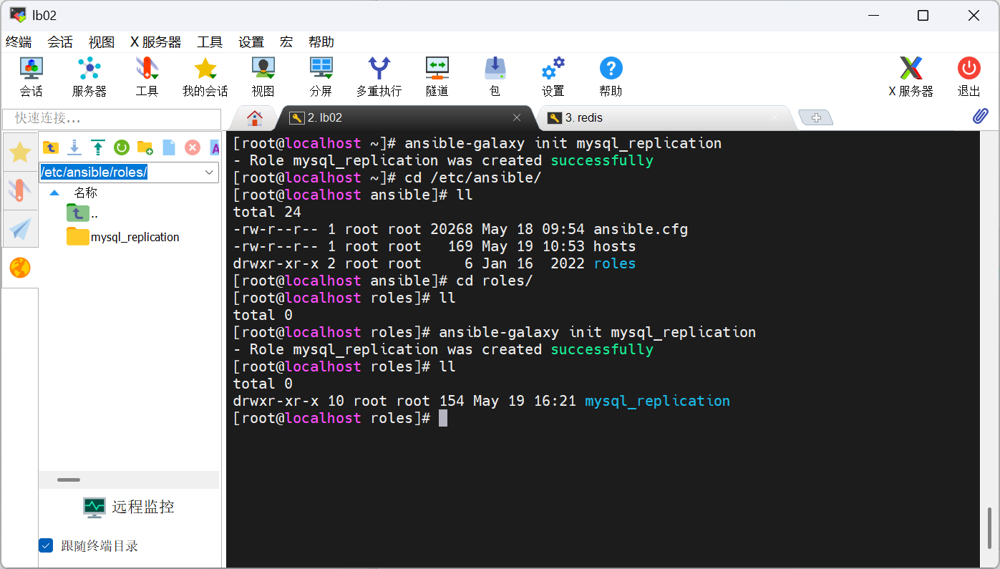
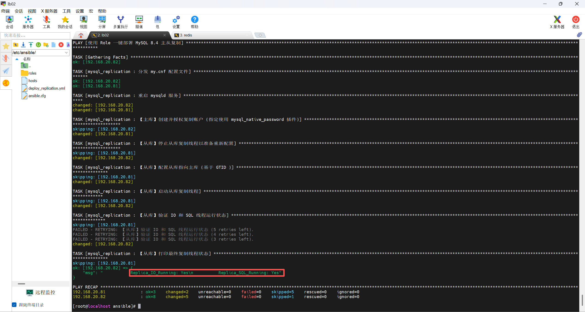

## 使用Ansible的Role方式一键部署MySQL主从复制

### Ansible Role 标准目录结构

在控制端（管理机）建立如下的目录结构：

```
ansible/
├── hosts                       # 主机清单
├── deploy_replication.yml      # 入口剧本
└── roles/
    └── mysql_replication/      # 核心 Role 目录
        ├── defaults/
        │   └── main.yml        # 变量定义
        ├── tasks/
        │   └── main.yml        # 任务流程控制
        └── templates/
            └── my.cnf.j2       # 动态 my.cnf 模板
```

在`/etc/ansible/roles`下创建名为`mysql_replication`的`role`用户

```bash
ansible-galaxy init mysql_replication
```



### 完整配置文件源码

文件 1：主机清单 `hosts`

```bash
vi /etc/ansible/hosts
```

```ini
[mysql_servers]
192.168.20.81 mysql_role=master server_id=1  #自定义标识变量 在剧本和模板中引用
192.168.20.82 mysql_role=slave server_id=2

[mysql_master]
192.168.20.81

[mysql_slave]
192.168.20.82

[all:vars]
# 所有主机都生效的变量
ansible_connection=ssh
ansible_port=22
ansible_user=root
ansible_password=1
ansible_sudo_pass=1
```

文件 2：入口剧本 `deploy_replication.yml`

```bash
vi /etc/ansible/deploy_replication.yml
```

```yaml
---
- name: 使用 Role 一键部署 MySQL 8.4 主从复制
  hosts: mysql_servers
  become: yes
  roles:
    - mysql_replication
```

文件 3：变量定义 `roles/mysql_replication/defaults/main.yml`

```bash
vi /etc/ansible/roles/mysql_replication/defaults/main.yml
```

```yaml
---
# 默认的用户及密码
mysql_root_user: "root"
mysql_root_password: "Chen123456!"

# 复制专用账户及密码
replica_user: "repl_user"
replica_password: "Chen123456!"

# 主库的 IP 地址
master_ip: "192.168.20.81"
```

文件 4：配置模板 `roles/mysql_replication/templates/my.cnf.j2`

```bash
vi /etc/ansible/roles/mysql_replication/templates/my.cnf.j2
```

```ini
[mysqld]
# --- 基础网络配置 ---	
# 动态分配服务器 ID
server-id = {{ server_id }}

# --- GTID 核心配置 ---
gtid_mode = ON
enforce_gtid_consistency = ON

# --- 二进制日志配置 ---
log_bin = mysql-bin
binlog_format = ROW

# 设置日志保留时间（例如 7 天 = 604800 秒）
binlog_expire_logs_seconds = 604800

# 性能与安全平衡
sync_binlog = 1

# --- MySQL 8.4 特殊插件配置 ---
# 注意：去掉引号，确保加载路径正确
plugin-load-add = mysql_native_password.so
mysql_native_password=ON


# ==============================================================================
# --- 从库特有配置 ---
# ==============================================================================
# --- 中继日志配置 ---
relay_log = relay-bin
# 开启只读模式，防止误写入数据
read_only = ON
# 即使有 SUPER 权限也无法写入，更安全
super_read_only = ON

```

文件 5：核心任务 `roles/mysql_replication/tasks/main.yml`

```bash
vi /etc/ansible/roles/mysql_replication/tasks/main.yml
```

```yaml
---
# ==============================================================================
# 1. 通用公共任务：分发配置并重启
# ==============================================================================
- name: 分发 my.cnf 配置文件
  template:
    src: my.cnf.j2
    dest: /etc/my.cnf
    owner: root
    group: root
    mode: '0644'

- name: 重启 mysqld 服务
  service:
    name: mysqld
    state: restarted

# ==============================================================================
# 2. 主库特有任务：创建同步账户
# ==============================================================================
- name: 【主库】创建并授权复制账户 (指定使用 mysql_native_password 插件)
  shell: |
    mysql -u{{ mysql_root_user }} -p'{{ mysql_root_password }}' -e "
    CREATE USER IF NOT EXISTS '{{ replica_user }}'@'192.168.20.%' IDENTIFIED WITH mysql_native_password BY '{{ replica_password }}';
    GRANT REPLICATION SLAVE ON *.* TO '{{ replica_user }}'@'192.168.20.%';
    FLUSH PRIVILEGES;
    "
  when: mysql_role == 'master'

# ==============================================================================
# 3. 从库特有任务：通过 GTID 自动对齐加入集群
# ==============================================================================
- name: 【从库】停止从库复制线程以准备重新配置
  shell: mysql -u{{ mysql_root_user }} -p'{{ mysql_root_password }}' -e "STOP REPLICA;"
  ignore_errors: yes
  when: mysql_role == 'slave'

- name: 【从库】配置从库指向主库 (基于 GTID 自动对齐，免去指定物理位置)
  shell: |
    mysql -u{{ mysql_root_user }} -p'{{ mysql_root_password }}' -e "
    CHANGE REPLICATION SOURCE TO
      SOURCE_HOST='{{ master_ip }}',
      SOURCE_USER='{{ replica_user }}',
      SOURCE_PASSWORD='{{ replica_password }}',
      SOURCE_AUTO_POSITION = 1,
      SOURCE_SSL = 1;
    "
  when: mysql_role == 'slave'

- name: 【从库】启动从库复制线程
  shell: mysql -u{{ mysql_root_user }} -p'{{ mysql_root_password }}' -e "START REPLICA;"
  when: mysql_role == 'slave'

# ==============================================================================
# 4. 结果精准验证（合并为单行 Shell 过滤）
# ==============================================================================
- name: 【从库】验证 IO 和 SQL 线程运行状态
  shell: mysql -u root -p"{{ mysql_root_password }}" -e "SHOW REPLICA STATUS\G" | grep "Running:"
  register: replica_status
  when: mysql_role == 'slave'
  # ！！！以下为新增优化：如果不是 Yes，就每隔 2 秒重试一次，最多重试 5 次！！！
  until: " 'Replica_IO_Running: Yes' in replica_status.stdout "
  retries: 5
  delay: 2
 
- name: 【从库】打印最终复制线程状态
  debug:
    msg: "{{ replica_status.stdout }}"
  when: mysql_role == 'slave'
```

### 执行流程与验证

在 `ansible` 根目录下执行以下命令：

```bash
ansible-playbook deploy_replication.yml
```

查看输出结果

