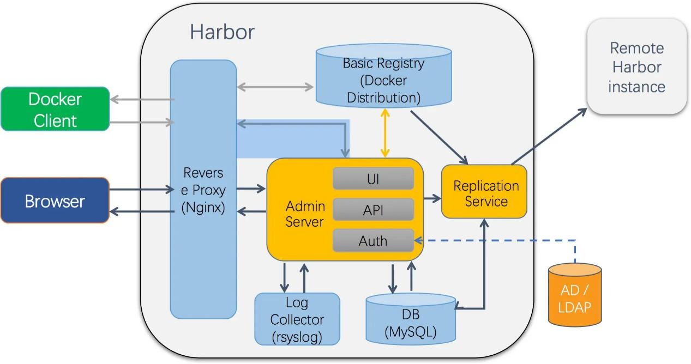
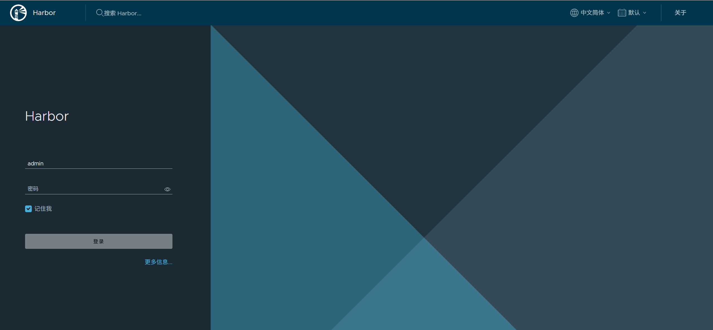
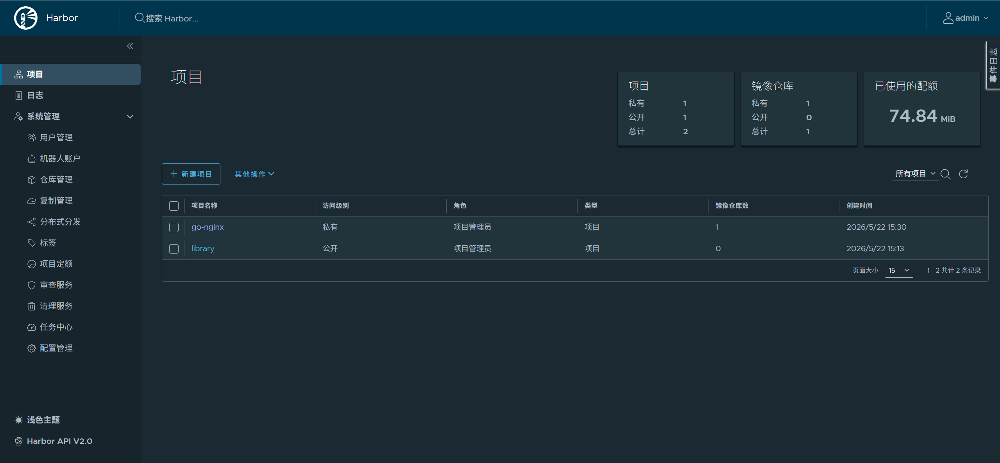

# **容器 - Docker容器**

## 什么是容器技术

容器技术是基于 Linux 内核的轻量级虚拟化方案，通过隔离进程运行环境实现资源高效利用。核心依托 Linux Namespace（隔离文件系统、网络、进程等）和 cgroups（限制 CPU、内存等资源），无需额外 Hypervisor 开销，相比虚拟机启动更快、资源利用率更高。其核心目标是让应用及依赖 “一次打包，到处运行”，实现环境一致性和快速交付。

1. 服务器之间的隔离
2. 进程隔离
3. 快速启动

## Docker 的简介

Docker 是 2013 年开源的应用容器引擎，基于 Go 语言编写，遵循 Apache 2.0 协议，本质是轻量级应用容器（Application Container）。通过客户端 / 服务端架构，利用远程 API 管理容器，核心理念为 “build（构建）、ship（运输）、run（运行）”。

## Docker 组成

- Docker 主机（Host）：运行 Docker 服务和容器的物理机或虚拟机。
- Docker 服务端（Server）：Docker 守护进程（daemon），负责运行容器。
- Docker 客户端（Client）：通过 docker 命令或 API 调用服务端。
- Docker 仓库（Registry）：存储镜像的仓库（如官方 Hub、私有仓库）。
- Docker 镜像（Images）：创建容器的只读模板，包含运行环境和应用。
- Docker 容器（Container）：镜像的运行实例，可对外提供服务。

## Docker 优势与缺点

- 优势：快速部署（成百上千应用秒级启动）、高效虚拟化（无 Hypervisor 开销）、节省开支（提高服务器利用率）、简化配置（环境打包）、跨平台迁移（兼容物理机 / 虚拟机 / 公有云）。
- 缺点：隔离性不如虚拟机彻底，依赖 Linux 内核特性。

## 核心技术

- OCI 规范：含 runtime spec（容器运行时标准）和 image format spec（镜像格式标准），保障不同容器产品兼容。
- 主流 Runtime：runc（Docker 默认，兼容 OCI）、Lxc（早期使用）、rkt（CoreOS 开发，兼容 OCI）。

## Docker 镜像、容器、仓库的概念详解

### 镜像（Images）

- 定义：只读模板，包含运行应用所需的文件系统、依赖库、配置等，是创建容器的基础。
- 特点：采用分层存储（layer），每层保存与上层的差异内容，复用性强。
- 命名格式：`仓库服务器IP:端口/项目名称/镜像名称:tag（版本）`，默认 tag 为 latest（如 `nginx:latest`、`docker.zhangzhuo.com/ceshi/nginx:v1`）。

### 容器（Container）

- 定义：镜像的可运行实例，在镜像只读层之上添加一层可读写层，所有数据操作都在该层进行。
- 生命周期：创建→运行→暂停→停止→删除，容器删除后可读写层数据默认丢失（需通过数据卷持久化）。

### 仓库（Registry）

- 定义：存储和分发 Docker 镜像的平台，类似代码仓库（Git/SVN）。
- 分类：官方仓库（Docker Hub：https://hub.docker.com/）、私有仓库（企业内部搭建或云厂商提供）

## Docker 的安装（CentOS 7）

### 前置要求

- 内核版本 ≥ 3.10（通过 `uname -r` 验证）。
- 关闭防火墙或开放相关端口（可选）。

### YUM 安装（推荐）

```bash
# 1. 配置阿里云 YUM 源
wget -O /etc/yum.repos.d/CentOS-Base.repo http://mirrors.aliyun.com/repo/Centos-7.repo
wget -O /etc/yum.repos.d/epel.repo http://mirrors.aliyun.com/repo/epel-7.repo
wget -O /etc/yum.repos.d/docker-ce.repo https://mirrors.aliyun.com/docker-ce/linux/centos/docker-ce.repo

# 2. 安装 Docker CE（社区版）
yum install docker-ce -y

# 3. 启动 Docker 并设置开机自启
systemctl enable --now docker

# 4. 验证安装（查看服务状态）
systemctl is-active docker  # 输出 active 表示成功
docker --version  # 查看版本
```

### 配置镜像加速器（解决下载慢问题）

```bash
vi /etc/docker/daemon.json
```

```json
{
"registry-mirrors": [
"https://docker.m.daocloud.io",
"https://hub-mirror.c.163.com",
"https://docker.anyhub.us.kg",
"https://docker.unsee.tech"
]
}
```

```bash
systemctl restart docker
```

### 报错解决：不支持 swap 限制警告

```bash
# 1. 编辑 grub 配置文件
vim /etc/default/grub

# 2. 在 GRUB_CMDLINE_LINUX 后追加参数
GRUB_CMDLINE_LINUX="net.ifnames=0 biosdevname=0 cgroup_enable=memory swapaccount=1"

# 3. 生成新的 grub 配置并重启
update-grub
reboot
```

## docker run 以及相关命令

### docker run（创建并运行容器）

```bash
docker run [选项] [镜像名] [shell 命令]
```

### 核心参数详解（含案例）

| **参数**   | **作用说明**                                        | **案例示例**                                                 |
| ---------- | --------------------------------------------------- | ------------------------------------------------------------ |
| -it        | 分配伪终端并保持 STDIN 打开（交互模式）             | `docker run -it centos:7 /bin/bash`                          |
| -d         | 后台运行容器（守护模式）                            | `docker run -d --name nginx nginx:latest`                    |
| --name     | 指定容器名称（默认自动生成）                        | `docker run -d --name web-nginx nginx`                       |
| -p         | 端口映射（宿主机端口：容器端口）                    | `docker run -d -p 8080:80 nginx`                             |
| -v         | 挂载目录 / 数据卷（宿主机路径：容器路径 [: 权限]）  | 绑定挂载：`docker run -v /data:/data nginx` 数据卷挂载：`docker run -v myvol:/data nginx` |
| -e/--env   | 设置环境变量                                        | `docker run -e "MYSQL_ROOT_PASSWORD=123456" mysql:5.7`       |
| --restart  | 容器重启策略（no/on-failure/always/unless-stopped） | `docker run -d --restart always nginx`                       |
| --network  | 指定网络（bridge/host/none/ 自定义网络）            | `docker run -d --network mynet nginx`                        |
| --cpus     | 限制 CPU 核心数                                     | `docker run --cpus 2 nginx`                                  |
| --memory   | 限制内存大小（如 1G/512M）                          | `docker run --memory 1G nginx`                               |
| --hostname | 设置容器主机名                                      | `docker run --hostname docker-test nginx`                    |
| --dns      | 指定 DNS 服务器                                     | `docker run --dns 8.8.8.8 nginx`                             |
| --rm       | 容器退出后自动删除                                  | `docker run --rm -it centos:7 bash`                          |

### 完整案例

```bash
# 创建并运行一个 Nginx 容器，配置端口映射、数据挂载、环境变量、重启策略
docker run -it -d \
--name prod-nginx \
-p 80:80 \
-p 443:443 \
-v /data/nginx/conf:/etc/nginx/conf.d \
-v /data/nginx/logs:/var/log/nginx \
-e "ENV=production" \
--restart always \
--cpus 1 \
--memory 512M \
nginx:latest
```

## 容器核心操作命令（含案例）

| **命令**             | **作用说明**                                  | **案例示例**                                                 |
| -------------------- | --------------------------------------------- | ------------------------------------------------------------ |
| docker ps            | 查看运行中的容器（-a 查看所有容器）           | `docker ps -a`（查看所有容器状态）                           |
| docker stop          | 停止容器（支持容器名 / ID）                   | `docker stop nginx`或 `docker stop 842f5a55555`              |
| docker start         | 启动已停止的容器                              | `docker start nginx`                                         |
| docker restart       | 重启容器                                      | `docker restart nginx`                                       |
| docker rm            | 删除容器（-f 强制删除运行中容器）             | `docker rm -f nginx`（强制删除） `docker rm $(docker ps -aq)`（删除所有容器） |
| docker exec          | 进入运行中的容器终端（-it 交互模式）          | `docker exec -it nginx /bin/bash`docker exec [参数] [容器名称/容器的id] [在容器中执行的命令] |
| docker logs          | 查看容器日志（-f 实时跟踪）                   | `docker logs -f nginx`                                       |
| docker inspect       | 查看容器详细信息（JSON 格式）                 | `docker inspect nginx`（查看网络、挂载等信息）               |
| docker port          | 查看容器端口映射关系                          | `docker port nginx`                                          |
| docker stats         | 实时查看容器资源使用情况（CPU / 内存 / 网络） | `docker stats nginx`                                         |
| docker cp            | 容器与宿主机之间拷贝文件                      | 宿主机→容器：`docker cp /tmp/file.txt nginx:/tmp/` 容器→宿主机：`docker cp nginx:/tmp/file.txt /tmp/` |
| docker update        | 更新容器配置（如资源限制）                    | `docker update --memory 2G nginx`                            |
| docker pause/unpause | 暂停 / 恢复容器                               | `docker pause nginx` `docker unpause nginx`                  |
| docker rename        | 修改容器名称                                  | `docker rename nginx web-nginx`                              |

## Docker 镜像相关的命令

| **命令**             | **作用说明**                            | **案例示例**                                                 |
| -------------------- | --------------------------------------- | ------------------------------------------------------------ |
| docker search        | 搜索镜像（默认 Docker Hub）             | `docker search nginx`（搜索 Nginx 镜像）；`docker search nginx:latest`（指定版本） |
| docker pull          | 拉取镜像到本地                          | `docker pull nginx:latest`（拉取最新版）；`docker pull docker.zhangzhuo.com/ceshi/nginx:v1`（拉取私有镜像） |
| docker images        | 查看本地所有镜像（-q 只显示镜像 ID）    | `docker images`；`docker images -q nginx`（只看 Nginx 镜像 ID） |
| docker save          | 导出镜像为 tar 包（可多个镜像合并导出） | `docker save -o nginx.tar nginx:latest`；`docker save nginx:latest redis:6 > app-images.tar`  docker save -o all.tar nginx:latest mysql:8.4.7 alpine:latest busybox:latest php:8.0.30-fpm-alpine centos:7 php:8.0.8-fpm-alpine3.14 |
| docker load          | 导入 tar 包中的镜像                     | `docker load -i nginx.tar`；`docker load < app-images.tar`   |
| docker rmi           | 删除本地镜像（-f 强制删除）             | `docker rmi nginx:latest`；`docker rmi -f $(docker images -q)`（删除所有镜像） |
| docker tag           | 为镜像打标签（用于推送私有仓库）        | `docker tag nginx:latest docker.zhangzhuo.com/ceshi/nginx:v1` |
| docker build         | 通过 Dockerfile 构建镜像（-t 指定标签） | `docker build -t my-nginx:v1 .`（当前目录 Dockerfile）       |
| docker commit        | 将运行中的容器提交为镜像                | `docker commit -m "添加自定义配置" nginx my-nginx:v2`        |
| docker history       | 查看镜像分层历史（构建过程）            | `docker history nginx:latest`                                |
| docker image inspect | 查看镜像详细信息（JSON 格式）           | `docker image inspect nginx:latest`                          |

## 数据卷相关的内容

| **类型**                | **定义**                                                     | **优势**                                  | **适用场景**                     |
| ----------------------- | ------------------------------------------------------------ | ----------------------------------------- | -------------------------------- |
| 绑定挂载（Bind Mounts） | 直接挂载宿主机目录 / 文件到容器                              | 配置简单，宿主机可直接访问文件            | 配置文件共享、日志收集           |
| 数据卷（Volume）        | Docker 管理的独立存储目录（默认 `/var/lib/docker/volumes/`） | 隔离性好、跨容器共享、支持插件（NFS/SMB） | 数据库数据持久化、多容器数据共享 |

### 绑定挂载（Bind Mounts）

```bash
docker run -v 宿主机路径:容器路径[:权限] 镜像名
```

- 权限说明：`rw`（读写，默认）、`ro`（只读）。

## Docker 网络

- 端口发布：通过 `-p` 参数将容器端口映射到宿主机，外部可通过宿主机 IP: 端口访问容器。
- 容器 IP：默认从所在网络子网动态分配，同一网络内容器可通过 IP / 名称通信。
- DNS 服务：自定义网络中容器支持名称解析，默认网络需通过 `--link`（已过时）或 IP 通信。

### Docker 网络类型（核心）

| **网络类型** | **定义**                             | **特点**                                | **适用场景**                   |
| ------------ | ------------------------------------ | --------------------------------------- | ------------------------------ |
| bridge       | 默认网络（docker0 网桥），NAT 模式   | 同一主机容器通信，隔离其他网络          | 单主机多容器协作               |
| host         | 容器共享宿主机网络命名空间           | 无端口映射，性能最优，无网络隔离        | 需占用宿主机端口的高性能场景   |
| none         | 容器无网络接口（仅本地环回）         | 完全隔离，不与外部通信                  | 无需网络的离线任务             |
| 自定义网络   | 用户通过 `docker network create`创建 | 支持名称解析、灵活隔离、动态连接 / 断开 | 多容器复杂网络拓扑（如微服务） |

### 网络核心操作命令

| **命令**                  | **作用说明**                       | **案例示例**                                                 |
| ------------------------- | ---------------------------------- | ------------------------------------------------------------ |
| docker network create     | 创建自定义网络（默认 bridge 类型） | `docker network create mynet`指定子网：`docker network create --subnet 192.168.20.0/24 --gateway 192.168.20.1 mynet` |
| docker network ls         | 查看所有网络                       | `docker network ls`                                          |
| docker network inspect    | 查看网络详细信息（容器、子网等）   | `docker network inspect mynet`                               |
| docker network connect    | 为运行中的容器添加网络             | `docker network connect mynet nginx`                         |
| docker network disconnect | 断开容器与网络的连接               | `docker network disconnect mynet nginx`                      |
| docker network rm         | 删除网络（需无容器使用）           | `docker network rm mynet`                                    |
| docker network prune      | 删除所有未使用的网络               | `docker network prune`                                       |

## Docker Compose

Docker Compose 是 Docker 官方推出的**多容器应用编排工具**，通过 YAML 格式的配置文件（`docker-compose.yml`）定义应用所需的所有服务（容器）、网络、数据卷等依赖关系，再通过单一命令即可创建、启动、停止整个应用栈。

**核心价值**：解决多容器协同问题（如 Web 服务依赖数据库、缓存服务），避免手动执行大量 `docker run` 命令，实现 “一键部署” 多容器应用，保证环境一致性。

### 安装 Docker Compose 

> **目前，docker 中使用 docker compose 代替了下面的命令。**

```bash
wget https://github.com/docker/compose/releases/download/v5.0.0-rc.1/docker-compose-linux-x86_64

mv docker-compose-linux-x86_64 docker-compose

chmod +x docker-compose

mv docker-compose /usr/bin/
```

### Docker Compose 核心组件

1. `docker-compose.yml`：配置文件，定义服务、网络、数据卷的详细信息（核心）。
2. `docker-compose` **命令行工具**：用于解析配置文件并操作服务（启动、停止、重建等）。
3. **服务（Services）**：配置文件中定义的每个容器实例（如 `web`、`db`、`redis` 等）。
4. **网络（Networks）**：服务间通信的网络环境，可自定义隔离策略。
5. **数据卷（Volumes）**：服务间共享或持久化数据的存储卷。

### `docker-compose.yml` 配置文件详解

配置文件采用 YAML 格式，核心结构包括 `version`（版本声明）、`services`（服务配置）、`networks`（网络配置）、`volumes`（数据卷配置）。

#### 版本声明（`version`）

指定 Compose 配置文件版本，需与 Docker 版本兼容（版本对应关系见文末）。

```bash
version: '3.8'  # 主流稳定版本，支持大部分新特性
```

#### 服务配置（`services`）

定义应用所需的容器服务，每个服务对应一个容器，支持大部分 `docker run` 的参数。

| **参数**         | **作用说明**                                                 | **案例示例**                                                 |
| ---------------- | ------------------------------------------------------------ | ------------------------------------------------------------ |
| `image`          | 指定容器使用的镜像（若本地没有会自动拉取）                   | `image: nginx:latest`或 `image: 192.168.1.100/nginx:v1`（私有仓库） |
| `build`          | 从 Dockerfile 构建镜像（替代 `image`），可指定 Dockerfile 路径 | `build: ./nginx`（当前目录下的 `nginx`文件夹，含 Dockerfile） |
| `container_name` | 指定容器名称（默认自动生成，如 `project_service_1`）         | `container_name: my-nginx`                                   |
| `ports`          | 端口映射（宿主机端口：容器端口），与 `docker run -p` 一致    | `ports: - "8080:80"`（单个）或 `ports: - "8080:80" - "443:443"`（多个） |
| `volumes`        | 挂载数据卷或宿主机目录，与 `docker run -v` 一致              | 数据卷：`volumes: - app-data:/data`；绑定挂载：`volumes: - ./logs:/var/log` |
| `environment`    | 设置环境变量（键值对或列表形式）                             | `environment: - MYSQL_ROOT_PASSWORD=123456 - ENV=prod`       |
| `env_file`       | 从文件加载环境变量（每行 `KEY=VALUE`）                       | `env_file: ./.env`（加载当前目录的 `.env` 文件）             |
| `depends_on`     | 定义服务启动顺序（A 依赖 B，则先启动 B 再启动 A）            | `depends_on: - db - redis`（`web`服务依赖 `db` 和 `redis`）  |
| `networks`       | 指定服务加入的网络（需在 `networks`中定义）                  | `networks: - app-net`                                        |
| `restart`        | 容器重启策略（同 `docker run --restart`）                    | `restart: always`（总是重启）或 `restart: on-failure:3`（失败最多重启 3 次） |
| `command`        | 覆盖容器默认启动命令                                         | `command: ["nginx", "-g", "daemon off;"]`                    |
| `working_dir`    | 指定容器工作目录                                             | `working_dir: /app`                                          |
| `user`           | 指定容器运行用户（UID 或用户名）                             | `user: "1000:1000"`或 `user: appuser`                        |
| `healthcheck`    | 健康检查配置（检测服务是否存活）                             | `healthcheck: test: ["CMD", "curl", "-f", "http://localhost"] interval: 30s timeout: 10s retries: 3` |

#### 网络配置（`networks`）

定义服务间通信的网络，支持自定义子网、网关等，默认使用 `bridge` 驱动（单主机）。

```yaml
networks:
  app-net:  # 网络名称
    driver: bridge  # 驱动类型（默认 bridge，可选 overlay 用于跨主机）
    ipam:  # 自定义子网和网关
      config:
        - subnet: 172.20.0.0/16
          gateway: 172.20.0.1
  backend-net:  # 另一个隔离网络
    driver: bridge
```

#### 数据卷配置（`volumes`）

定义可被多个服务共享的数据卷，支持自定义驱动（如本地目录、NFS 等）。

```yaml
volumes:
  mysql-data:  # 数据卷名称（默认存储在 /var/lib/docker/volumes/）
    driver: local  # 本地存储驱动
  app-logs:
    driver: local
    driver_opts:  # 自定义存储路径（可选）
      type: 'none'
      device: '/data/app/logs'  # 宿主机目录
      o: 'bind'  # 绑定挂载
```

### Docker Compose 常用命令

通过 `docker-compose [命令]` 操作服务，默认读取当前目录的 `docker-compose.yml`（可通过 `-f` 指定其他文件）。

| **命令**             | **作用说明**                                                 | **案例示例**                                                 |
| -------------------- | ------------------------------------------------------------ | ------------------------------------------------------------ |
| `up`                 | 创建并启动所有服务（`-d`后台运行，`--build`强制重建镜像）    | `docker-compose up -d`（后台启动）；`docker-compose up --build`（重建镜像后启动） |
| `down`               | 停止并删除所有服务、网络（数据卷默认保留，`-v`可删除未被其他服务使用的卷） | `docker-compose down`；`docker-compose down -v`（删除数据卷） |
| `start/stop/restart` | 启动 / 停止 / 重启已创建的服务                               | `docker-compose start web`（仅启动 `web` 服务）；`docker-compose restart`（重启所有） |
| `ps`                 | 查看服务状态（容器 ID、状态、端口等）                        | `docker-compose ps`（所有服务）；`docker-compose ps db`（仅 `db`服务） |
| `logs`               | 查看服务日志（`-f`实时跟踪，`--tail 100`显示最后 100 行）    | `docker-compose logs -f web`（实时查看 `web`日志）           |
| `exec`               | 进入指定服务的容器终端（需服务运行中）                       | `docker-compose exec db bash`（进入 `db`容器的 bash 终端）   |
| `build`              | 构建或重建服务镜像（仅针对 `build`定义的服务）               | `docker-compose build web`（仅构建 `web`镜像）；`docker-compose build --no-cache`（无缓存构建） |
| `pull`               | 拉取服务依赖的镜像（针对 `image`定义的服务）                 | `docker-compose pull`（拉取所有）；`docker-compose pull mysql`（仅拉取 `mysql`） |
| `config`             | 验证配置文件语法并显示配置内容                               | `docker-compose config`（检查语法）；`docker-compose config --services`（列出所有服务名） |
| `rm`                 | 删除已停止的服务容器（`-f`强制删除运行中容器）               | `docker-compose rm web`（删除 `web`容器）                    |

### 实战案例：多容器 Web 应用

以 “Node.js + MySQL + Nginx” 组成的 Web 应用为例，展示完整配置与操作流程。

```
myapp/
├── docker-compose.yml  # Compose 配置文件
├── .env                # 环境变量文件
├── nginx/              # Nginx 配置
│   ├── Dockerfile
│   └── nginx.conf
├── web/                # Node.js 应用
│   ├── Dockerfile
│   └── app.js
└── mysql/              # MySQL 初始化脚本
    └── init.sql
```

#### 配置文件内容

```yaml
version: '3.8'

services:
  # Nginx 服务（反向代理）
  nginx:
    build: ./nginx  # 从 ./nginx/Dockerfile 构建
    container_name: myapp-nginx
    ports:
      - "80:80"  # 宿主机 80 端口映射到容器 80
    volumes:
      - ./nginx/nginx.conf:/etc/nginx/nginx.conf:ro  # 只读挂载配置文件
    depends_on:
      - web  # 依赖 web 服务，web 启动后再启动 nginx
    networks:
      - app-net
    restart: always

  # Node.js 应用服务
  web:
    build: ./web
    container_name: myapp-web
    environment:
      - DB_HOST=db  # 数据库主机名（与 db 服务名一致，可直接通信）
      - DB_PORT=3306
    env_file: ./.env  # 从 .env 加载数据库密码等敏感信息
    depends_on:
      - db  # 依赖 db 服务
    networks:
      - app-net
    restart: always
    healthcheck:  # 健康检查：检测 Node 服务是否存活
      test: ["CMD", "curl", "-f", "http://localhost:3000/health"]
      interval: 30s
      timeout: 10s
      retries: 3

  # MySQL 数据库服务
  db:
    image: mysql:8.0
    container_name: myapp-db
    ports:
      - "3306:3306"
    volumes:
      - mysql-data:/var/lib/mysql  # 数据卷持久化数据
      - ./mysql/init.sql:/docker-entrypoint-initdb.d/init.sql  # 初始化脚本
    environment:
      - MYSQL_DATABASE=myapp  # 初始数据库名
      - MYSQL_ROOT_PASSWORD_FILE=/run/secrets/db_root_password  # 从 secret 读取密码
    secrets:
      - db_root_password  # 引用下方定义的 secret
    networks:
      - app-net
    restart: always

networks:
  app-net:  # 自定义网络，所有服务在此网络内通信

volumes:
  mysql-data:  # 数据卷，持久化 MySQL 数据

secrets:  # 存储敏感信息（替代明文环境变量）
  db_root_password:
    file: ./db_root_password.txt  # 密码存储在文件中（需提前创建，内容为密码）
```

#### `.env`（环境变量文件）

```bash
# Node.js 应用使用的数据库密码（与 MySQL root 密码一致）
DB_PASSWORD=MySecurePass123
```

#### `db_root_password.txt`（MySQL 密码文件）

```bash
MySecurePass123  # 与 .env 中的 DB_PASSWORD 保持一致
```

#### 启动与管理应用

```bash
# 1. 进入项目目录
cd myapp

# 2. 启动所有服务（后台运行）
docker-compose up -d

# 3. 查看服务状态
docker-compose ps

# 4. 查看 web 服务日志
docker-compose logs -f web

# 5. 进入 db 容器查看数据库
docker-compose exec db mysql -u root -p  # 输入密码 MySecurePass123

# 6. 停止并删除所有服务（保留数据卷）
docker-compose down

# 7. 重建 web 镜像并重启
docker-compose up -d --build web
```

## **容器 - 构建Docker镜像**

Docker容器镜像是Docker中的一个重要概念，它是一个轻量级、独立运行的软件包，包含了运行应用所需的一切：代码、运行时环境、系统工具、系统库等。Docker容器镜像是由一个或多个只读的文件系统层组成的，每个文件系统层都包含了一个或多个文件或目录的变更。这种分层的结构使得容器镜像可以高效地共享和复用。Docker容器镜像可以通过Dockerfile文件定义，Dockerfile是一个文本文件，包含了一系列的指令，用于构建容器镜像。通过运行Dockerfile中的指令，Docker可以自动化地构建容器镜像，并将其保存为一个可用的镜像文件。Docker容器镜像可以通过Docker Hub等镜像仓库进行分享和分发。用户可以从镜像仓库中下载所需的镜像，然后在本地运行该镜像创建一个容器实例。总结来说，Docker容器镜像是一个轻量级、独立运行的软件包，包含了运行应用所需的一切。它可以通过Dockerfile文件定义，并可以通过镜像仓库进行分享和分发。

Dockerfile 约定必须使用这个名字。

### Docker容器镜像没有内核

从镜像大小上面来说，一个比较小的镜像只有十几MB，而内核文件需要一百多兆， 因此镜像里面是没有内核的，镜像在被启动为容器后将直接使用宿主机的内核，而镜像本身则只提供相应的rootfs，即系统正常运行所必须的用户空间的文件系统，比如/dev/，/proc，/bin，/etc 等目录，所以容器当中基本是没有 /boot目录的，而/boot当中保存的就是与内核相关的文件和目录。

```bash
#查看本机内核
[18:55:22 root@docker ~]#uname -r
4.15.0-140-generic
#启动容器且查看容器内核
[18:55:25 root@docker ~]#docker run -it --rm --name centos7 centos:7
[root@e592cd81d362 /]# uname -r
4.15.0-140-generic
[root@e592cd81d362 /]# ll /boot
ls: cannot access /boot: No such file or directory
```

**为什么没有内核？**

由于容器启动和运行过程中是直接使用了宿主机的内核，所以没有直接调用过物理硬件，所以也不会涉及到硬件驱动，因此也用不上内核和驱动，另外有内核的那是虚拟机。

### 构建镜像

Docker镜像可通过多种方式进行构建，分别有

- 使用Dockerfile这是最常见和推荐的方法。通过编写一个Dockerfile文件，定义镜像的构建步骤和配置，然后使用`docker build`命令来构建镜像。
- 使用Docker Commit这种方法可以在运行容器的基础上进行镜像构建。首先，通过`docker run`命令创建一个容器，并在其中进行一些配置和操作。然后，使用`docker commit`命令将该容器的状态保存为一个新的镜像。

#### Docker Commit

这种方式构建容器镜像一般用来调试镜像，很少用于生产。主要是把正在运行的容器提交为镜像。默认情况下，正在提交的容器及其进程将在提交映像时暂停。这降低了在创建提交的过程中遇到数据损坏的可能性。具体命令如下

**参数如下：**

- -a：作者信息，可选
- -c：将 Dockerfile 指令应用到创建的镜像
- -m：提交信息
- -p：在提交是是否暂停容器运行，默认为true

### DockerFile

DockerFile 可以说是一种可以被 Docker 程序解释的脚本，DockerFile 是由一条条的命令组成的，每条命令对应linux下面的一条命令，Docker程序将这些DockerFile指令再翻译成真正的linux命令，其有自己的书写方式和支持的命令， Docker 程序读取 DockerFile 并根据指令生成 Docker 镜像，相比手动制作镜像的方式，DockerFile 更能直观的展示镜像是怎么产生的，有了写好的各种各样 DockerFile 文件，当后期某个镜像有额外的需求时，只要在之前的 DockerFile 添加或者修改相应的操作即可重新生成新的 Docke 镜像，避免了重复手动制作镜像的麻烦，具体如下：

官方文档：https://docs.docker.com/engine/reference/builder/

#### 文件指令

Dockerfile文件的内部指令如下：

**基础：**

- `FROM`：在整个dockfile文件中，除了解析器指令、注释和全局范围的ARG之后之外的第一行应该就是FROM，用于指定父镜像
- `ADD`：用于添加宿主机本地的文件、目录、压缩等资源到镜像里面去，会自动解压tar.gz格式的压缩包，不会自动解压zip
- `COPY`：用于添加宿主机本地的文件、目录、压缩等资源到镜像里面去，不会解压任何压缩包
- `ENV`：设置容器环境变量，该值将存在于构建阶段中所有后续指令的环境中，并且也可以在许多指令中内联替换该值将被解释为其他环境变量
- `USER`：指定运行操作的用户，之后容器启动时运行的程序将会使用设置的用户运行
- `VOLUME`：定义volume，也就是创建目录
- `WORKDIR`：用于定义工作目录，也就是容器镜像运行的目录，也是进入容器终端的默认目录
- `RUN`：执行shell命令，但是一定要以非交互式的方式执行
- `MAINTAINER`：镜像的作者信息
- `LABEL`：设置镜像的属性标签
- `EXPOSE`：设置容器在运行时监听指定的网络端口。您可以指定端口是侦听TCP还是UDP，如果不指定协议，则默认为TCP，实际上并未发布端口，他提供运维人员一个类似与标识的内容。
- `CMD`：指定容器启动时执行的默认命令，空格需要使用`,`隔开，如：CMD ["/bin/bash","sleep","30000"]
- `ENTRYPOINT`：也可以用于定义容器在启动时候默认执行的命令或者脚本，如果是和CMD命令混合使用的时候，会将CMD的命令当做参数传递给ENTRYPOINT后面的脚本，可以在脚本中对参数做判断并进行相应的容器初始化操作。

**高级：**

- `STOPSIGNAL`：设置将发送到容器以退出的系统调用信号，如SIGKILL。
- `HEALTHCHECK`：设置容器健康检查。

#### FROM

该`FROM`指令初始化一个新的构建阶段并为后续指令设置基础映像。因此，有效`Dockerfile`必须以指令开始`FROM`。

- ARG是FROM中可能位于前面的唯一指令Dockerfile。
- `FROM`可以在单个映像中出现多次`Dockerfile`以创建多个映像或使用一个构建阶段作为另一个构建阶段的依赖项。只需记下每个新指令之前提交的最后一个映像ID输出即可`FROM`。每条`FROM`指令都会清除先前指令创建的任何状态。
- `AS name`（可选）可以通过添加到指令来为新的构建阶段指定名称`FROM`。`FROM`该名称可以在后续和说明中使用`COPY --from=<name>`来引用此阶段构建的图像。

#### RUN

用来在构建镜像时运行命令

`RUN --mount`此安装类型允许构建容器缓存编译器和包管理器的目录。

#### HEALTHCHECK

该`HEALTHCHECK`指令告诉 Docker 如何测试容器以检查它是否仍在工作。当容器指定了健康检查时，它除了正常状态之外，还具有健康状态。这种状态最初是`starting`。每当健康检查通过时，它就会变成`healthy`（无论它之前处于什么状态）。连续失败一定次数后，就变成了`unhealthy`。

**相关参数如下**

- `--interval=`：探测间隔默认30s
- `--timeout=`：超时时间默认30s
- `--start-period=`：初始化时间默认0s
- `--retries=`：探测次数默认3

#### ARG

`ARG` 指令用于定义构建时的参数。这些参数可以在构建过程中使用，并且可以通过 `--build-arg` 参数进行传递。语法`ARG <name>[=<default value>]`其中，`<name>` 是参数的名称，`<default value>` 是可选的默认值。如果没有提供默认值，那么在构建时必须通过 `--build-arg` 参数显式地传递该参数,

`ARG` 指令定义的参数可以在 Dockerfile 中的任何位置使用，包括 `FROM`、`RUN`、`ENV`、`CMD` 等指令中。在使用参数时，可以通过 `${<name>}` 的方式引用参数的值。

### docker build

该`docker build`命令从Dockerfile中构建Docker镜像。

#### 使用.dockerignore文件

在执行docker build时如果`.dockerignore`文件存在。会查找这个文件中匹配的文件在执行ADD或者COPY时排除匹配到的文件。示例如下

```dockerfile
#文件如下
Dockerfile  .dockerignore  go.mod  main.go
#.dockerignore内容
Dockerfile
*/temp*
**/*temp
!README.md
#dockerfile
FROM golang:1.20-alpine AS gobin
WORKDIR /src
COPY . .  #这里copy时不会拷贝这个文件
RUN  go build -o service

FROM alpine:latest
WORKDIR /app
COPY --from=gobin /src/service /app/
CMD ["./service","-content","ceshi"]
```

#### 使用详解

- -t：指定构建后的镜像名称
- -f：指定构建使用的dockerfile文件
- --add-host：指定hosts解析

## 容器 - Harbor镜像仓库

Harbor 是一个用于存储和分发 Docker 镜像的企业级 Registry 服务器，由 vmware 开源，其通过添加一些企业必需的功能特性，例如安全、标识和管理等， 扩展了开源 Docker Distribution。作为一个企业级私有 Registry 服务器，Harbor 提供了更好的性能和安全。提升用户使用 Registry 构建和运行环境传输镜像的效率。Harbor 支持安装在多个 Registry 节点的镜像资源复制，镜像全部保存在私有 Registry 中， 确保数据和知识产权在公司内部网络中管控，另外，Harbor 也提供了高级的安全特性，诸如用户管理，访问控制和活动审计等。vmware 官方开源服务列表地址：https://vmware.github.io/harbor/cn/harbor 官方 github 地址：https://github.com/vmware/harborharbor 官方网址：https://goharbor.io/



基于角色的访问控制：用户与 Docker 镜像仓库通过“项目”进行组织管理， 一个用户可以对多个镜像仓库在同一命名空间（project）里有不同的权限。 镜像复制：镜像可以在多个 Registry 实例中复制（同步）。尤其适合于负载均衡，高可用，混合云和多云的场景。

图形化用户界面：用户可以通过浏览器来浏览，检索当前 Docker 镜像仓库，管理项目和命名空间。

AD/LDAP 支：Harbor 可以集成企业内部已有的 AD/LDAP，用于鉴权认证管理。 审计管理：所有针对镜像仓库的操作都可以被记录追溯，用于审计管理。

国际化：已拥有英文、中文、德文、日文和俄文的本地化版本。更多的语言将会添加进来。

RESTful API - RESTful API ：提供给管理员对于 Harbor更多的操控, 使得与其它管理软件集成变得更容易。

部署简单：提供在线和离线两种安装工具， 也可以安装到 vSphere 平台(OVA 方式)虚拟设备。

```bash
nginx：harbor 的一个反向代理组件，代理 registry、ui、token 等服务。这个代理会转发 harbor web 和 docker client 的各种请求到后端服务上。
harbor-adminserver：harbor 系统管理接口，可以修改系统配置以及获取系统信息。
harbor-db：存储项目的元数据、用户、规则、复制策略等信息。
harbor-jobservice：harbor 里面主要是为了镜像仓库之前同步使用的。
harbor-log：收集其他 harbor 的日志信息。
harbor-ui：一个用户界面模块，用来管理 registry。
registry：存储 docker images 的服务，并且提供 pull/push 服务。
redis：存储缓存信息
webhook：当 registry 中的 image 状态发生变化的时候去记录更新日志、复制等操作。
token service：在 docker client 进行 pull/push 的时候负责 token 的发放。
```

### 安装 Harbor

下载地址：https://github.com/vmware/harbor/releases

安装文档： https://goharbor.io/docs/2.14.0/

本次使用当前harbor最新的稳定版本2.14.4离线安装包，具体名称为harbor-offline-installer-v2.14.4.tgz

需要在部署的主机事先部署docker与docker-compose。

#### 配置 Harbor

解压并编辑 harbor.yml配置文件，之前的版本配置文件名称为harbor.cfg

```bash
tar xf harbor-offline-installer-v2.14.4.tgz

cp harbor.yml.tmpl harbor.yml

vi harbor.yml
```

```yaml
hostname: www.xxx.com   # 这里修改为拥有https的域名
# http related config
#http:					# 使用http测试
  # port for http, default is 80. If https enabled, this port will redirect to https port
#  port: 80				# 使用http测试

# https related config
https:					# 使用https测试
  # https port for harbor, default is 443
  port: 443				# 使用https测试
  # The path of cert and key files for nginx
  certificate: /data/harbor/ssl/www.xxx.com.pem		# 填写https密钥
  private_key: /data/harbor/ssl/www.xxx.com.key		# 填写https密钥
  # enable strong ssl ciphers (default: false)
  # strong_ssl_ciphers: false
harbor_admin_password: Harbor12345      # admin管理员登录密码
database:
  password: root123
  max_idle_conns: 100
  max_open_conns: 900
  conn_max_lifetime: 5m
  conn_max_idle_time: 0
data_volume: /docker/images       		# 镜像存放位置
trivy:
  ignore_unfixed: false
  skip_update: false
  skip_java_db_update: false
  offline_scan: false
  security_check: vuln
  insecure: false
  timeout: 5m0s
jobservice:
  max_job_workers: 10
  max_job_duration_hours: 24
  job_loggers:
    - STD_OUTPUT
    - FILE
notification:
  webhook_job_max_retry: 3
log:
  level: info
  local:
    rotate_count: 50
    rotate_size: 200M
    location: /var/log/harbor
_version: 2.14.0
proxy:
  http_proxy:
  https_proxy:
  no_proxy:
  components:
    - core
    - jobservice
    - trivy
upload_purging:
  enabled: true
  age: 168h
  interval: 24h
  dryrun: false
cache:
  enabled: false
  expire_hours: 24
```

#### 启动 Harbor

```bash
./install.sh 

[Step 5]: starting Harbor ...
[+] Running 10/10
 ✔ Network harbor_harbor        Created                                0.3s
 ✔ Container harbor-log         Started                                1.4s
 ✔ Container harbor-db          Started                                3.1s
 ✔ Container redis              Started                                2.8s
 ✔ Container registryctl        Started                                2.9s
 ✔ Container harbor-portal      Started                                3.1s
 ✔ Container registry           Started                                2.6s
 ✔ Container harbor-core        Started                                3.8s
 ✔ Container nginx              Started                                4.9s
 ✔ Container harbor-jobservice  Started                                4.7s
✔ ----Harbor has been installed and started successfully.----

```

登录web页面





### 其他功能

#### 停止与启动和重启Harbor

```bash
docker-compose stop

docker-compose start

docker-compose restart
```

#### 更新harbor配置文件

```bash
[root@doker harbor]# ./prepare --help

prepare base dir is set to /data/harbor
Usage: main.py prepare [OPTIONS]

Options:
  --conf TEXT   the path of Harbor configuration file
  --with-trivy  the Harbor instance is to be deployed with Trivy
  --help        Show this message and exit.
Clean up the input dir

#如果配置文件修改需要直接执行./prepare，后执行
```

#### 开启harbor镜像扫描功能

```bash
docker-compose stop

#删除所有镜像
docker-compose rm

#重新配置
./install.sh --with-trivy
```

#### 推送镜像

```bash
# 在项目中标记镜像
docker tag SOURCE_IMAGE[:TAG] www.xxx.com/[项目名]/REPOSITORY[:TAG]

# 推送镜像到当前项目
docker push www.xxx.com/[项目名]/REPOSITORY[:TAG]
```