# ELK Stack + Beats

>运维人员需要对系统和业务日志进行精准把控，便于分析系统和业务状态。日志分布在不同的服务器上，传统的使用传统的方法依次登录每台服务器查看日志，既繁琐又效率低下。所以我们需要**集中化**的日志管理工具**将位于不同服务器上的日志收集到一起, 然后进行分析、展示。**

## 认识ELK

ELK是一套开源的日志分析系统，由 elasticsearch+logstash+Kibana 组成。

官网说明:https://www.elastic.co/cn/products


首先: 先一句话简单了解E,L,K这三个软件

Elasticsearch 日志处理厂Elasticsearch 是基于 JSON 的分布式搜索和分析引擎，专为实现水平扩展、高可靠性和管理便捷性而设计

Elasticsearch 是一个分布式的 RESTful 风格的搜索和数据分析引擎，能够解决不断涌现出的各种用例。作为 Elastic Stack 的核心，它集中存储您的数据，帮助您发现意料之中以及意料之外的情况。

Kibana 垃圾处理报表Kibana 能够以图表的形式呈现数据，并且具有可扩展的用户界面，供您全方位配置和管理 Elastic Stack。

Kibana 让您能够自由地选择如何呈现您的数据。或许您一开始并不知道自己想要什么。不过借助 Kibana 的交互式可视化，您可以先从一个问题出发，看看能够从中发现些什么。一张图片胜过千万行日志

Beats 垃圾桶 垃圾回收车Beats 是轻量型采集器的平台，从边缘机器向 Logstash 和 Elasticsearch 发送数据。

Beats 是数据采集的得力工具。将这些采集器安装在您的服务器中，它们就会把数据汇总到 Elasticsearch。如果需要更加强大的处理性能，Beats 还能将数据输送到 Logstash 进行转换和解析。


ELK下载地址：https://www.elastic.co/cn/downloads

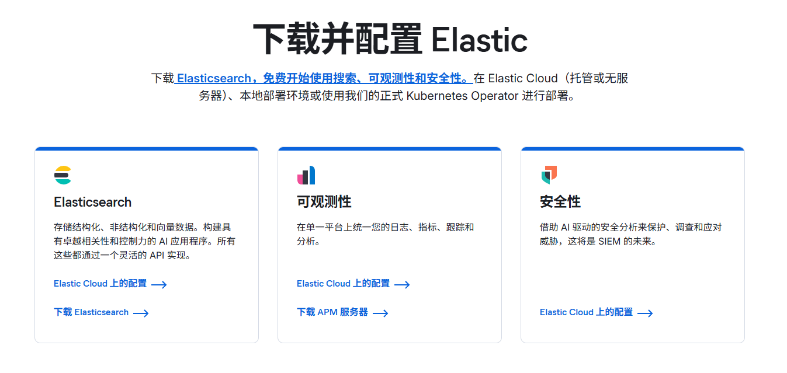

## 部署前准备

- 静态IP(要求能上公网,最好用虚拟机的NAT网络类型上网)
- 主机名及IP绑定
- 关闭防火墙和selinux
- 时间同步 chrony
- yum源(centos安装完系统后的默认yum源就OK)

| **主机名称** | **IP地址**        | **角色**       |
| ------------ | ----------------- | -------------- |
| manage01     | 192.168.20.200/24 | kibana数据展示 |
| node1        | 192.168.20.201/24 | ES1            |
| node2        | 192.168.20.202/24 | Kafka          |
| node3        | 192.168.20.203/24 | LogStash       |

## Elasticsearch

Elasticsearch(简称ES)是一个开源的分布式搜索引擎，Elasticsearch还是一个分布式文档数据库。所以它提供了大量数据的存储功能,快速的搜索与分析功能。

提到搜索,大家肯定就想到了百度,谷歌,必应等。当然也有如下的搜索场景。


### Elasticsearch集群部署方式

单节点的ES需要在处理大量数据的时候需要消耗大量内存和CPU资源，数据量大到一定程度就会产生处理瓶颈，甚至会出现宕机。为了解决单节点ES的处理能力的瓶颈及单节点故障问题，我们考虑使用ES集群。

#### ES集群的优点

优化数据处理能力：通过多台ES共同处理数据，提升处理能力，节省时间。

容错能力增强：解决了ES单点故障问题，让架构更稳定。

数据安全：分布式数据存储，数据更安全

#### 节点规划

- **主节点（master）**：负责集群元数据管理、分片分配，不存储数据（可按需调整）。

- **从节点（data）**：存储数据，参与数据分片和查询负载，不参与主节点选举。

- 节点规划（示例 IP）：

  - 主节点：`192.168.20.200`（manage01）

  - 从节点 1：`192.168.20.202`（node1）

#### 系统初始化

```bash
# 关闭 SELinux
setenforce 0
sed -i 's/SELINUX=enforcing/SELINUX=disabled/' /etc/selinux/config

# 关闭防火墙（或开放 9200、9300 端口，9300 为节点间通信端口）
systemctl stop firewalld
systemctl disable firewalld

# 配置主机名（每台机器分别设置，如主节点设为 master，从节点设为 data1、data2）
hostnamectl set-hostname manage01  # 主节点执行
# hostnamectl set-hostname node1  # 从节点1执行

# 配置 hosts 解析（2台机器均添加）
cat >> /etc/hosts << EOF
192.168.20.200 manage01
192.168.20.201 node1
EOF
```

#### 安装 Java 环境（9.x 需 JDK 17+）

```bash
# 下载并解压 Temurin 17
wget https://github.com/adoptium/temurin17-binaries/releases/download/jdk-17.0.11%2B9/OpenJDK17U-jdk_x64_linux_hotspot_17.0.11_9.tar.gz

# 解压
tar -zxvf OpenJDK17U-jdk_x64_linux_hotspot_17.0.11_9.tar.gz -C /usr/local/

# 重命名文件夹
mv /usr/local/jdk-17.0.11+9 /usr/local/jdk17

# 配置环境变量
echo 'export JAVA_HOME=/usr/local/jdk17' >> /etc/profile
echo 'export PATH=$JAVA_HOME/bin:$PATH' >> /etc/profile
source /etc/profile

# 验证
java -version  # 输出 17.0.11 即为成功
```

#### 调整系统参数

```bash
# 1. 调整虚拟内存
echo 'vm.max_map_count=262144' >> /etc/sysctl.conf
sysctl -p

# 2. 调整文件描述符和进程限制（为 es 用户）
echo 'es soft nofile 65536' >> /etc/security/limits.conf
echo 'es hard nofile 65536' >> /etc/security/limits.conf
echo 'es soft nproc 4096' >> /etc/security/limits.conf
echo 'es hard nproc 4096' >> /etc/security/limits.conf
echo 'es soft memlock unlimited' >> /etc/security/limits.conf
echo 'es hard memlock unlimited' >> /etc/security/limits.conf
```

#### 验证 PAM 模块是否加载

CentOS 7 依赖 `pam_limits` 模块使 `limits.conf` 生效，检查 `/etc/pam.d/login` 和 `/etc/pam.d/system-auth` 是否包含以下行（若没有则添加）：

```bash
# 编辑 login 配置
vi /etc/pam.d/login
# 添加或确认
session    required     pam_limits.so

# 编辑 system-auth 配置
vi /etc/pam.d/system-auth
# 添加或确认
session    required     pam_limits.so
```

#### 创建 es 用户

```bash
# 添加用户
useradd -M -r -s /sbin/nologin es
```

#### 安装 Elasticsearch（2 台机器均执行）

```bash
# 下载 9.2.0 版本
wget https://artifacts.elastic.co/downloads/elasticsearch/elasticsearch-9.2.0-linux-x86_64.tar.gz

# 解压到 /opt 并授权
tar -zxvf elasticsearch-9.2.0-linux-x86_64.tar.gz -C /opt/

# 重命名文件
mv /opt/elasticsearch-9.2.0 /opt/elasticsearch

# 授权文件夹用户和用户组为es
chown -R es:es /opt/elasticsearch
```

#### **调整 JVM 内存（2 台机器均执行）**

编辑 `/opt/elasticsearch/config/jvm.options`，设置堆内存（建议为系统内存的 50%，不超过 31GB）：

```bash
vi /opt/elasticsearch/config/jvm.options

-Xms2g
-Xmx2g
```

#### 创建数据和日志目录（2 台机器均执行）

```bash
mkdir -p /var/lib/elasticsearch /var/log/elasticsearch
chown -R es:es /var/lib/elasticsearch /var/log/elasticsearch
```

#### 节点配置（核心步骤，按节点类型分别配置）

##### 主节点配置（manage01，192.168.20.200）

编辑配置文件：`vi /opt/elasticsearch/config/elasticsearch.yml`

```bash
# 集群名称（所有节点必须一致）
cluster.name: es-cluster

# 节点名称（当前为主节点，需唯一）
node.name: manage01

# 节点角色（仅作为主节点，不存储数据）
node.roles: [data, master]

# 数据存储路径
path.data: /var/lib/elasticsearch

# 日志存储路径
path.logs: /var/log/elasticsearch

# 绑定当前主节点IP
network.host: 192.168.20.200

# HTTP访问端口（默认9200）
http.port: 9200

# 节点间通信端口（默认9300）
transport.port: 9300

# 集群所有节点的通信地址（含自身及从节点）
discovery.seed_hosts: ["192.168.20.200:9300", "192.168.201.17:9300"]

# 首次启动时参与主节点选举的候选节点
cluster.initial_master_nodes: ["manage01", "node1"]

# 启用内存锁定（需配合系统配置）
bootstrap.memory_lock: true

# 允许跨域访问（方便Kibana连接）
http.cors.enabled: true

# 允许所有来源跨域（测试环境用）
http.cors.allow-origin: "*"

# 测试阶段关闭安全验证（生产环境需开启并配置证书）
xpack.security.enabled: false

# 禁用机器学习功能（解决启动失败问题）
xpack.ml.enabled: false
```

##### 从节点 1 配置（node1，192.168.20.201）

```bash
# 集群名称（与主节点一致）
cluster.name: es-cluster

# 节点名称（从节点1，需唯一）
node.name: node1

# 节点角色（数据节点，同时作为主节点候选）
node.roles: [data, master]

# 数据存储路径
path.data: /var/lib/elasticsearch

# 日志存储路径
path.logs: /var/log/elasticsearch

# 绑定当前从节点IP
network.host: 192.168.20.201

# HTTP访问端口
http.port: 9200

# 节点间通信端口
transport.port: 9300

# 集群所有节点的通信地址（与主节点一致）
discovery.seed_hosts: ["192.168.20.200:9300", "192.168.20.201:9300"]

# 首次启动时参与主节点选举的候选节点（与主节点一致）
cluster.initial_master_nodes: ["manage01", "node1"]

# 启用内存锁定
bootstrap.memory_lock: true

# 允许跨域访问
http.cors.enabled: true

# 允许所有来源跨域
http.cors.allow-origin: "*"

# 关闭安全验证（测试用）
xpack.security.enabled: false

# 禁用机器学习功能（解决启动失败问题）
xpack.ml.enabled: false
```

#### 配置系统服务（2 台机器均执行，可选但推荐）

```bash
# 创建服务文件
cat > /usr/lib/systemd/system/es.service << EOF
[Unit]
Description=Elasticsearch
After=network.target

[Service]
User=es
Group=es
ExecStart=/opt/elasticsearch/bin/elasticsearch
Restart=always
LimitNOFILE=65536
LimitNPROC=4096
LimitMEMLOCK=infinity

[Install]
WantedBy=multi-user.target
EOF

# 重载服务配置
systemctl daemon-reload
```

#### 启动集群（按顺序启动）

##### 先启动主节点：

```bash
systemctl start es
systemctl enable es
```

##### 再启动从节点（分别在从节点机器执行）：

```bash
systemctl start es
systemctl enable es
```

#### 集群验证

##### 检查节点状态（在任意节点执行）

```bash
# 查看集群健康状态（green 表示正常）
curl http://192.168.20.200:9200/_cluster/health?pretty

# 查看所有节点信息
curl http://192.168.20.200:9200/_cat/nodes?v
```

- 健康状态为 `green` 表示集群正常；
- `_cat/nodes` 输出中，主节点会标记 `*`，从节点标记 `-`。


## Kibana

Kibana 是 Elastic Stack（ELK Stack）的核心组件之一，是一款开源的数据可视化和分析平台，专为与 Elasticsearch 配合设计。它可以通过直观的图表、表格、地图等形式展示 Elasticsearch 中的数据，支持实时日志分析、业务指标监控、数据挖掘等场景，常被用于日志分析、运维监控、业务数据分析等领域。

### 核心功能

- 数据可视化：通过折线图、柱状图、饼图、地图等多种图表展示数据；
- 实时监控：创建仪表盘（Dashboard）实时监控关键指标；
- 日志分析：快速检索、过滤和分析 Elasticsearch 中的日志数据；
- 告警功能：基于数据阈值设置告警，支持邮件、Slack 等通知方式；
- 与 Elasticsearch 深度集成：无缝连接 Elasticsearch 索引，支持复杂查询和聚合分析。

### Kibana 安装步骤（与 Elasticsearch 9.2.0 配套，CentOS 7）

Kibana 版本需与 Elasticsearch 严格一致（此处使用 9.2.0 版本），以下是详细安装步骤：

#### 用户与权限

Kibana 不建议用 root 用户启动，可复用之前创建的 `es` 用户，或单独创建 `kibana` 用户（此处复用 `es` 用户）。

#### 下载并安装 Kibana 9.2.0

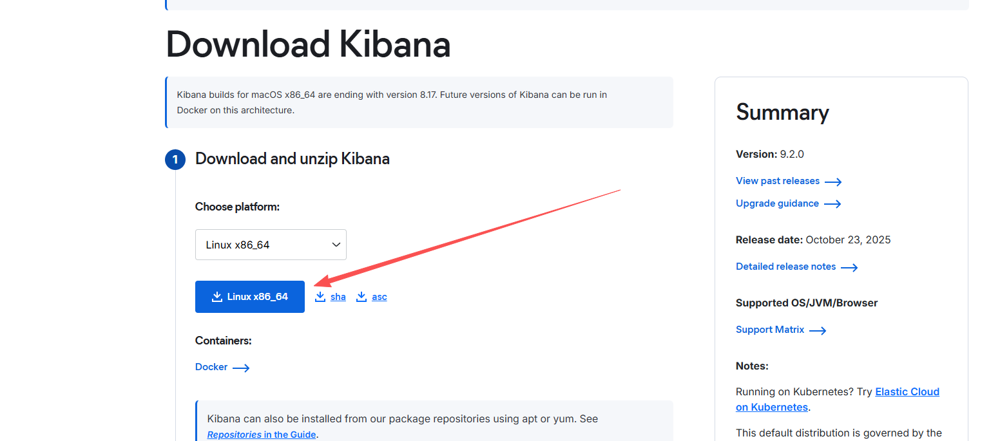 

```bash
# 从 Elastic 官网下载对应版本（Linux x86_64）：
wget https://artifacts.elastic.co/downloads/kibana/kibana-9.2.0-linux-x86_64.tar.gz
```

#### 解压并授权

将安装包解压到 `/opt` 目录，并授权给 `es` 用户：

```bash
useradd -r -s /sbin/nologin kibana 

# 解压
tar -zxvf kibana-9.2.0-linux-x86_64.tar.gz -C /opt/

# 重命名文件
mv /opt/kibana-9.2.0 /opt/kibana

# 授权（与 Elasticsearch 同用户，避免权限问题）
chown -R kibana.kibana /opt/kibana

# 创建kibana日志目录
mkdir -p /var/log/kibana
chown -R kibana.kibana /var/log/kibana
```

#### 编辑配置文件

```bash
vi /opt/kibana/config/kibana.yml
```

#### 核心配置项（根据实际环境修改）

```bash
# 1. 基础网络设置
server.port: 5601

# 允许你通过浏览器访问虚拟机的 IP:5601
server.host: "0.0.0.0"

# 服务器名称（自定义）
server.name: "kibana-manage01"

# 2. 连接 Elasticsearch
# 建议同时写上两个 ES 节点的地址，实现高可用
elasticsearch.hosts: ["http://192.168.20.200:9200", "http://192.168.20.201:9200"]

# 3. 认证信息
# 如果 ES 开了安全验证，打开以下两行示例设置用户名密码
# elasticsearch.username: "kibana_system"
# elasticsearch.password: "Chen123456!"

# 4. 日志配置
logging:
  appenders:
    file_appender:
      type: file
      fileName: /var/log/kibana/kibana.log
      layout:
        type: json
  root:
    appenders: [default, file_appender]

# 5. 中文界面
i18n.locale: "zh-CN"
```

### 启动 Kibana

```bash
vi /usr/lib/systemd/system/kibana.service
```

```bash
[Unit]
Description=Kibana
After=elasticsearch.service

[Service]
User=kibana
Group=kibana
ExecStart=/opt/kibana/bin/kibana
Restart=always
LimitNOFILE=65536

[Install]
WantedBy=multi-user.target
```

```bash
# 启动
systemctl start kibana
# 确认启动成功
systemctl status kibana
```

访问http://192.168.20.200:5601


## Kafka

Kafka 是一款高吞吐、低延迟的分布式消息队列，核心用于数据的异步传输与缓冲，能接收多源数据（如 Filebeat 采集的日志）并可靠转发给下游消费端（如 Elasticsearch、LogStash）。选择 Kafka 而非 Logstash 作为中间件，核心优势在于：高吞吐可支撑海量日志并发写入，分布式架构保证高可用与水平扩展，持久化存储避免数据丢失，且能解耦 Filebeat 与 Elasticsearch 的直接依赖，缓冲峰值流量、灵活调度数据传输节奏；而 Logstash 本质是数据处理引擎，转发能力、扩展性及稳定性远不及 Kafka，更适合作为下游数据清洗工具而非中间传输枢纽。

### Kafka(4.1.0版本后，无Zookeeper)

#### 核心特点：

- **高吞吐量**：通过分区（Partition）并行处理和磁盘顺序读写，单节点可轻松处理每秒十万级 / 秒的消息，集群模式支持更高流量。
- **持久化存储**：消息被持久化到磁盘，支持按时间 / 大小保留数据，可重复消费。
- **分布式高可用**：数据多副本（Replica）存储，节点故障不丢失数据，服务持续可用。
- **实时性**：消息从生产到消费的延迟可达毫秒级，适合实时日志收集、监控数据等场景。

#### 核心概念：

- **Topic（主题）**：消息的分类容器，生产者向 Topic 写消息，消费者从 Topic 读消息（类似 “消息队列名称”）。
- **Partition（分区）**：每个 Topic 分为多个分区（可理解为 “子队列”），是并行处理的最小单位，消息按规则分配到不同分区。
- **Producer（生产者）**：发送消息到 Topic 的应用（如 Filebeat 收集日志后发送到 Kafka）。
- **Consumer（消费者）**：从 Topic 读取消息的应用（如 Logstash 消费 Kafka 消息并转发到 Elasticsearch）。
- **Broker（代理）**：Kafka 服务器节点，负责存储消息、处理生产 / 消费请求，多个 Broker 组成集群。

#### 典型用途：

- 日志收集：如 Filebeat 收集应用日志，发送到 Kafka 暂存，再由下游系统（如 Elasticsearch）处理。
- 实时数据管道：连接不同系统（如数据库、缓存、大数据平台），实现数据实时同步。
- 流处理：结合 Kafka Streams 或 Flink 等工具，实时分析数据流（如实时监控、用户行为分析）。

#### 环境准备

```bash
# 创建kafka用户
useradd kafka -s /sbin/nologin

mkdir -p /var/lib/kafka /var/log/kafka
chown -R kafka.kafka /var/lib/kafka /var/log/kafka

# CentOS
# 下载 Temurin 17（根据系统架构选择，此处为 x64）
wget https://github.com/adoptium/temurin17-binaries/releases/download/jdk-17.0.11%2B9/OpenJDK17U-jdk_x64_linux_hotspot_17.0.11_9.tar.gz

# 解压到 /usr/local
tar -zxvf OpenJDK17U-jdk_x64_linux_hotspot_17.0.11_9.tar.gz -C /usr/local/
mv /usr/local/jdk-17.0.11+9 /usr/local/jdk17

# 添加环境变量
echo 'export JAVA_HOME=/usr/local/jdk17' >> /etc/profile
echo 'export PATH=$JAVA_HOME/bin:$PATH' >> /etc/profile
source /etc/profile
```

#### 下载和安装 Kafka

```bash
wget https://dlcdn.apache.org/kafka/4.1.0/kafka_2.13-4.1.0.tgz

# 解压
tar -xf kafka_2.13-4.1.0.tgz -C /usr/local/

# 重命名文件
mv /usr/local/kafka_2.13-4.1.0 /usr/local/kafka

# 授权用户和用户组
chown -R kafka.kafka /usr/local/kafka
```

#### 配置 Kafka

编辑 `/usr/local/kafka/config/server.properties`：

```Properties
# 角色配置（KRaft模式：同时作为broker和controller，单机场景）
process.roles=broker,controller

# 节点唯一ID（集群模式需递增，如1、2、3）
node.id=1

# Controller集群配置（单机场景指向自身，集群需填所有controller节点）
controller.quorum.bootstrap.servers=192.168.20.200:9093

# 监听配置（关键：绑定实际IP，允许外部访问）
listeners=PLAINTEXT://192.168.20.200:9092,CONTROLLER://192.168.20.200:9093
# 集群内通信使用的监听器
inter.broker.listener.name=PLAINTEXT

# 对外暴露的地址（生产者/消费者连接用，必须填写实际可访问的IP）
advertised.listeners=PLAINTEXT://192.168.20.200:9092
# （CONTROLLER监听器无需对外暴露，删除advertised.listeners中的CONTROLLER配置）

# 控制器专用监听器名称
controller.listener.names=CONTROLLER
# 监听器协议映射（保持默认，KRaft模式需显式配置）
listener.security.protocol.map=CONTROLLER:PLAINTEXT,PLAINTEXT:PLAINTEXT,SSL:SSL,SASL_PLAINTEXT:SASL_PLAINTEXT,SASL_SSL:SASL_SSL

# 网络/IO线程（默认值适合单机，集群可增加）
num.network.threads=3
num.io.threads=8
socket.send.buffer.bytes=102400
socket.receive.buffer.bytes=102400
socket.request.max.bytes=104857600

# 日志存储目录（关键：默认/tmp易丢失，改为持久化目录）
# 建议创建此目录并授权
log.dirs=/var/log/kafka/

# 分区与副本配置（单机场景副本数=1，集群建议≥3）
# 默认分区数从1增至3，提升并行度
num.partitions=3
num.recovery.threads.per.data.dir=1

# 元数据主题配置（KRaft模式专用，副本数与node.id数量匹配）
offsets.topic.replication.factor=1
share.coordinator.state.topic.replication.factor=1
share.coordinator.state.topic.min.isr=1
transaction.state.log.replication.factor=1
transaction.state.log.min.isr=1

# 日志保留策略（按需求调整，默认7天）
log.retention.hours=168
# 单个日志段1GB
log.segment.bytes=1073741824
# 5分钟检查一次
log.retention.check.interval.ms=300000
```

#### 生成ID

> [!IMPORTANT]
>
> 重要：以下命令要在 kafka用户下执行

```bash
# 生成集群ID（保存输出的UUID，如：INqTLyf0Rpu0V3q7_HgdVw）
su -s /bin/bash -c "/usr/local/kafka/bin/kafka-storage.sh random-uuid" kafka
INqTLyf0Rpu0V3q7_HgdVw

# 【集群版】初始化存储（替换<集群ID>为上面生成的UUID）
/usr/local/kafka/bin/kafka-storage.sh format -t <集群ID> -c /usr/local/kafka/config/server.properties
su -s /bin/bash -c "/usr/local/kafka/bin/kafka-storage.sh format -t INqTLyf0Rpu0V3q7_HgdVw -c /usr/local/kafka/config/server.properties" kafka

# 【单机版】初始化kafka集群
# 标记为单机模式，自动配置初始控制器
su -s /bin/bash -c "/usr/local/kafka/bin/kafka-storage.sh format -t INqTLyf0Rpu0V3q7_HgdVw -c /usr/local/kafka/config/server.properties --standalone" kafka
```

#### 创建系统服务

创建 `/etc/systemd/system/kafka.service`：

```bash
[Unit]
Description=Kafka Service
After=network.target zookeeper.service

[Service]
Type=simple
User=kafka
Group=kafka
Environment="JAVA_HOME=/usr/local/jdk17"
Environment="KAFKA_HEAP_OPTS=-Xmx2G -Xms1G"
ExecStart=/usr/local/kafka/bin/kafka-server-start.sh /usr/local/kafka/config/server.properties
ExecStop=/usr/local/kafka/bin/kafka-server-stop.sh
Restart=on-failure
RestartSec=10

[Install]
WantedBy=multi-user.target
```

#### 启动kafka

```bash
systemctl daemon-reload
systemctl start kafka
systemctl enable kafka
```

#### 验证

```bash
# 测试 Kafka 功能
/usr/local/kafka/bin/kafka-topics.sh --bootstrap-server 192.168.20.202:9092 --list

# 能够正常执行（可能返回空列表）

# 创建测试 topic
/usr/local/kafka/bin/kafka-topics.sh --create \
  --topic test-kraft-healthy \
  --bootstrap-server 192.168.20.202:9092 \
  --partitions 3 \
  --replication-factor 1

# 查看 Topic 详情（确认创建成功）
# # 正常输出会显示 Topic 名称、分区数、副本分布等信息（无报错即可）
/usr/local/kafka/bin/kafka-topics.sh --describe \
  --topic test-kraft-healthy \
  --bootstrap-server 192.168.20.202:9092

# 启动生产者发送消息
# 进入交互模式后，输入测试消息（如："kafka test 123"），按回车发送
/usr/local/kafka/bin/kafka-console-producer.sh \
  --topic test-kraft-healthy \
  --bootstrap-server 192.168.20.202:9092

# 启动消费者接收消息
# 正常情况下，会立即收到终端1发送的消息
/usr/local/kafka/bin/kafka-console-consumer.sh \
  --topic test-kraft-healthy \
  --bootstrap-server 192.168.20.202:9092 \
  --from-beginning

# 查看 KRaft 集群状态
/usr/local/kafka/bin/kafka-metadata-quorum.sh \
  --bootstrap-server 192.168.20.202:9092 \
  describe --status
```

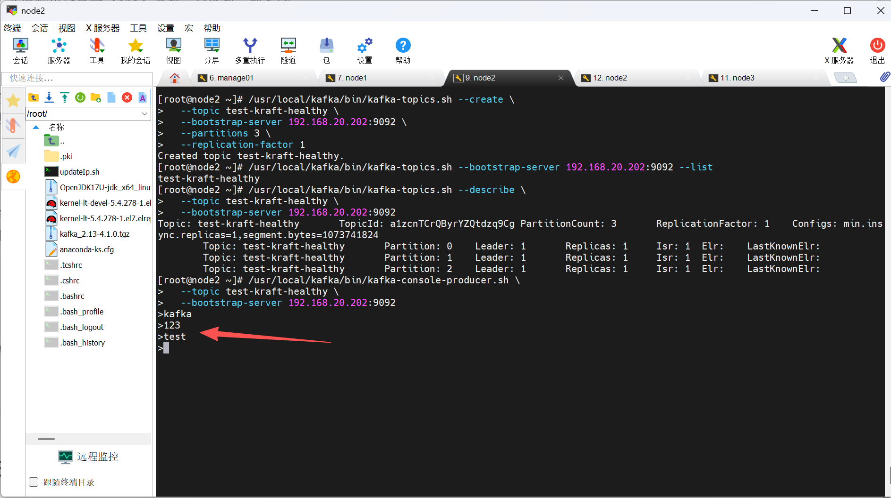

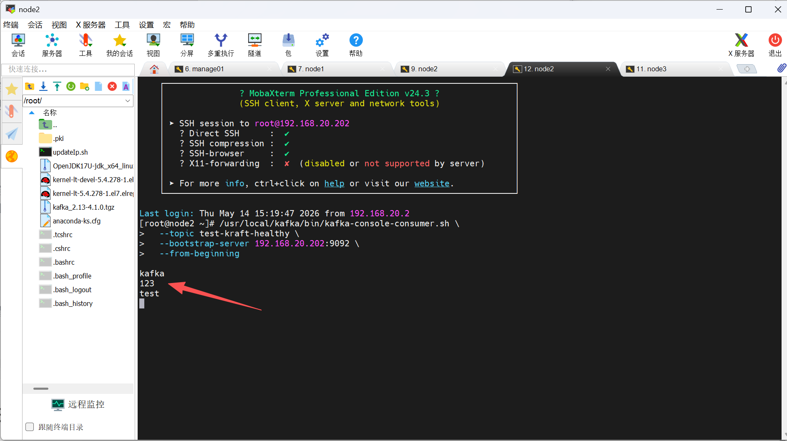

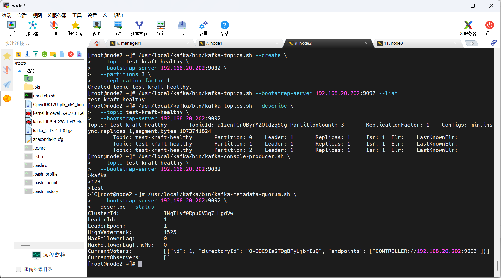

## FileBeat

Filebeat是轻量级日志采集器，部署于服务器端。它实时监控指定日志文件或目录，将新增行高效转发至Logstash或Elasticsearch。其低资源占用、断点续传及结构化解析能力，使其成为构建ELK日志栈的首选前端组件。

beats是轻量级的日志收集处理工具，Beats占用资源少

- Packetbeat： 网络数据（收集网络流量数据）
- Metricbeat： 指标 （收集系统、进程和文件系统级别的 CPU 和内存使用情况等数据）
- Filebeat： 文件（收集日志文件数据）
- Winlogbeat： windows事件日志（收集 Windows 事件日志数据）
- Auditbeat：审计数据 （收集审计日志）
- Heartbeat：运行时间监控 （收集系统运行时的数据）

我们这里主要是收集日志信息, 所以只讨论filebeat。

filebeat可以直接将采集的日志数据传输给ES集群（EFK)

### filebeat部署

#### 环境准备

- **依赖检查**：Filebeat 无需额外依赖（内置运行环境），仅需确保：

  - 服务器能访问 Elasticsearch（HTTP 9200 端口）和 Kibana（HTTP 5601 端口）；

  - 已创建 `es` 用户（复用 Elasticsearch 的运行用户，避免权限问题）。

- **日志源准备**：明确需要采集的日志路径（如 `/var/log/messages`、应用日志 `/opt/logs/*.log`），确保 `es` 用户有读取权限。

#### 下载filebeet

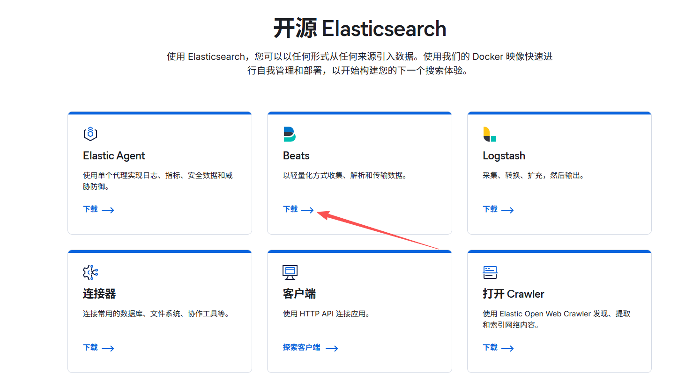


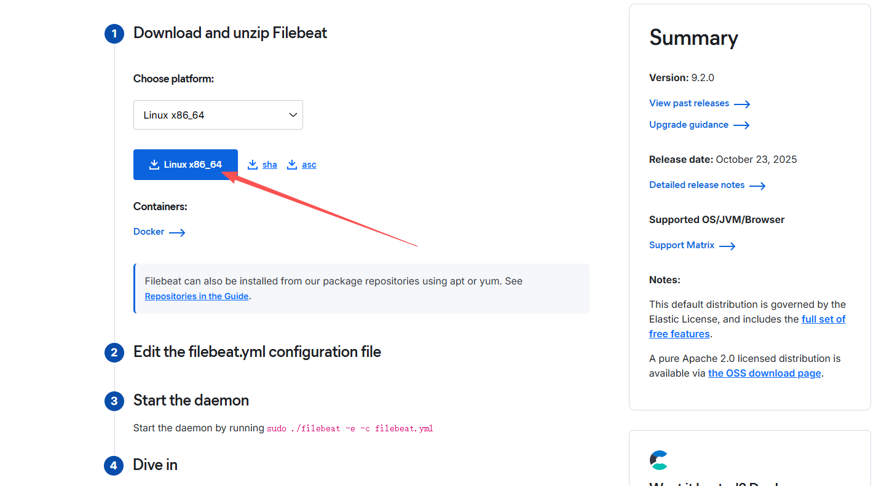

```bash
# 下载安装包
wget https://artifacts.elastic.co/downloads/beats/filebeat/filebeat-9.2.0-linux-x86_64.tar.gz

# 解压
tar -xf filebeat-9.2.0-linux-x86_64.tar.gz -C /opt/

# 重命名文件
mv /opt/filebeat-9.2.0-linux-x86_64 /opt/filebeat

# useradd -M -r -s /sbin/nologin es # 我这里使用了第一台机器安装，所以无需再次创建用户

# 授权给 es 用户（与 Elasticsearch 同用户，避免日志读取权限问题）
chown -R es:es /opt/filebeat
```

#### 目录说明（核心目录）

- `/opt/filebeat/config`：配置文件目录（核心 `filebeat.yml`）；
- `/opt/filebeat/data`：存储采集进度（如日志读取偏移量）；
- `/opt/filebeat/logs`：Filebeat 自身日志。

#### 核心配置（filebeat.yml）

<span id="target-location">生成日志工具：</span>[📎templates.zip](https://www.yuque.com/attachments/yuque/0/2026/zip/682281/1778244908049-852360e9-1cd3-4003-b926-80aa2f30a22a.zip)

编辑配置文件，实现「日志采集 → kafka -> 输出到 Elasticsearch → 关联 Kibana 索引模板」，步骤如下：

> Filebeat 的官方文档：https://www.elastic.co/docs/reference/beats/filebeat/configuring-howto-filebeat

Filebeat收集日志写入Kafka

```bash
vi /opt/filebeat/filebeat.yml
```

```yaml
# ========================== Filebeat 核心采集配置 ==========================
filebeat.inputs:
  # 使用新版的 filestream 读取器（比旧版 log 组件性能更好、更稳定）
  - type: filestream
    # 唯一的输入 ID，用于 Filebeat 内部记录读取进度（注册表）
    id: ok-log
    enabled: true
    paths:
      # 监控并采集该目录下的所有 .log 结尾的日志文件
      - /tmp/template/logs/*.log
    
    # ------------------ NDJSON 解析配置（适配你的JSON日志） ------------------
    parsers:
      - ndjson:
          # 核心：解析后的字段放到根层级（可直接用%{[project]}等字段）
          target: ""
          # 覆盖Filebeat默认的message字段（你的日志有自定义message，需保留）
          overwrite_keys: true
          # 展开带点的key（如日志中有a.b.c格式的字段时生效，兼容未来扩展）
          expand_keys: true
          # 解析失败时添加error字段，便于排查格式异常
          add_error_key: true
          # 忽略单条日志解析失败（避免一条坏日志导致批量丢数据）
          ignore_decoding_error: true
          # 无需配置message_key：你的日志是完整JSON，非"包裹式JSON"

# ========================== 字段处理器（数据加工）==========================
processors:
  # 自动获取当前主机的元数据（如主机名、IP等），除非数据中已经包含了 forwarded 标签
  - add_host_metadata:
      when.not.contains.tags: forwarded
  # 自动检测并添加云厂商元数据（如阿里云、AWS等，如果部署在云服务器上会自动生效）
  - add_cloud_metadata: ~
  # 自动检测并添加 Docker 容器元数据（如果在容器内运行）
  - add_docker_metadata: ~
  # 自动检测并添加 Kubernetes 集群元数据（如果在 K8s 环境中运行）
  - add_kubernetes_metadata: ~
  # 字段剪裁：删除不需要的字段，减少传输数据量和存储空间
  - drop_fields:
  	  # 过滤掉默认自带的 service 字段
      fields: ["service"]
      # 如果字段本身就不存在，忽略错误继续执行
      ignore_missing: true


# ============================ 模块配置加载 ============================
# 自动加载 modules.d 目录下的内置模组配置（如 Nginx, MySQL 等系统模组）
filebeat.config.modules:
  path: ${path.config}/modules.d/*.yml
  # 关闭动态热加载（若改为 true，修改模组配置后无需重启 Filebeat）
  reload.enabled: false

# ======================= Output 配置（输出到 Kafka）=======================
output.kafka:
  # Kafka Broker 节点的 IP 和端口
  hosts: ["192.168.20.202:9092"]
  # 发送目的地：Kafka 的 Topic 名称
  topic: "filebeat-logs"
  # 确认机制：1 表示只要 Kafka 的 Leader 节点收到就返回成功（折中性能与可靠性）
  required_acks: 1
  # 开启 gzip 压缩，大幅减少网络传输带宽
  compression: gzip
  # 单条发送给 Kafka 的消息最大限制（约 1MB）
  max_message_bytes: 1000000
  
  # 负载均衡策略：轮询发送到 Kafka 的所有分区
  partition.round_robin:
    # 即使某个分区暂时不可达，也会尝试轮询，保证数据绝对的轮询均衡
    reachable_only: false

# ======================== Filebeat 自身日志配置 ==========================
# Filebeat 自身的运行日志级别（info, warning, error, debug）
logging.level: info
# 将 Filebeat 自身的日志输出到文件（而不是直接打印到控制台）
logging.to_files: true
logging.files:
  # Filebeat 系统日志存放的目录
  path: /var/log/filebeat
  # 日志文件名
  name: filebeat.log
  # 保留最近 7 个历史日志文件（超过的会自动删除滚动）
  keepfiles: 7
  # 生成的日志文件权限（所有者可读写，其他用户只读）
  permissions: 0644
```

#### 创建并授权对应文件夹

```bash
# 创建日志目录
mkdir -p /var/log/filebeat
# 创建你要采集的模拟日志目录（防止等下找不到日志源）
mkdir -p /tmp/template/logs/

# 统一授权给 es 用户
chown -R es:es /var/log/filebeat
chown -R es:es /opt/filebeat
chown -R es:es /tmp/template/logs/
```

#### 测试配置是否正常

```bash
cd /opt/filebeat/

# 测试配置
su -s /bin/bash -c "./filebeat test config -c filebeat.yml" es

# 测试Kafka连通性
su -s /bin/bash -c "./filebeat test output" es
```

- 预期输出：`Config OK`，表示所有处理器均支持，配置完全可用。
- 如果显示 `Kafka: OK`：说明链路已经完全通了。

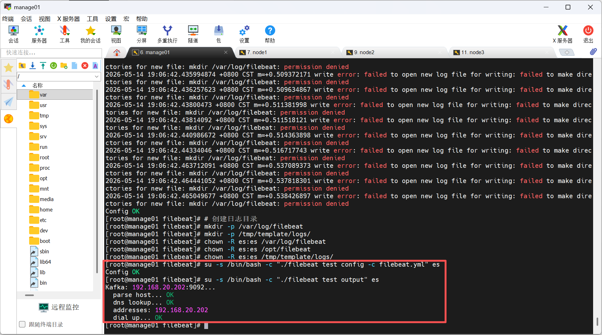

#### 添加`system`服务

创建服务配置文件：`vi /etc/systemd/system/filebeat.service`。

```bash
[Unit]
Description=Filebeat Log Shipper for Elasticsearch/Kafka
Documentation=https://www.elastic.co/docs/beats/filebeat
Wants=network-online.target
After=network-online.target

[Service]
User=es
Group=es
# 【新增】指定工作目录，确保 data 目录能正确创建在安装目录下
WorkingDirectory=/opt/filebeat
# Filebeat 执行路径和配置文件路径
ExecStart=/opt/filebeat/filebeat -c /opt/filebeat/filebeat.yml

Restart=always
RestartSec=5
LimitNOFILE=65535

[Install]
WantedBy=multi-user.target
```

#### 测试1

启动

```bash
systemctl start filebeat
```

在配置Kafka的机器上开启“监听”

```bash
# 进入 Kafka 安装目录
cd /usr/local/kafka

# 启动自带的命令行消费者
./bin/kafka-console-consumer.sh --bootstrap-server 192.168.20.202:9092 --topic filebeat-logs --from-beginning
```

注：执行完后，屏幕会卡住进入等待状态，这是正常的，不要关掉它。


回到配置FlieBeat的机器。我们的的配置是监控 `/tmp/template/logs/*.log`，我们只需往这个路径写一行 JSON 数据。

```bash
# 写入一行模拟日志（注意：必须是换行符结尾，Filebeat 才会读取）
# 疯狂写入，直到文件超过 1024 字节
# 因为 “文件太小” 触发了 Filebeat 9.x 的保护机制。所以使用下面的循环写入日志进行测试
for i in {1..20}; do echo '{"project":"hello-japan", "message":"Testing ELK link", "user":"Gemini"}' >> /tmp/template/logs/real_test.log; done
```

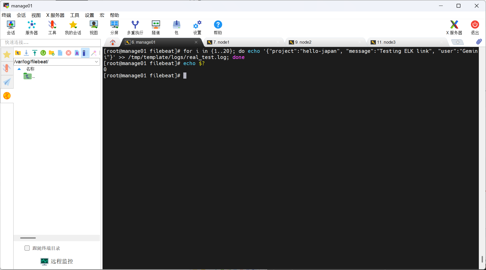

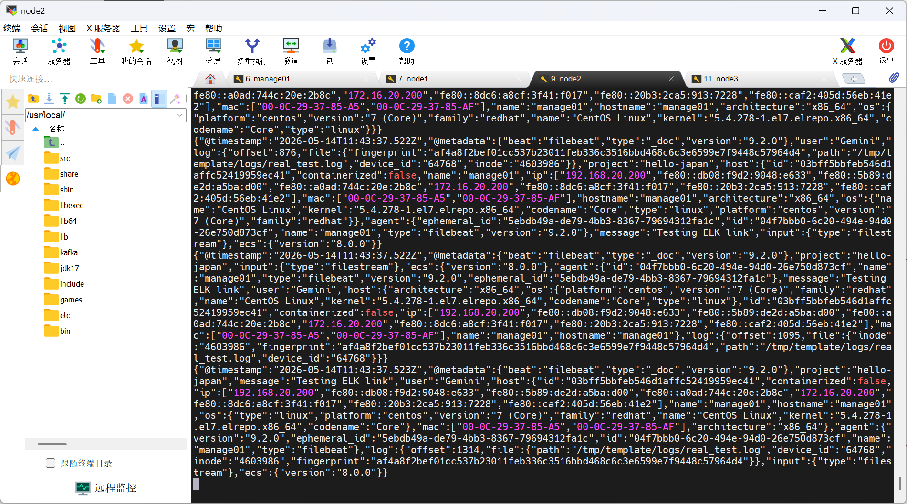

#### 测试2

启动

```bash
systemctl start filebeat
```

在配置Kafka的机器上开启“监听”

```bash
# 进入 Kafka 安装目录
cd /usr/local/kafka

# 启动自带的命令行消费者
./bin/kafka-console-consumer.sh --bootstrap-server 192.168.20.202:9092 --topic filebeat-logs --from-beginning
```

注：执行完后，屏幕会卡住进入等待状态，这是正常的，不要关掉它。


回到配置FlieBeat的机器。我们可以使用上面的[日志生成工具](#target-location)来进行测试。

下载后将其解压到`/usr/local/logs`目录中，解压后得到两个文件`createLog`和`templates`

修改用户和用户组

```bash
chmod -R es:es /usr/local/logs
```

若`createLog`没有可执行权限则赋权

```bash
chmod +x createLog
```

修改配置文件`filebeat.yml`中的`filebeat.inputs:`部分，路径部分添加一条我们的新日志路径

```yml
paths:
    - /usr/local/logs/**/*.log
```

添加`log`服务：`vi /etc/systemd/system/log.service`

```bash
[Unit]
Description=Elasticsearch Templates Service
After=network.target

[Service]
User=es
Group=es
WorkingDirectory=/usr/local/logs
ExecStart=/usr/local/logs/createLog

[Install]
WantedBy=multi-user.target
```

启动服务

```bash
systemctl daemon-reload
systemctl start log
systemctl status log
```

启动成功后访问http://192.168.20.200:8080，点击生成日志则会在`/usr/local/logs`目录中生成一个`logs`文件夹，文件夹下是我们的测试日志。

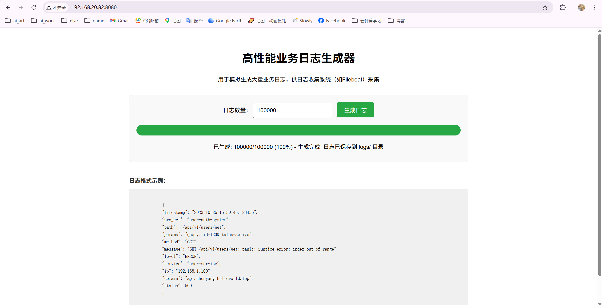

同样在配置`kafka`来接收我们日志的机器上，会展现大量`json`格式的输出

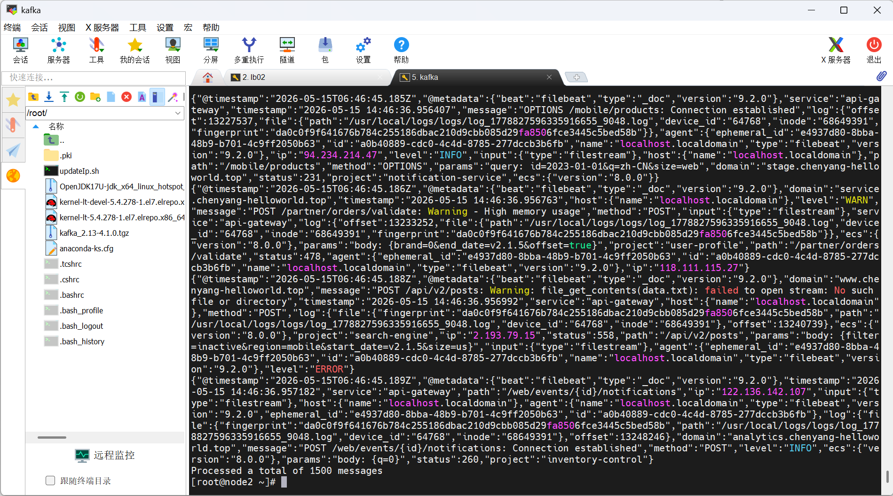

## LogStash

LogStash 是一个强大的数据收集、处理和转发管道工具，它之所以必不可少，是因为在复杂的数据流水线中能够解决数据格式不一致、来源多样化和实时处理需求等关键问题。具体来说，当您的系统需要从多种异构数据源（如文件、Kafka、数据库等）收集数据时，LogStash 提供了丰富的输入插件和过滤器，能够对数据进行实时解析、清洗、富化和格式转换，确保下游系统（如 Elasticsearch）接收到标准化、结构化的数据。虽然 Filebeat 能够直接将日志发送到 Kafka，但在数据需要复杂处理（如 Grok 解析、字段拆分、条件路由、数据脱敏等）的场景下，LogStash 的灵活处理能力是不可替代的，它作为数据流水线的“智能中间层”，极大地提升了数据管道的可维护性和扩展性。

### 环境准备

- **前置条件**：已安装 Kafka（192.168.20.202:9092）和 Elasticsearch 集群（192.168.20.200/201:9200），且 Filebeat 已正常将日志写入 Kafka。
- **版本要求**：Logstash 版本需与 ES 一致（9.2.0），避免兼容性问题。
- **服务器选择**：建议部署在与 Kafka/ES 同网段的服务器（如 192.168.20.x 网段），减少网络延迟。

### 安装Java

Logstash 是基于 Java 开发的工具，必须在 JVM（Java 虚拟机）上运行，没有 Java 环境会直接启动失败。

```bash
# 下载 Temurin 17（根据系统架构选择，此处为 x64）
wget https://github.com/adoptium/temurin17-binaries/releases/download/jdk-17.0.11%2B9/OpenJDK17U-jdk_x64_linux_hotspot_17.0.11_9.tar.gz

# 解压到 /usr/local
tar -zxvf OpenJDK17U-jdk_x64_linux_hotspot_17.0.11_9.tar.gz -C /usr/local/

# 重命名文件
mv /usr/local/jdk-17.0.11+9 /usr/local/jdk17

# 配置环境变量
echo 'export JAVA_HOME=/usr/local/jdk17' >> /etc/profile
echo 'export PATH=$JAVA_HOME/bin:$PATH' >> /etc/profile
source /etc/profile

# 验证 Java 版本
java -version  # 输出应包含 17.0.11 字样
```

### 安装LogStash

```bash
wget https://artifacts.elastic.co/downloads/logstash/logstash-9.2.0-linux-x86_64.tar.gz

# 解压
tar -xf logstash-9.2.0-linux-x86_64.tar.gz -C /usr/local/

# 重命名
mv /usr/local/logstash-9.2.0 /usr/local/logstash

# 添加用户
useradd -M -r -s /sbin/nologin logstash

# 授权
chown -R logstash.logstash /usr/local/logstash
```

### 修改LogStash的配置

>配置文件：[https://www.elastic.co/guide/en/logstash/8.19/plugins-inputs-kafka.html](https://www.elastic.co/guide/en/logstash/8.19/plugins-inputs-kafka.html#plugins-inputs-kafka-bootstrap_servers)

```bash
vi /usr/local/logstash/config/kafka2es.conf
```

```bash
input {
  kafka {
    # Kafka 服务器地址
    bootstrap_servers => "192.168.20.202:9092"
    # 订阅的主题名称（支持正则）
    topics_pattern => "filebeat-logs"
    # 入口数据直接按 JSON 解码
    codec => "json"
    # 消费者线程数，建议与 Kafka 分区数一致
    consumer_threads => 5
    # 若无偏移量记录，从最早的数据开始读取
    auto_offset_reset => "earliest"
    # 消费者组 ID，确保消费进度同步
    group_id => "logstash-es-filebeat-group"
    
    # 性能与稳定性参数
    # 会话超时时间
    session_timeout_ms => 30000
    # 单次拉取最大字节数 (50MB)
    fetch_max_bytes => 52428800
    # 开启自动提交偏移量
    enable_auto_commit => true
    # 自动提交间隔 (5秒)
    auto_commit_interval_ms => 5000
  }
}

filter {
# 1. 解析日志内容：将 message 字段中的 JSON 字符串转为结构化字段
  json {
    # 要解析的源字段
    source => "message"
    # 解析后的内容放入 log_data 对象中
    target => "log_data"
    # 解析失败则打上标签
    tag_on_failure => ["_jsonparsefailure"]
    # 解析成功后删除冗余的原始 message 字段
    remove_field => ["message"]
  }
  
# 2. 时间格式化：将业务日志的时间字符串转为 Logstash 标准时间格式
  date {
  	# 匹配 log_data 里的 timestamp 字段
    match => ["[log_data][timestamp]", "yyyy-MM-dd HH:mm:ss.SSSSSS"]
    # 将解析结果覆盖到系统标准时间字段
    target => "@timestamp"
    # 指定时区，防止 8 小时时差问题
    timezone => "Asia/Shanghai"
    # 保留原始时间备份
    add_field => { "log_original_time" => "%{[log_data][timestamp]}" }
  }

# 3. 类型转换：确保数据写入 ES 时的字段类型正确（方便后期聚合计算）
  mutate {
    convert => {	
      # HTTP 状态码转为整数
      "[log_data][status]" => "integer"
      # 请求参数强制转为字符串
      "[log_data][params]" => "string"
    }
  }

# 4. 逻辑处理：根据日志级别打标签，便于 Kibana 过滤告警
  if [log_data][level] in ["ERROR", "FATAL"] {
    mutate {
      add_tag => ["error_log", "need_attention"]
    }
  }

# 5. 缺失值填充：如果日志里没有 project 字段，给一个默认值
  if ![log_data][project] {
    mutate {
      add_field => { "[log_data][project]" => "default-project" }
    }
  }

}

output {
  # 数据写入 Elasticsearch
  elasticsearch {
    # ES 集群地址
    hosts => ["http://192.168.20.200:9200", "http://192.168.20.201:9200"]
    
    # 动态索引名：根据日志中的 project 字段和日期自动创建索引
    # 注意：这里使用了之前在 filter 中解析出来的 [log_data][project]
    
    index => "b-%{[project]}-%{+yyyy.MM.dd}"
    # 写入失败重试的最大间隔（秒）
    retry_max_interval => 60
    # 指定批量写入接口
    bulk_path => "/_bulk"
    # 若 ES 未开启 SSL，设为 false
    ssl_enabled => false
  }

  # 调试模式：如果需要观察数据流，可以取消下方注释，将结果打印到控制台
  #stdout {
  #  codec => rubydebug { metadata => false }
  #}
}
```

### 测试LogStash配置是否正确

```bash
cd /usr/local/logstash
sudo -u logstash ./bin/logstash --config.test_and_exit -f ./config/kafka2es.conf
```

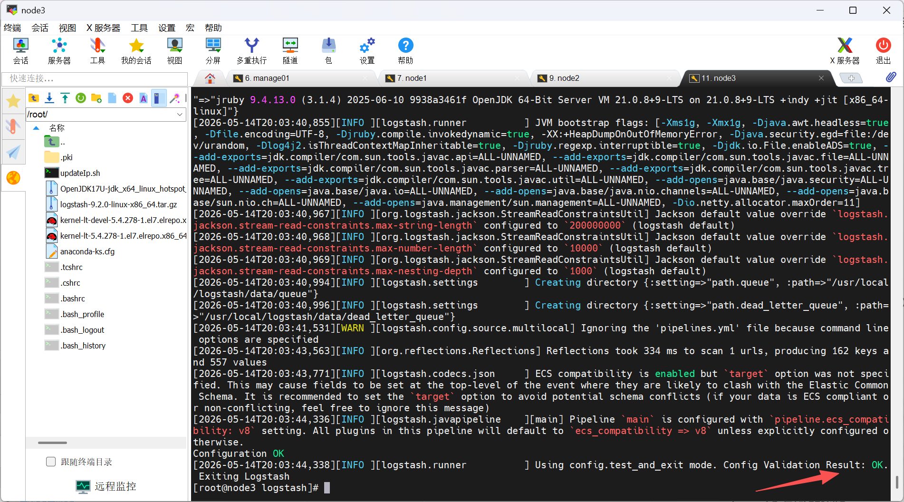

### 启动LogStash

用于后台运行 Logstash 并设置开机自启（`/etc/systemd/system/logstash.service`）：

```bash
[Unit]
Description=Logstash 9.2.0 Data Pipeline（Kafka→ES 日志同步）
Documentation=https://www.elastic.co/docs/beats/logstash
After=network-online.target
Wants=network-online.target

[Service]
# 专用运行用户（避免 root 权限）
User=logstash
# 专用用户组
Group=logstash
# 启动命令
ExecStart=/usr/local/logstash/bin/logstash -f /usr/local/logstash/config/kafka2es.conf
# 故障时自动重启
Restart=always
# 重启间隔（5 秒）
RestartSec=5
# 最大文件句柄数（适配高并发日志处理）
LimitNOFILE=65535
# 标准输出重定向（避免日志冗余）
StandardOutput=null
# 标准错误输出到日志和控制台
StandardError=journal+console

[Install]
WantedBy=multi-user.target
```

启动

```bash
systemctl start logstash
systemctl status logstash
systemctl enable logstash
```

访问http://192.168.20.200/（此处为安装了谷歌浏览器的Elasticsearch Multi-Head插件的展示效果）

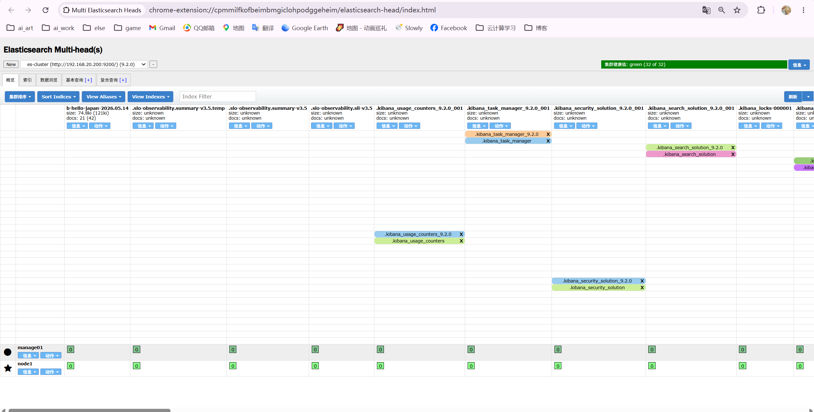

## kibana 链接 ES

Kibana 链接 Elasticsearch（ES）的核心是通过配置 ES 地址建立通信，实现数据可视化与管理。

确保ES、Kafka、logstash、filebeat、kibana全部启动

访问http://192.168.20.200:5601/


可以看到成功打通

选择匹配刚刚测试的源

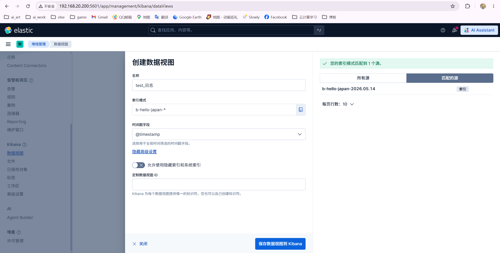

保存后返回

可以看到我们测试的日志

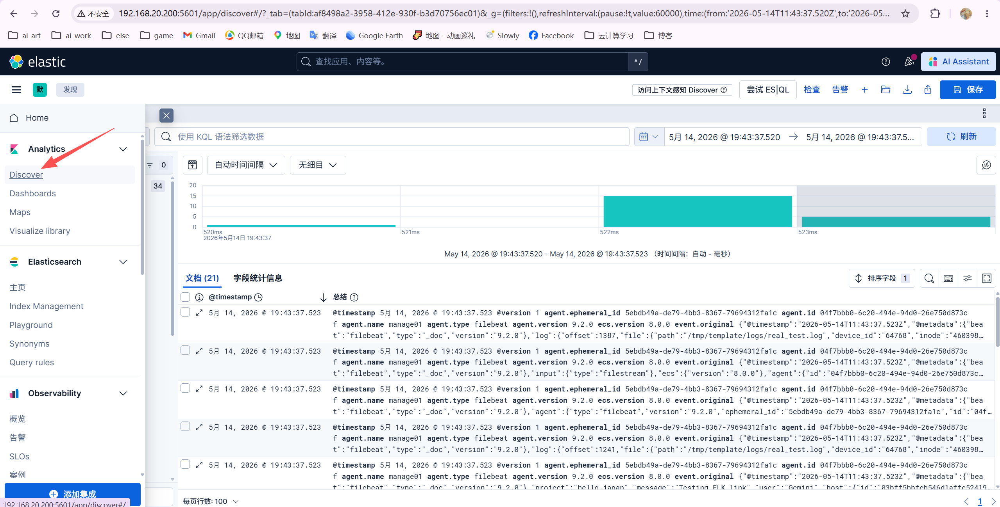

## Logstash收集不同的项目日志

>logstash 的官方文档：https://www.elastic.co/docs/reference/logstash/plugins/plugins-outputs-elasticsearch