## hugo搭建博客

### 下载hugo11

[官网](https://gohugo.io/)

#### 官网页面点击进入`GitHub`

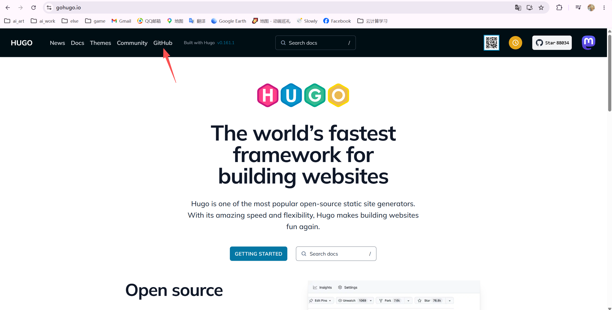

#### 点击进入`Tags`

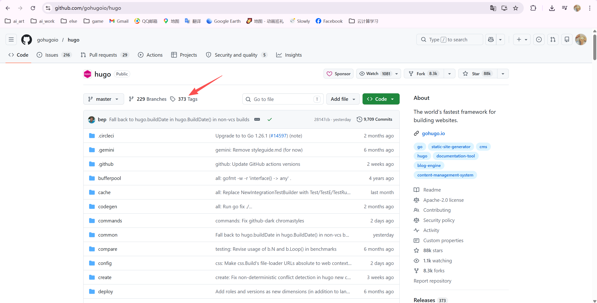

#### 选择最新版进入

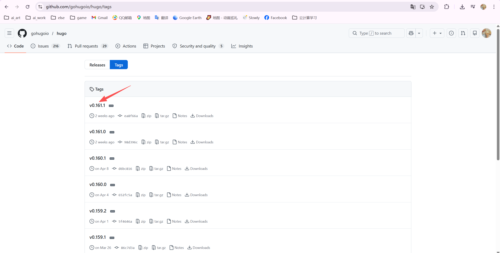

#### 选择对应版本下载压缩包

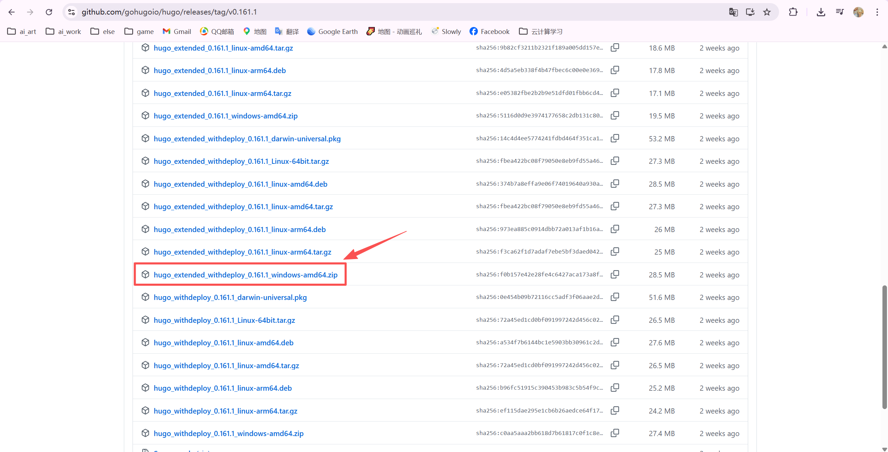

### 搭建基础

#### 初始化

进入解压后目录，输入`cmd`

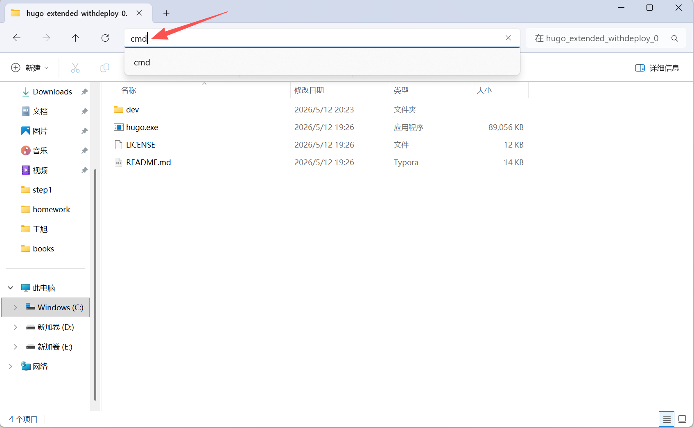

初始化目录

```bash
hugo new site [自定义目录] 这里我使用了dev
```

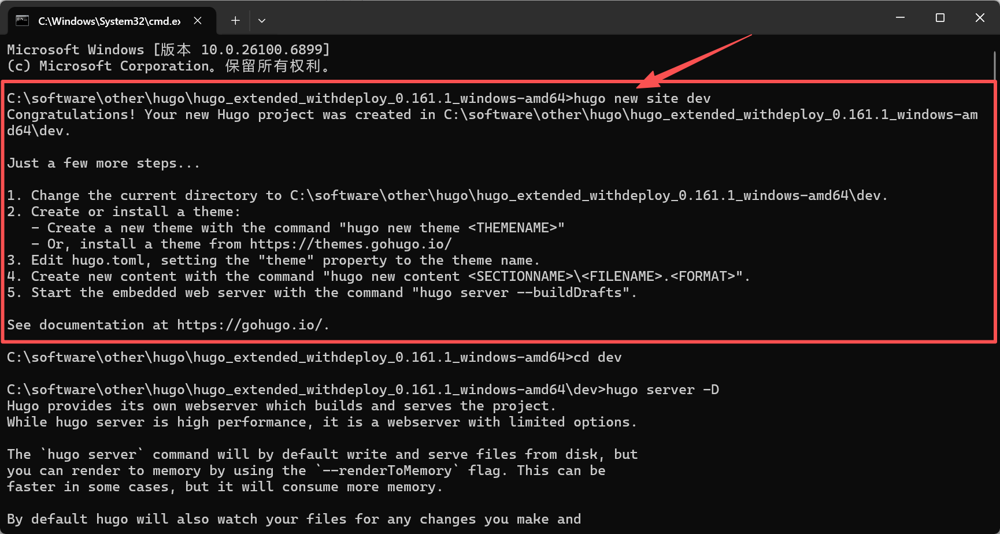

切换到自定义目录下

```bash
cd dev
```

> [!NOTE]
>
> **注意：接下来的所有命令都必须在这个 `dev` 文件夹下运行。**

#### 下载主题

进入[官网](https://gohugo.io/)点击`Themes`

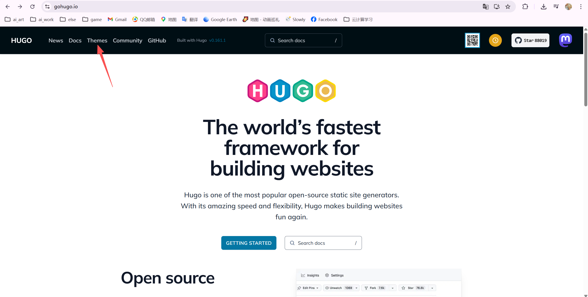

选择喜欢的主题进行下载，这里我选择了`stack`

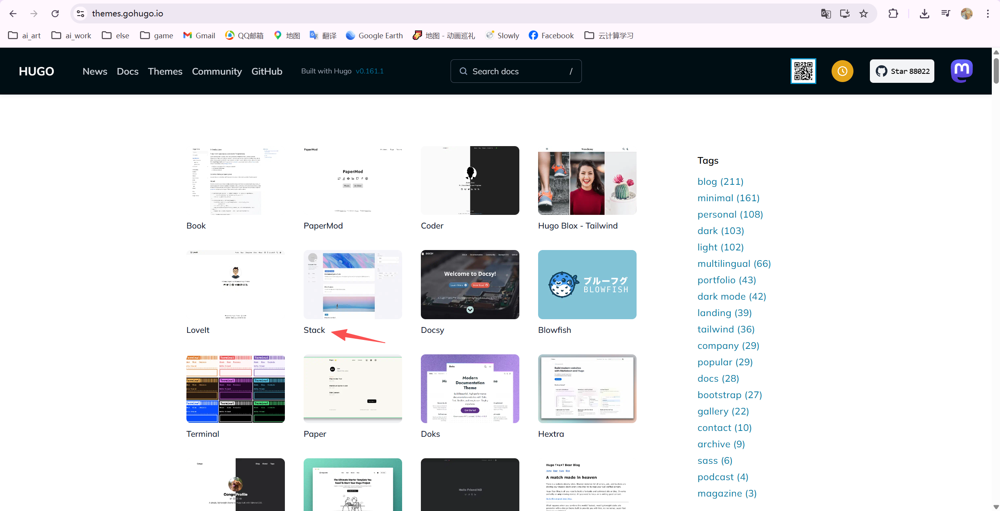

点击`download`

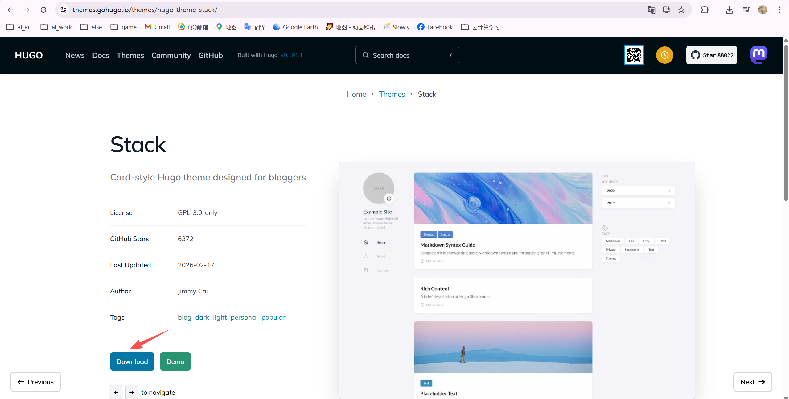

点击`Tags`

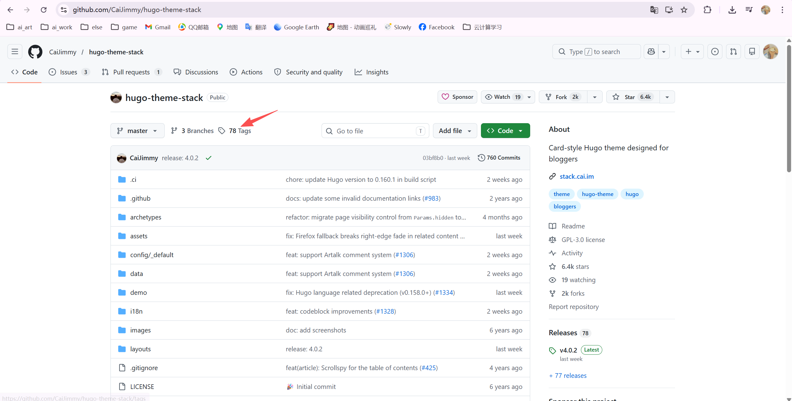

选择最新版

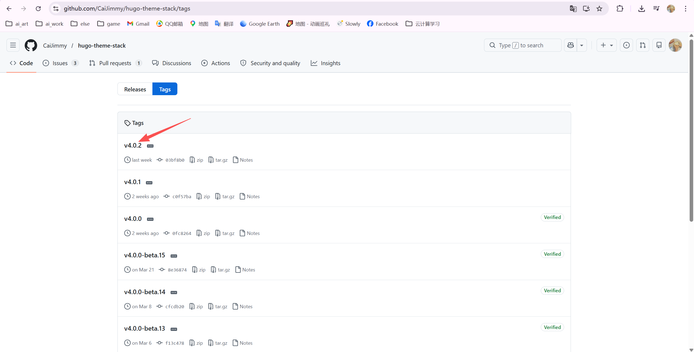

下载

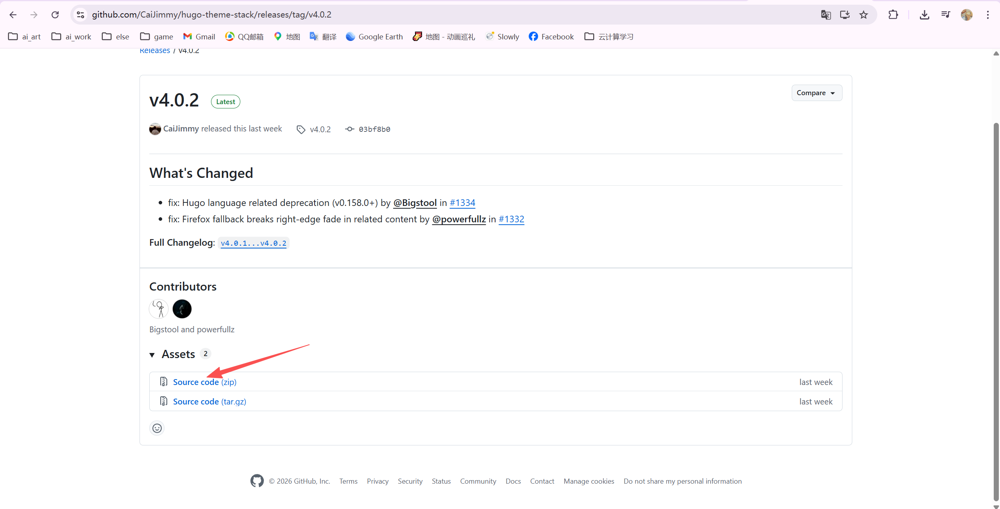

#### 配置主题

**第一步：同步配置文件（关键）**

- 找到你下载的 `hugo-theme-stack-4.0.2.zip`。
- 解压它，你会得到一个名为 `hugo-theme-stack-4.0.2` 的文件夹。
- 将这个文件夹重命名为 **`hugo-theme-stack`**（为了后续配置方便）。
- 将该文件夹移动到你项目的 **`themes`** 文件夹内。
  - 路径看起来应该是：`C:\...\dev\themes\hugo-theme-stack\`


进入 `dev\themes\hugo-theme-stack\demo` 文件夹。

将 `content` 文件夹复制到你的项目根目录 `dev\` 下。

**最重要的一步**：

- 删掉你 `dev` 根目录下的 `hugo.toml`。
- 将 `dev\themes\hugo-theme-stack\` 目录下的 **`config` 文件夹** 整个复制到你的项目根目录 **`dev\`** 下。
- 将 `dev\themes\hugo-theme-stack\` 目录下的 **`go.mod`** 文件也复制到项目根目录 **`dev\`** 下。

此时你的项目根目录 `dev` 应该长这样：

- `config/` (从主题挪过来的文件夹)
- `content/` (文章)
- `themes/`
- `go.mod`
- ...其他文件


**第二步：修改项目配置**

打开 `dev\config\_default\hugo.toml`，在文件顶部（或者任何地方）确保有以下这一行：

```ini
theme = "hugo-theme-stack"
```

同样在 `dev\config\_default\hugo.toml` 里，找到 `baseURL` 这一行。 为了本地预览正常，请将其修改为：

```ini
baseURL = "http://localhost:1313/"
```

示例修改

```ini
# 这里的地址改成本地预览地址，或者你的未来域名
baseURL = "http://localhost:1313/"
locale = "zh"  # 建议改为中文
title = "我的个人博客" # 改成你喜欢的名字

# 设置为 true，这样中文文章的字数统计才准确
hasCJKLanguage = true

# 核心修改：直接指定本地主题文件夹名称
theme = "hugo-theme-stack"

# 以下保持原样或按需修改
defaultContentLanguage = "zh"

[pagination]
    pagerSize = 5

[permalinks]
    post = "/p/:slug/"
    page = "/:slug/"
    
    
    redis-cli --cluster create \
  192.168.20.81:7000 192.168.20.81:7001 192.168.20.81:7002 \
  192.168.20.81:7003 192.168.20.81:7004 192.168.20.81:7005 \
  --cluster-replicas 1 \
  -a Chen123456!
```

#### 启动

回到 CMD，确保在 `dev` 目录下，运行：

```bash
hugo server -D
```

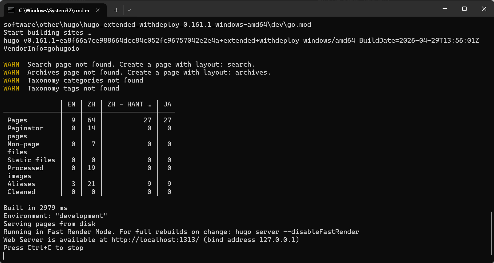

打开 http://localhost:1313/

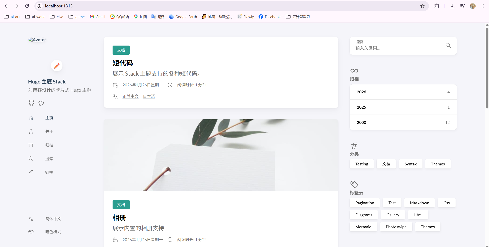


