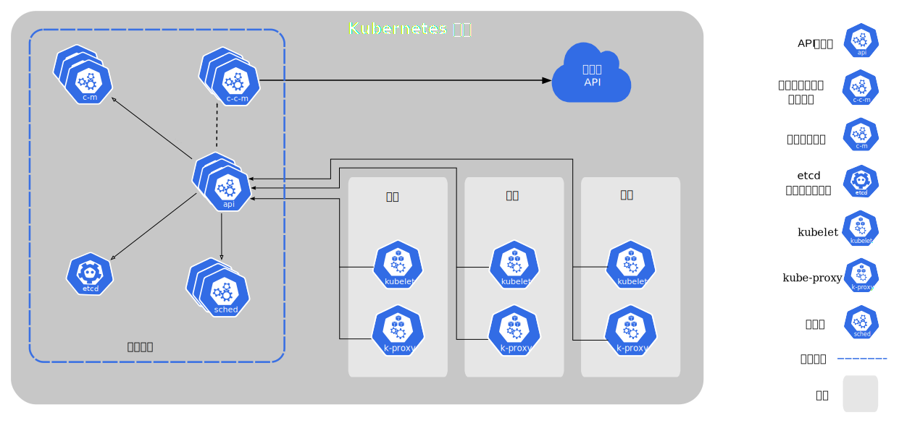
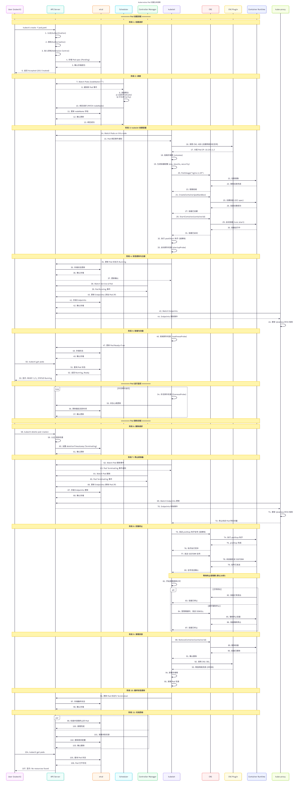

## **K8S 最小单元POD**

k8s架构



在k8s集群中，节点分为：控制台节点master、一个是工作节 点node，

- 其中master中包含apiserver、etcd、controllermanager、scheduler 、kubelet、kebue_proxy
- node节点包含 kubelet、kebue_proxy 、Docker 

控制平面组件

控制平面是集群的“大脑”，负责全局决策。它通常运行在集群的主节点上。

| **组件名称**           | **核心职责（做什么）**                                       | **关键技术点（怎么做）**                                     |
| ---------------------- | ------------------------------------------------------------ | ------------------------------------------------------------ |
| **etcd**               | 1. 存储集群所有状态与配置（唯一数据源） 2. 提供高可用、强一致性的键值存储 | 1. **Raft 算法**（保证一致性） 2. **Watch 机制**（数据变更实时推送） 3. TLS 加密与数据持久化 |
| **API Server**         | 1. 集群的**唯一访问入口**，处理 REST 请求 2. 负责安全校验（认证、授权、准入控制） 3. 协调其他组件，作为它们交互的枢纽 | 1. 认证/授权机制（如 **RBAC**） 2. **准入控制器**（Mutating/Validating） 3. 支持高效的 **Watch 长连接** |
| **Scheduler**          | 1. 监听未绑定的 Pod，决定将其分配到哪个最佳 Node             | 1. 调度两步法：**过滤**（筛选）与 **打分**（排序） 2. 调度规则：**亲和性/反亲和性**、**污点与容忍** |
| **Controller Manager** | 1. 运行各类控制器，维护集群**期望状态**与**实际状态**的一致（实现自愈） | 1. **控制循环（Control Loop）**：观察 -> 对比 -> 行动 2. 核心控制器：Deployment、Node、Endpoints 等 3. **Informer 机制**（本地缓存，减轻 API Server 压力） |

工作节点组件

| **组件名称**                        | **核心职责（做什么）**                                       | **关键技术点（怎么做）**                                     |
| ----------------------------------- | ------------------------------------------------------------ | ------------------------------------------------------------ |
| **kubelet**                         | 1. 节点上的“大管家”，负责 **Pod 生命周期全管理**（创建、监控、销毁） 2. 挂载存储卷，执行 Hook（postStart/preStop） 3. 定期向 API Server 上报节点和 Pod 的健康状态 | 1. **探针机制**：**Liveness**（存活）、**Readiness**（就绪）、**Startup**（启动） 2. 通过 **CRI（gRPC）** 驱动底层容器运行时 3. 存储卷（Volume）的本地挂载与管理 |
| **kube-proxy**                      | 1. 节点上的“网络代理”，负责 **Service 流量转发与负载均衡** 2. 实时同步 Service 和 Endpoints 的变化并更新本地网络规则 | 1. **两种工作模式**： - **iptables**：纯内核态，规则随规模增大性能会下降 - **IPVS**：支持高效负载均衡算法，适合大规模集群 2. 自动剔除异常 Pod 的转发规则 |
| **CNI 插件** *(如 Calico/Flannel)*  | 1. 负责为 Pod 创建网络命名空间并**分配集群唯一 IP** 2. 实现 Pod 间、Pod 与外网的互通，支持网络策略 | 1. **CNI 规范操作**：核心是 **ADD**（创建网络与分配 IP） 2. **主流实现**：**Flannel**（大二层，简单）与 **Calico**（三层路由，支持 NetworkPolicy 策略） |
| **CRI / containerd** *(容器运行时)* | 1. 实现 CRI 标准接口，解耦 K8s 与底层容器 2. **管理容器与镜像**：拉取镜像，创建/启停容器 3. 为 Pod 创建隔离的底层运行环境（**Pod 沙箱**） | 1. **Pod Sandbox**：为同一个 Pod 内的容器共享网络（Network Namespace）和存储 2. **兼容 OCI 规范**：底层调用 **runc** 真正跑容器 3. **OverlayFS**：主流的快照驱动，实现镜像分层的高效复用 |

### 什么是POD？

**通俗话术理解**：Pod就像一个"豌豆荚"，里面可以放多个"豆子"（容器）。每个豌豆荚代表一个逻辑主机，里面的豆子（容器）共享豌豆荚的资源，就像在同一台虚拟机上运行的进程一样。

**专业技术性话术理解**：Pod是Kubernetes中的最小调度单元，可以封装一个或多个容器。Pod中的容器共享网络命名空间、存储卷和IP地址空间。Pod需要被调度到集群的工作节点上运行，具体的调度决策由Scheduler调度 器完成。

### 举例-将nginx部署到k8s的pod中去

#### 创建Pod资源清单文件

```bash
# 创建Pod配置文件
vim pod-nginx.yaml
```

```yaml
apiVersion: v1				# API版本：指定使用Kubernetes的v1 API版本
kind: Pod				# 资源类型：创建一个Pod类型的资源对象
metadata:				# 元数据：定义资源的标识信息
  name: nginx-test			# Pod名称：指定这个Pod的名称为nginx-test
  namespace: default			# 命名空间：将Pod创建在default命名空间中
  labels:				# 标签：定义Pod的标签信息，用于标识和选择器
    app: nginx				# 标签键值对：app=nginx，表示这是一个nginx应用
spec:					# 规范：定义Pod的具体配置
  containers:				# 容器列表：定义Pod中包含的容器
  - name: nginx			# 容器名称：指定第一个容器的名称为nginx
    ports:				# 端口配置：定义容器暴露的端口
    - containerPort: 80		# 容器端口：指定容器监听80端口（HTTP默认端口）
    image: nginx:latest		# 镜像：使用nginx:latest镜像启动容器
    imagePullPolicy: IfNotPresent	# 镜像拉取策略：
                                  	# IfNotPresent - 本地不存在镜像时才从仓库拉取
                                  	# Always - 每次启动容器都重新拉取镜像
                                  	# Never - 从不拉取镜像，只使用本地镜像
```

#### 创建Pod

```bash
# 发布创建pod
kubectl apply -f pod-nginx.yaml

# 查看Pod状态
kubectl get pods -o wide -l app=nginx
```

## **创建完整pod过程**

### 客户端请求与认证阶段

- **读取配置与寻址：** `kubectl` 自动寻找本地的 `kubeconfig` 文件，获取其中定义的用户凭证和集群地址，从而定位到集群的 **API Server**。
- **提交请求：** `kubectl` 解析 `.yaml` 文件，并向 API Server 发送一个 `POST` 请求，申请创建该 Pod。

### API Server 处理与持久化阶段

- **校验与写入：** API Server 接收到请求后，对请求进行认证、鉴权和准入控制（Admission Control）。验证无误后，将 Pod 的属性信息（Metadata 与 Spec）写入 **etcd** 进行持久化。
- **触发 Watch：** 一旦写入 etcd 成功，API Server 就会通过其核心的 **Watch 机制** 向外广播这个新 Pod 的创建事件。

### Scheduler 调度阶段

- **监听新 Pod：** **kube-scheduler（调度器）** 一直在 Watch API Server。发现有一个新创建、但 `nodeName` 为空的 Pod 后，将其捞起。
- **计算与选择：** 调度器运行其调度算法（预选过滤和优选打分），在集群中挑选出一个最合适的 **Node（节点）**。
- **绑定返回：** 调度器将选中的 Node 信息（Binding 对象）提交给 API Server。API Server 再次将这个“Pod 与 Node 的绑定关系”写入 **etcd**。

### Kubelet 落地与容器运行时阶段

- **监听属于自己的任务：** 目标 Node 上的 **kubelet** 通过 Watch 机制发现有一个 Pod 已经被分配到了自己所在的节点。
- **调用 Runtime 创建：** kubelet 本身不直接运行容器，它会通过 CRI（容器运行时接口）调用本地的 **容器运行时（如 Containerd、Docker）** 来下载镜像、创建并启动 nginx 容器。
- **状态上报：** 容器启动成功后，容器运行时将结果反馈给 kubelet。kubelet 收集到 Pod 的最新状态信息（Status），将其上报给 API Server。
- **最终持久化：** API Server 将 Pod 的最新状态（如 Running）写入 **etcd**。至此，Pod 创建流程完美闭环。

## **Pod 生命周期管理**

### Pod生命周期核心概念

Pod从开始创建到终止退出的时间范围称为Pod生命周期，包含以下重要流程：创建基础容器、初始化容器、容器启动后钩子、健康探测、就绪性探测、容器停止前钩子、容器结束。

### 其中Pod状态管理

Pod在整个生命周期过程中会处于以下几个状态： 

1. Pending（待处理）： 创建了Pod资源并存入etcd中，但尚未完成调度 
2. ContainerCreating（容器创建中）： Pod的调度完成，被分配到指定Node上，处于容器创建过程中 
3. Running（运行中）： Pod包含的所有容器都已经成功创建，并且成功运行起来 
4. Succeeded（成功）： Pod中的所有容器都已经成功终止并且不会被重启 
5. Failed（失败）： 所有容器都已经终止，但至少有一个容器终止失败 
6. Unknown（未知）： 因为某些原因无法取得Pod的状态

### Pod生命周期重要行为

#### 基础容器创建（Pause Container）

- **核心作用**：作为 Pod 的**环境初始化容器**，为 Pod 内所有业务容器提供共享的命名空间（网络、UTS、IPC 等），保证 Pod 内容器的资源隔离与互通。
- **运行时机**：启动 Pod 内任何业务容器**之前**，由容器运行时（如 containerd）自动创建。
- **特性**：轻量级、长期运行，不执行业务逻辑，仅维持 Pod 的命名空间存在。

#### 初始化容器（InitContainer）

- **定义**：Pod 中可以配置**任意数量**的初始化容器，与主容器分离。

- **执行规则**

  - **顺序执行**：严格按照配置文件中的顺序依次运行，前一个 InitContainer 执行成功后，才会启动下一个。

  - **全量成功**：只有**所有 InitContainer 执行完毕且成功退出**，才会启动 Pod 内的主容器。

  - **作用域**：针对**整个 Pod**，用于完成主容器启动前的前置任务（如配置拉取、依赖检查、服务预热）。

#### 生命周期钩子

Pod 支持为**每个容器**单独定义生命周期钩子，在容器生命周期的特定阶段触发自定义操作，与 InitContainer（作用于 Pod）的作用域不同。

| **钩子类型**  | **触发时机**               | **作用**                                             |
| ------------- | -------------------------- | ---------------------------------------------------- |
| **postStart** | 容器**创建完成后**立即触发 | 执行容器启动后的初始化操作（如注册服务、日志初始化） |
| **preStop**   | 容器**终止前**触发         | 执行容器退出前的清理操作（如数据备份、连接关闭）     |

#### 生命周期钩子类型

生命周期钩子总共有4中类型，分别是：exec、tcpSocket、httpGet、sleep

- exec ：是在容器终止之前执行命令
- tcpSocket：是在容器终止之前进行端口探测
- httpGet：是在容器终止之前进行一次 HTTP 访问
- sleep : 在容器终止之前，睡眠一段时间

#### 容器健康探测

通过三种探测机制诊断 Pod 及容器的健康状态，保障业务可用性，探测规则可针对**单个容器**配置。

| **探测类型**                     | **核心作用**                   | **失败处理**                                                 |
| -------------------------------- | ------------------------------ | ------------------------------------------------------------ |
| **StartupProbe（启动探测）**     | 判断容器内应用是否**完全启动** | 探测失败时，根据重启策略重启容器                             |
| **LivenessProbe（存活性探测）**  | 判断容器是否**正常运行**       | 探测失败时，触发容器重启                                     |
| **ReadinessProbe（就绪性探测）** | 判断容器是否**可以接收请求**   | 探测失败时，将 Pod 从 Service Endpoints 中移除，停止流量转发 |

#### 探针的类型

探针的类型总共有 4 种，分别是：httpGet、exec、tcpSocket、grpc。

- httpGet 是通过 HTTP 的方式，进行访问来探测服务是否正常。
- exec 是通过执行某个shell命令，如果命令执行然会的状态码是 0 ；则证明探测的服务正常。
- tcpSocket 是通过 telnet 的方式，探测端口是否正常从而证明服务是否正常。
- grpc 是通过 grpc 协议，探测相关服务是否正常。

#### 容器重启策略

定义 Pod 内容器终止后的重启规则，作用于**整个 Pod 内的所有容器**，是 Pod 的级别的配置，默认值为 `Always`。

| **策略类型**       | **触发条件**                          | **适用场景**                       |
| ------------------ | ------------------------------------- | ---------------------------------- |
| **Always（默认）** | 容器无论因何种原因终止（正常 / 异常） | 无状态服务、需要持续运行的守护进程 |
| **OnFailure**      | 仅当容器**异常退出**（退出码非 0）    | 一次性任务、批处理作业             |
| **Never**          | 容器终止后**永不重启**                | 测试类 Pod、一次性执行的任务       |

#### Pod 终止过程

Pod 终止是一个有序的优雅流程，核心步骤如下：

1. **接收删除请求**：用户执行 `kubectl delete pod` 或控制器触发 Pod 删除。
2. **标记终止状态**：API Server 为 Pod 设置 `deletionTimestamp`，Pod 状态变为 `Terminating`。
3. **移出服务端点**：Endpoints Controller 移除该 Pod 的 IP 地址，kube-proxy 更新转发规则，停止流量流入。
4. **执行 preStop 钩子**：kubelet 调用容器的 `preStop` 钩子，执行清理操作。
5. **发送终止信号**：kubelet 向容器发送 `SIGTERM` 信号，通知容器优雅退出。
6. **等待宽限期**：等待 Pod 定义的 `terminationGracePeriodSeconds`（默认 30 秒）。
7. **强制终止**：若宽限期内容器未退出，kubelet 发送 `SIGKILL` 信号强制终止容器。
8. **清理资源**：kubelet 清理容器、网络、存储等资源，更新 Pod 状态为 `Terminated`，最终由垃圾回收器删除 Pod 对象。

#### Pod 完整生命周期过程



## **K8S名称空间和资源配额**

### 命名空间（Namespace）概述

在 Kubernetes（以及 Linux 底层）中，**Namespace（命名空间）** 的核心作用就是：**隔离**。

如果把一个 Kubernetes 集群比作一栋**大型办公楼**，那么 Namespace 就是楼里划分出来的**独立办公室**。不同办公室之间互不干扰，从而实现对资源的高效管理和安全隔离。

我们可以从以下四个方面来理解它的具体作用：

#### 1. 多租户与团队隔离（资源切分）

在一个公司里，可能有很多团队（如开发、测试、生产，或者 A 业务线、B 业务线）共用同一个 K8s 集群。

- **作用：** 通过为每个团队分配一个独立的 Namespace（如 `dev`、`test`、`prod`），可以让各团队在自己的“地盘”里部署应用，**互不影响**。
- **效果：** 开发团队在 `dev` 空间里怎么折腾，都不会影响到 `prod` 空间里的线上生产业务。

#### 2. 避免命名冲突（名字空间）

K8s 要求在同一个空间内，资源的名称必须是唯一的（比如不能有两个叫 `nginx-service` 的服务）。

- **作用：** Namespace 提供了名称作用域的隔离。
- **效果：** 你可以在 `dev` 空间里建一个 `nginx` Pod，同时也可以在 `test` 空间里建一个一模一样的 `nginx` Pod，它们同名同姓但互不冲突。

#### 3. 资源配额限制（防止占满集群）

如果没有限制，某一个跑偏的测试服务可能会疯狂消耗 CPU 和内存，把整个集群的资源全部吃光，导致其他重要业务崩溃。

- **作用：** 管理员可以针对不同的 Namespace 设置 **ResourceQuota（资源配额）**。
- **效果：** 比如给 `dev` 空间限制最多使用 10 核 CPU 和 20G 内存。一旦超过这个界限，开发空间就无法再创建新资源，从而保护了集群其他空间的稳定性。

#### 4. 安全与权限控制（谁能干什么）

配合 K8s 的 RBAC（基于角色的权限控制），可以实现非常精细的安全管理。

- **作用：** 权限可以绑定在特定的 Namespace 上。
- **效果：** 你可以给前端开发人员分配 `dev` 空间的“管理员”权限，但只给他们 `prod` 空间的“只读”权限（只能看日志，不能改配置），从而极大地提升了集群的安全性。

> [!CAUTION]
>
> 注意：Namespace 隔离的局限性
>
> Namespace 属于 **逻辑隔离**，而不是物理隔离。

**网络默认互通：** 在默认情况下，不同 Namespace 之间的 Pod 仍然是通过 IP 互相通信的（如果要彻底切断，需要配置网络策略 Network Policy）。

**不隔离底层资源：** 底层的节点（Node）、存储卷（PersistentVolume）和集群角色（ClusterRole）等是全局共享的，不属于任何 Namespace。

### Kubernetes YAML 配置示例

将以下内容保存为 `namespace-demo.yaml`

```yaml
# ==========================================
# 1. 定义一个名为 "dev-team" 的命名空间
# ==========================================
apiVersion: v1
kind: Namespace
metadata:
  name: dev-team      # 空间的名字，后续所有资源都分配在这里
  labels:
    env: development  # 给空间打上标签，方便过滤和做网络隔离

---

# ==========================================
# 2. 为这个命名空间设置资源配额（ResourceQuota）
# ==========================================
apiVersion: v1
kind: ResourceQuota
metadata:
  name: dev-quota
  namespace: dev-team # 【核心】明确指定这个配额只在 dev-team 空间生效
spec:
  hard:
    pods: "4"         # 该空间内最多只能同时运行 4 个 Pod
    requests.cpu: "2" # 该空间所有 Pod 申请的 CPU 总和不能超过 2 核
    requests.memory: 4Gi # 申请的内存总和不能超过 4GB
    limits.cpu: "4"   # 该空间最多能撑满的 CPU 上限
    limits.memory: 8Gi # 最多能撑满的内存上限

---

# ==========================================
# 3. 在该命名空间下部署一个 Nginx 应用
# ==========================================
apiVersion: apps/v1
kind: Deployment
metadata:
  name: nginx-app
  namespace: dev-team # 【核心】明确指定将这个应用部署到 dev-team 空间
spec:
  replicas: 2         # 启动 2 个副本（未超过配额限制的 4 个）
  selector:
    matchLabels:
      app: nginx
  template:
    metadata:
      labels:
        app: nginx
    spec:
      containers:
      - name: nginx
        image: nginx:1.25-alpine
        ports:
        - containerPort: 80
        resources:
          # K8s 要求：一旦空间配置了 ResourceQuota，
          # 空间下的 Pod 必须明确写出资源申请（requests/limits），否则会被拒绝创建！
          requests:
            memory: "256Mi"
            cpu: "200m"
          limits:
            memory: "512Mi"
            cpu: "500m"
```

**一键创建所有资源：**

```bash
kubectl apply -f namespace-demo.yaml
```

**查看你刚创建的 Namespace：**

```Bash
kubectl get ns
```

**【关键】查看特定 Namespace 下的资源：** 如果你直接运行 `kubectl get pods`，你会发现**什么都看不到**（因为 K8s 默认看的是 `default` 空间）。你必须加上 `-n` 参数指定空间：

```Bash
kubectl get pods -n dev-team
```

**查看该空间下的资源消耗和配额情况：**

```Bash
kubectl describe quota dev-quota -n dev-team
```

你会看到类似下面的表格，清晰地显示了当前 `dev-team` 空间用了多少资源，还剩多少：

```Plaintext
Resource        Used   Hard
--------        ----   ----
pods            2      4
requests.cpu    400m   2
requests.memory 512Mi  4Gi
limits.cpu      1      4
limits.memory   1Gi    8Gi
```

## **POD：亲和性、污点、容忍度的多种调度策略**

在 Kubernetes 中，将 Pod 调度到指定的节点（Node）上是生产环境中非常常见的需求。K8s 提供了多种机制来实现这一功能。

### nodeName：最直接的“强行绑定”

`nodeName` 是最简单的调度方式。你直接在 YAML 中写死目标节点的名称，Pod 就会跳过所有的调度算法和 Scheduler（调度器），直接由该节点上的 `kubelet` 接管并运行。

- **工作原理：** **跳过调度器**。即使目标节点资源满了、或者有污点（Taint），Pod 也会强行调度过去（如果节点故障，Pod 就会一直处于 Error 或 Pending 状态）。
- **适用场景：** 通常用于测试、开发环境，或者写 K8s 内部组件（如 DaemonSet）时，非常不建议在生产环境的普通业务中使用。

YAML 示例：

```yaml
apiVersion: v1
kind: Pod
metadata:
  name: nodename-demo
spec:
  nodeName: k8s-node-02 # 【核心】直接写死节点名称，必须与 kubectl get nodes 看到的名称完全一致
  containers:
  - name: nginx
    image: nginx:1.25-alpine
```

### nodeSelector：基于标签的“硬性筛选”

`nodeSelector` 是早期的、最经典的**标签选择器**。它要求节点必须具备某些特殊的键值对标签（Label），Pod 才会调度过去。

- **工作原理：** **硬性过滤（Must 关系）**。调度器在调度时，会检查哪些 Node 拥有 Pod 指定的标签。如果找不到满足条件的 Node，Pod 就会一直处于 `Pending` 状态。
- **使用步骤：**
  1. 先给节点打标签：`kubectl label nodes k8s-node-01 disk=ssd`
  2. 在 Pod 中配置 `nodeSelector` 匹配该标签。

**YAML 示例：**

```yaml
apiVersion: v1
kind: Pod
metadata:
  name: nodeselector-demo
spec:
  nodeSelector:
    disk: ssd      # 【核心】要求节点必须有 disk=ssd 这个标签
    gpu: "true"    # 可以写多个条件，节点必须同时满足（And 关系）
  containers:
  - name: nginx
    image: nginx:1.25-alpine
```

### 高级标签方法：节点亲和性（Node Affinity）

虽然 `nodeSelector` 很好用，但它太死板了（只有“必须满足”和“不满足”两种情况）。为了实现更复杂的调度逻辑，K8s 引入了 **Node Affinity（节点亲和性）**。

节点亲和性分为两种硬度：

- **硬亲和性（Required...）：** 必须满足，等同于增强版的 `nodeSelector`。
- **软亲和性（Preferred...）：** 尽量满足。如果满足最好；如果不满足，调度器会妥协，找一个普通节点让 Pod 也能运行（**不会 Pending**）。

此外，它还支持丰富的操作符（如 `In`, `NotIn`, `Exists`, `DoesNotExist`），而不像 `nodeSelector` 只能写等号。

**示例 A：硬亲和性（必须在 SSD 或 10G 网卡的节点上）**

```yaml
apiVersion: v1
kind: Pod
metadata:
  name: affinity-required-demo
spec:
  affinity:
    nodeAffinity:
      requiredDuringSchedulingIgnoredDuringExecution: # 【硬限制】
        nodeSelectorTerms:
        - matchExpressions:
          - key: disk-type
            operator: In # 支持 In 操作符，表示值在列表中即可
            values:
            - ssd
            - nvme
```

**示例 B：软亲和性（优先调度到有 GPU 的节点，没有也行）**

```yaml
apiVersion: v1
kind: Pod
metadata:
  name: affinity-preferred-demo
spec:
  affinity:
    nodeAffinity:
      preferredDuringSchedulingIgnoredDuringExecution: # 【软限制】
      - weight: 80 # 权重 (1-100)，数字越大优先级越高
        preference:
          matchExpressions:
          - key: has-gpu
            operator: In
            values:
            - "true"
```

我们可以从 **Node（节点）** 和 **Pod（工作负载）** 两个完全不同的视角来看待和配置亲和性。

#### Node 角度：节点亲和性 (Node Affinity)

节点亲和性是以 **Pod 为中心，看中了哪个 Node 的标签**。它决定了 Pod 应该被调度到具有哪些特征的物理机或虚拟机上。

它主要分为两种规则强度：

1. **`requiredDuringSchedulingIgnoredDuringExecution`（硬策略）**：**必须**满足条件，否则 Pod 宁可处于 `Pending` 状态也绝不上岸。

2. **`preferredDuringSchedulingIgnoredDuringExecution`（软策略）**：**尽量**满足条件，如果有带这个标签的节点就优先去；如果没有，退而求其次，随便找个普通的节点也能运行。

   > *注：后缀 `IgnoredDuringExecution` 意味着：如果 Pod 已经运行在节点上了，此时节点的标签被管理员删改了，K8s 也**不会**把正在运行的 Pod 赶走。*

**典型应用场景**

- **硬件特殊需求**：某些大数据处理或 AI 训练的 Pod，必须调度到带有 `hardware-type=gpu` 标签的节点上（硬策略）。
- **业务环境隔离**：生产环境的 Pod 必须调度到 `env=production` 的节点上（硬策略）。
- **成本/偏好控制**：优先把服务部署到 SSD 硬盘的节点 `storage=ssd` 上，如果没有，普通机械硬盘 `storage=hdd` 也能接受（软策略，通过 `weight` 权重控制优先级）。

#### Pod 角度：Pod 亲和性与反亲和性

Pod 角度的亲和性则完全不同。**它不在乎 Node 叫什么、有什么硬件，它只在乎 Node 上目前已经运行了哪些 Pod**。

Pod 角度分为**亲和性（Affinity）和反亲和性（Anti-Affinity）**。同样，它们各自也支持硬策略和软策略。

**Pod 亲和性 (Pod Affinity)**

- **核心逻辑**：我想和某类 Pod **住在一起**（在同一个拓扑域）。
- **典型场景（就近看齐）**： 在微服务架构中，你的 **LNMP 环境**（Nginx 和 PHP-FPM）或者**应用与本地缓存**（如一个 Java 应用和它的专属 Redis）。因为它们之间有高频的网络调用，如果把它们调度到同一个机架、甚至同一个节点上，网络延迟会降到最低。
- **规则示例**：我要启动一个 `php-pod`，它的亲和性规则是：必须找到一个已经运行了 `app=nginx` 的节点，然后和它挤在一起。

**Pod 反亲和性 (Pod Anti-Affinity)**

- **核心逻辑**：我**不想**和某类 Pod 住在一起。
- **典型场景（分散避嫌）**：
  - **高可用防灾**：你的多副本服务（比如 3 个 Nginx 副本）。如果这 3 个副本都被调度到了同一台物理机上，一旦这台物理机宕机，服务就全线崩溃了。通过**反亲和性硬策略**，可以强制这 3 个副本分别落到不同的节点上。
  - **强占资源避让**：两个极其消耗 CPU/内存的大型大数据处理任务，不希望在一台机器上互相抢占资源。

#### 关键概念：什么是“拓扑域” (topologyKey)？

在配置 Pod 亲和性/反亲和性时，有一个必填参数叫 **`topologyKey`**。这是理解 Pod 亲和性的灵魂。

K8s 怎么定义“住在一起”或“不准住在一起”？

- 如果 `topologyKey: kubernetes.io/hostname`：这意味着**以单个“节点（Node）”为边界**。反亲和性代表不能在同一个 Node 上。
- 如果 `topologyKey: topology.kubernetes.io/zone`：这意味着**以“可用区（Zone/机房）”为边界**。反亲和性代表不能在同一个机房里，从而实现跨机房容灾。

#### 对比总结表格

| **维度**         | **节点亲和性 (Node Affinity)**                      | **Pod 亲和性 (Pod Affinity)**                                | **Pod 反亲和性 (Pod Anti-Affinity)**                     |
| ---------------- | --------------------------------------------------- | ------------------------------------------------------------ | -------------------------------------------------------- |
| **关注对象**     | 关注 **Node** 的标签                                | 关注 **邻居 Pod** 的标签                                     | 关注 **邻居 Pod** 的标签                                 |
| **核心目的**     | 把 Pod 调度到匹配的硬件/环境上。                    | 让有紧密通信关系的 Pod 挨在一起，降低网络时延。              | 让相同服务的不同副本分散开，实现高可用；或避免资源竞争。 |
| **常用匹配表达** | `In`, `NotIn`, `Exists`, `DoesNotExist`, `Gt`, `Lt` | `In`, `NotIn`, `Exists`, `DoesNotExist`                      | `In`, `NotIn`, `Exists`, `DoesNotExist`                  |
| **拓扑域限制**   | 不需要（直接面向 Node）                             | **必须**指定 `topologyKey`                                   | **必须**指定 `topologyKey`                               |
| **性能消耗**     | 极低（直接匹配 Node 属性）                          | **较高**。在大规模集群中，计算“谁和谁住一起”需要大量内存和 CPU，建议少用复杂的软策略。 | **较高**。在大规模集群中计算成本大。                     |

在实际编写部署架构时，通常会组合使用。比如：通过 **Node 亲和性** 让业务落到生产环境节点，再通过 **Pod 反亲和性** 让服务的 3 个副本分散在不同的机架上，以此达到完美的合规性与高可用性。

### 污点与容忍度

如果说亲和性（Affinity）是 Pod 表达它的“喜爱”（我想去哪儿，我想和谁住一起），那么污点（Taint）和容忍度（Toleration）则是节点和 Pod 之间表达“排斥”与“接纳”的硬核机制。

它们的配合可以形象地理解为：

- **污点 (Taint)**：**节点**对 Pod 说：“我很特殊/我有某种问题，身上有‘恶臭’，一般人别来沾边！”
- **容忍度 (Toleration)**：**Pod** 对节点说：“没关系，我带了防毒面具，我能‘容忍’你身上的味道，让我进去！”

#### 污点 (Taint) —— 属于节点 (Node)

污点是人为或系统自动打在 **Node** 上的一个标签。一旦节点有了污点，除非 Pod 明确声明自己能够“容忍”这个污点，否则 K8s 调度器**绝对不会**把 Pod 调度到这个节点上。

一个污点由三个部分组成：`key=value:effect`。其中最核心的是 **效果（Effect）**，它决定了排斥的严厉程度，共有三种：

1. **`NoSchedule`（强排斥，影响调度）**
   - **含义**：如果 Pod 没有容忍度，**新 Pod** 绝不可能调度到该节点上。
   - **注意**：但如果节点打污点之前，上面已经运行了一些没有容忍度的老 Pod，这些老 Pod **不会**被赶走，会继续运行。
2. **`PreferNoSchedule`（软排斥，尽量别来）**
   - **含义**：K8s 会尽量避免把新 Pod 调度到这个节点上。但如果集群里其他节点资源全满了，实在没地方去，调度器最终还是可能会妥协，把 Pod 放过来。
3. **`NoExecute`（驱逐排斥，格杀勿论）**
   - **含义**：不仅**新 Pod** 无法调度上来，如果节点上**已经运行着的老 Pod** 没有配置相应的容忍度，会立刻被**无情地驱逐（驱逐到别的节点上重建）**。

#### 容忍度 (Toleration) —— 属于 Pod

容忍度是配置在 **Pod Spec** 中的属性。它赋予了 Pod 免疫特定污点的能力。

**语法结构**

在 Pod 的 YAML 中，容忍度的配置通常长这样：

```yaml
spec:
  tolerations:
    - key: "key1"
      operator: "Equal"   # 精确匹配：键和值必须完全相等
      value: "value1"
      effect: "NoSchedule"
```

或者使用 `Exists` 运算符（只要键存在即可，不在乎值是什么，相当于通配符）：

```yaml
spec:
  tolerations:
    - key: "key2"
      operator: "Exists"  # 只要节点带有 key2 这个污点键，管它值是多少，我都容忍
      effect: "NoExecute"
      tolerationSeconds: 3600 # 遭遇 NoExecute 污点时，允许我在被赶走前继续苟活 1 小时
```

#### 典型生产应用场景

污点和容忍度在 K8s 集群运维中扮演着非常关键的底层角色：

1. **独占节点 / 专用节点 (Dedicated Nodes)**

如果你在集群里买了几台带 GPU 的高配机器，专门给大数据分析或 AI 团队用，不希望普通的小 Web 微服务跑过来抢占资源。

- **做法**：给 GPU 节点打上污点：`kubectl taint nodes node-gpu hardware=gpu:NoSchedule`。
- **结果**：普通的 Pod 全被挡在门外。只有大数据团队的 Pod 在 YAML 里写了 `tolerations` 容忍了这个污点，才能调度上去。

2. **控制平面节点的自我保护 (Master / Control Plane Isolation)**

你之前用 `kubectl get nodes` 看到过 `k8s-master` 节点。你有没有发现，平时你随便创建一个 Pod，它**从来不会**被调度到 Master 节点上？

- **底层原理**：K8s 部署成功后，默认就会给控制平面节点打上一个内置污点：`node-role.kubernetes.io/control-plane:NoSchedule`。
- **目的**：确保大脑的安全，防止普通的业务 Pod 把 Master 节点的 CPU 或内存撑爆导致整个集群瘫痪。

3. **基于节点状态的自动驱逐 (Taint-based Eviction)**

这是 K8s 极度智能的一面。当某个 Worker 节点突然断网（NotReady）、或者磁盘快满了（DiskPressure）时，K8s 的控制平面（Node Controller）会自动、动态地给这个节点打上特定的污点，例如 `node.kubernetes.io/unreachable:NoExecute`。

- **结果**：节点上一旦被打上这个内置污点，原本运行在上面的 Pod 就会被**立刻驱逐**，并在其他健康的正常节点上重新创建，从而实现了集群的**故障自愈**。

#### 亲和性与污点/容忍度的选择

- **亲和性 (Affinity)**：是 **Pod 的主动选择**。Pod 说：“我喜欢什么样的节点/我想去哪儿。”（属于**引力**）
- **污点与容忍度 (Taints and Tolerations)**：是 **节点的单向拒绝**。节点说：“不符合我要求的 Pod，通通给我滚开。”（属于**斥力**）

| **特性**       | **亲和性 (Affinity)**                      | **污点与容忍度 (Taints/Tolerations)**              |
| -------------- | ------------------------------------------ | -------------------------------------------------- |
| **配置主体**   | 全部写在 **Pod** 上。                      | 污点写在 **Node** 上，容忍度写在 **Pod** 上。      |
| **目的**       | 引导 Pod 倾向于去某个地方。                | 让节点能够排斥、宣告拒绝某些 Pod。                 |
| **运行期影响** | `IgnoredDuringExecution`（运行后不追溯）。 | `NoExecute` 效果可以在运行期**直接驱逐**已有 Pod。 |

在复杂的企业集群里，它们经常组合使用。例如：先用污点把普通 Pod 挡在 GPU 节点之外，再给 AI 业务的 Pod 加上容忍度以及 Node 亲和性，这样既保证了 GPU 节点不被污染，又确保了 AI 业务一定能精准命中 GPU 机器。