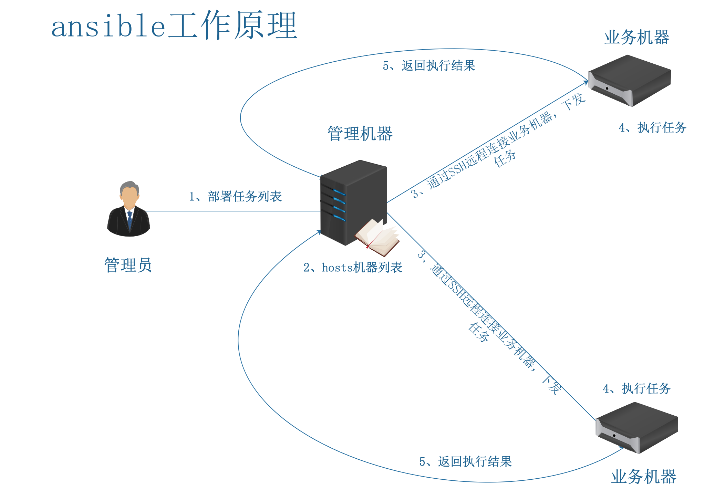
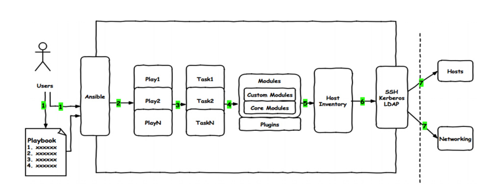

ansible是一种由Python开发的自动化运维工具，集合了众多运维工具（puppet、cfengine、chef、func、fabric）的优点，实现了批量系统配置、批量程序部署、批量运行命令等功能。**ansible是基于模块工作的，本身没有批量部署的能力**。**真正具有批量部署的是ansible所运行的模块，ansible只是提供一种框架**。主要包括：

1. 连接插件connection plugins：负责和被监控端实现通信；**ansible管理端和客户端基于ssh协议通信**
2. host inventory：指定操作的主机，是一个配置文件里面定义监控的主机；**提供主机管理列表，定义管理谁**
3. 各种模块核心模块、command模块、自定义模块；**提供了日常模块**
4. 借助于插件完成记录日志邮件等功能； **根据需求后续添加模块，邮件、日志模块**
5. playbook：剧本执行多个任务时，非必需可以让节点一次性运行多个任务。**一次发布多条指令给客户端**



## Ansible介绍

Ansible 是一款开源的无代理 IT 自动化工具，核心用于配置管理、应用部署和任务编排，无需在被控节点安装客户端，上手门槛低且兼容性强。

### 最关键的 3 个特点

- **无代理（Agentless）**：仅通过 SSH（Linux/Unix）或 WinRM（Windows）与被控节点通信，不用在目标机器装客户端，减少维护成本和系统占用。
- **声明式语法**：用 YAML 编写 “剧本（Playbook）”，描述 “最终要达到的状态”，而非一步步写执行脚本，比如 “确保 Nginx 已安装且启动”，无需关心中间步骤。
- **幂等性**：同一任务重复执行多次，结果始终一致，不会因重复操作导致系统异常（比如 “安装软件” 任务，已装过就不会再装）。

### Ansible的工作原理

Ansible 的工作原理可梳理为以下流程：

1. **发起任务**：用户登录管理机器，通过 Ansible 剧本或单行命令，针对业务机器组或单个机器部署任务。
2. **解析目标**：管理机器读取用户的部署任务后，依据自身 hosts 文件中定义的业务机器组，查找并确定对应的目标机器地址（IP 或域名）。
3. **下发任务**：管理机器通过 SSH 免密连接到目标业务机器，并将任务下发发至这些机器。
4. **执行任务**：业务机器接收任务后，按照指令执行相应操作。
5. **反馈结果**：业务机器将任务执行结果回传给 Ansible 管理机器，结果通过不同颜色区分状态：

- 绿色：表示任务执行后未发生变化
- 黄色：表示任务执行后更改生效
- 红色：表示任务执行过程中出现错误

## Ansible 安装

以下是 Ansible 的安装与部署步骤，适用于常见的 Linux 系统（以 Ubuntu 和 CentOS 为例），包括管理节点和被控节点的配置。

### 一、环境准备

Ansible 采用**C/S 架构**，但仅需在**管理节点**安装 Ansible，被控节点无需安装客户端，只需满足：

- 管理节点：Python 3.8+ 环境（Ansible 2.12+ 要求）
- 被控节点：
  - 开启 SSH 服务（默认 22 端口）
  - 允许管理节点通过 SSH 登录（密码或密钥认证）
  - 安装 Python 2.7 或 3.5+（部分模块依赖）

### 管理节点安装 Ansible

```bash
pip3 install ansible

yum install ansible
```

## Ansible 核心配置文件

Ansible 的配置文件用于定义全局行为（如 SSH 连接参数、日志级别、模块路径等），遵循 “优先级覆盖” 原则，优先级从高到低如下：

1. 执行命令时通过 `-c` 或 `ANSIBLE_CONFIG` 环境变量指定的配置文件；
2. 当前工作目录下的 `ansible.cfg`；
3. 用户家目录下的 `~/.ansible.cfg`；
4. 系统级默认配置 `/etc/ansible/ansible.cfg`（Ansible 安装后默认生成，可作为模板修改）。

### 常用配置

```bash
[root@localhost] ~ 12:47 $ cat /etc/ansible/ansible.cfg | grep -vE '^#|^\ *$'
# 这是 Ansible 的核心配置区块，用于定义全局默认参数，如默认 inventory 路径（inventory）、远程连接用户（remote_user）、主机密钥检查（host_key_checking）等。
[defaults]
# 用于配置主机清单（inventory）的相关参数，如动态清单脚本的缓存时间（cache_timeout）、清单变量的优先级（prefer_facts）等。
[inventory]
# 配置权限提升相关参数（如 sudo），例如是否默认启用权限提升（become）、提升方法（become_method）、目标用户（become_user）等。
[privilege_escalation]
# 配置基于 Paramiko 库的 SSH 连接参数（Ansible 早期的 SSH 连接方式，现在多使用系统原生 SSH）。
[paramiko_connection]
# 配置原生 SSH 连接的参数，如  SSH 控制持久连接（control_path）、连接超时（timeout）、并行连接数（pipelining）等。
[ssh_connection]
# 配置持久化连接的参数（用于加速多次任务执行时的连接复用），如连接超时时间（connect_timeout）。
[persistent_connection]
# 配置加速模式相关参数（Ansible 旧版本的加速功能，现已被更高效的连接方式替代）。
[accelerate]
# 配置与 SELinux 相关的参数，如是否自动处理 SELinux 上下文（selinux_ignore_errors）。
[selinux]
# 定义 Ansible 输出结果的颜色映射，如成功状态（green）、变更状态（yellow）、错误状态（red）的具体颜色值。
[colors]
# 配置文件内容对比（diff）的显示参数，如是否显示详细差异（always_show_diff）。
[diff]
```

- defaults：基础配置
  - inventory：【必要参数】默认主机清单文件位置，默认/etc/ansible/hosts
  - forks：任务执行时并发数，默认5
  - remote_port：默认远程连接端口，默认neno
  - roles_path：默认存放role目录，可使用`:`隔开写多个，默认`/roles:/usr/share/ansible/roles:/etc/ansible/roles`
  - executable：默认执行命令的shell，默认/bin/sh，可改为/bin/bash
  - module_name：默认执行命令的模块，默认command，可改为shell
  - gathering：主机信息采集策略，默认implicit，在执行playbook时会采集远程主机数据
    - implicit：除非执行playbook时设置`gather_facts: False`否则每次都采集
    - explicit：playbook中如果不要求采集则不会采集
    - smart：在同一个主机多次执行任务时，不会重复采集
  - fact_caching：使用那个缓存插件，默认memory
    - memory：内存
    - jsonfile：json文件
  - fact_caching_timeout：缓存超时时间默认86400s
  - fact_caching_connection：缓存数据的路径，默认none
  - host_key_checking：接远程主机检查主机密钥，设置为false不检查
- privilege_escalation：提权相关配置
  - become：是否允许提权，默认false
  - become_method：权限升级的方法，默认sudo
  - become_user：提权到那个用户，默认root
  - become_ask_pass：在执行提权时是否需要输入密码，默认false

例子：

```bash
[defaults]
inventory      = /etc/ansible/hosts
forks          = 5
remote_port    = 22
roles_path = /roles:/usr/share/ansible/roles:/etc/ansible/roles
gathering = smart
fact_caching_timeout = 600 
fact_caching = jsonfile
fact_caching_connection=/tmp
host_key_checking = false
executable = /bin/bash

[privilege_escalation]
become=True
become_method=sudo 
become_user=root
become_ask_pass=False
```

### 主机清单

Ansible 主机清单（Inventory）是定义 Ansible 管理的目标主机和组的配置文件，支持 INI 格式和 YAML 格式。它用于指定哪些主机或主机组需要执行 Ansible 任务。

#### 主机清单的核心概念

1. **主机（Hosts）**：可以是 IP 地址或主机名
2. **主机组（Groups）**：将多个主机归类，方便批量操作
3. **变量（Variables）**：可以为单个主机或整个组定义变量
4. **嵌套组**：组可以包含其他组

#### 清单文件格式

Ansible 支持两种主要格式：

- INI 格式（默认，简单直观）
- YAML 格式（更结构化，适合复杂配置）

#### 案例：INI 格式主机清单

```bash
# 简单主机定义（IP或主机名）
192.168.1.100
webserver.example.com

# 主机组定义（用方括号括起来）
[webservers]
web01.example.com
web02.example.com
192.168.1.101:2222  # 非默认SSH端口

[databases]
db01.example.com
db02.example.com

# 带变量的主机定义
[appservers]
app01.example.com ansible_user=admin ansible_port=2222
app02.example.com ansible_user=root

# 组变量
[webservers:vars]
ansible_user=www-data
http_port=80

[databases:vars]
db_port=3306
db_type=mysql

# 嵌套组（:children表示子组）
[production:children]
webservers
databases

[all:vars]
# 所有主机都生效的变量
ansible_connection=ssh
ansible_port=22
ansible_user=wang
ansible_password=123456
ansible_sudo_pass=123456
```

在 Ansible 主机清单中，`:vars` 和 `:children` 是两个特殊的关键字，用于扩展主机组的功能：

- `**:vars**`：为指定的主机组定义变量，这些变量会应用到该组内的所有主机
- `**:children**`：定义嵌套组（子组），允许将多个组归到一个父组下，便于批量操作

内置主机变量：

- ansible_host：远程连接的主机
- ansible_connection：远程连接方式linux一般都为ssh
- ansible_port：连接的端口ssh一般为22，如果没有变动可以不配置
- ansible_user：远程连接用户
- ansible_password：远程连接用户密码
- ansible_become_method：提权的方法一般为sudo
- ansible_become_user：sudo目标用户，一般为root
- ansible_become_password：远程执行sudo的密码

## Ansible相关命令

Ansible 是一款基于 Python 开发的**自动化运维工具**，核心功能包括批量执行命令、配置管理、应用部署、任务编排等，其命令体系围绕 “模块（Module）” 和 “剧本（Playbook）” 两大核心展开。以下将按**基础命令**、**核心功能命令**、**高级操作命令**和**辅助命令**四大类，详细介绍 Ansible 常用命令的用法、场景及示例。

### `ansible`

- **功能**：查看 Ansible 版本及核心配置信息（如配置文件路径、Python 版本、默认模块路径等）。
- **场景**：确认环境安装是否成功，或排查版本兼容性问题（如某些模块仅支持特定 Ansible 版本）。
- **示例：**

```bash
[root@localhost ~]# ansible --version
ansible 2.9.27
  config file = /etc/ansible/ansible.cfg
  configured module search path = [u'/root/.ansible/plugins/modules', u'/usr/share/ansible/plugins/modules']
  ansible python module location = /usr/lib/python2.7/site-packages/ansible
  executable location = /usr/bin/ansible
  python version = 2.7.5 (default, Nov 14 2023, 16:14:06) [GCC 4.8.5 20150623 (Red Hat 4.8.5-44)]
```

### `ansible-playbook`

- **功能**：执行 Ansible 剧本（Playbook），按顺序运行预定义的 “任务集”，实现复杂自动化（如多步骤部署、环境一致性配置）。
- **核心价值**：剧本是 “代码化的运维流程”，可版本控制（Git）、复用性强，支持条件判断、循环、变量等逻辑。

```yaml
ansible-playbook test.yml


# test.yaml 中的内容
# YAML文件开始标记，Ansible剧本通常以---开头
---
# 定义剧本名称，描述该剧本的主要功能
- name: 执行ping测试并安装必要工具
  # 指定该剧本作用的主机组为all，即对所有主机生效
  hosts: all
  # 启用facts收集，用于获取目标主机的系统信息（如操作系统类型等）
  gather_facts: yes
  # 启用特权升级，相当于使用sudo获取root权限，以便执行安装操作
  become: yes  # 用于获取root权限安装软件

  # 定义任务列表，所有要执行的操作都放在tasks下
  tasks:
    # 定义第一个任务：对test组主机执行ping测试
    - name: 对test组主机执行ping测试
      # 使用Ansible内置的ping模块，用于测试主机连通性
      ansible.builtin.ping:
      # 条件判断：仅当当前主机在test组中时才执行该任务
      when: inventory_hostname in groups['test']
      # 为任务添加标签，方便后续单独执行该任务
      tags: ping_test

    # 定义第二个任务：在Debian/Ubuntu系统上安装telnet和lsof
    - name: 在Debian/Ubuntu系统上安装telnet和lsof
      # 使用apt模块，适用于Debian系操作系统的软件包管理
      ansible.builtin.apt:
        # 指定要安装的软件包列表
        name:
          - telnet  # 第一个要安装的软件：telnet
          - lsof    # 第二个要安装的软件：lsof
        # 指定软件包状态为present，表示确保软件包已安装
        state: present
        # 安装前更新apt缓存（相当于apt update）
        update_cache: yes
      # 条件判断：仅当主机操作系统属于Debian家族时执行该任务
      when: ansible_os_family == 'Debian'
      # 为任务添加标签，方便后续单独执行安装相关任务
      tags: install_tools

    # 定义第三个任务：在RedHat/CentOS系统上安装telnet和lsof
    - name: 在RedHat/CentOS系统上安装telnet和lsof
      # 使用yum模块，适用于RedHat系操作系统的软件包管理
      ansible.builtin.yum:
        # 指定要安装的软件包列表
        name:
          - telnet  # 第一个要安装的软件：telnet
          - lsof    # 第二个要安装的软件：lsof
        # 指定软件包状态为present，表示确保软件包已安装
        state: present
      # 条件判断：仅当主机操作系统属于RedHat家族时执行该任务
      when: ansible_os_family == 'RedHat'
      # 为任务添加标签，方便后续单独执行安装相关任务
      tags: install_tools
```

### `ansible-inventory`：管理主机列表（Inventory）

Ansible 主机清单（Inventory）是定义被管理节点（目标主机）的配置文件，其正确性直接影响任务执行的准确性。主机清单验证是确保清单配置正确、格式合法、目标主机可访问的关键步骤，主要包括以下几个方面：

- --list：清单中所有主机信息以及分组信息
- -i：指定清单文件，否则使用配置文件中的主机清单文件
- --host：只查看指定主机
- --graph：按照组查看主机

```bash
#查看某个主机信息
ansible-inventory  --host 192.168.20.100
#按照组查看主机
ansible-inventory  --graph
ansible-inventory  --graph all
#查看主机清单所有信息
ansible-inventory  --list
```

### `ansible-doc`：查看模块文档

查询 Ansible 模块的详细用法、参数说明、示例（相当于 “模块说明书”）。

#### 常用用法：

- `ansible-doc -l`：列出所有可用模块（按字母排序）。
- `ansible-doc <模块名>`：查看指定模块的详细文档（如 `ansible-doc yum`）。
- `ansible-doc -s <模块名>`：查看指定模块的 “精简版” 文档（仅参数和示例，适合快速参考）。

```bash
# 快速查看 copy 模块的参数
ansible-doc -s copy
```

### `ansible-vault`：加密敏感信息

加密剧本中敏感数据（如数据库密码、API 密钥），避免明文存储泄露风险。

**核心操作**：

1. **创建加密文件**：`ansible-vault create secrets.yml`（输入密码后，用编辑器编写敏感信息）。
2. **编辑加密文件**：`ansible-vault edit secrets.yml`（需输入原密码）。
3. **查看加密文件**：`ansible-vault view secrets.yml`。
4. **执行含加密文件的剧本**：需加 `-ask-vault-pass`（提示输入密码）或 `-vault-password-file <密码文件>`（从文件读取密码）。

```bash
# 执行含加密文件的剧本，手动输入密码
ansible-playbook secrets.yml --ask-vault-pass
```

## Ansible使用

主要针对运行单个任务时使用具体命令如下：

```bash
ansible [主机清单组名称] -i [主机清单文件] -m [模块名称] -a [模块参数]  [其他命令参数]
```

常用参数，以下参数需要才使用

- --become：提权方式运行
- -vvv：开启debug日志
- --user：远程连接用户
- --forks：并行数
- -e：指定变量，可以单独指定变量，也可以指定变量文件，可以同时存在多个
  - 指定变量文件，文件必须为yaml格式，`-e="@env.yml"`
  - 直接指定变量`-e="name=aaaa"`
- --timeout：连接远程服务器的超时时间

```bash
ansible all -m ping
```

## Ansible中的模块

Ansible 模块（Modules）是实现具体任务的核心组件，相当于 “功能插件”，用于在远程主机上执行特定操作（如文件管理、服务控制、软件安装等）。每个模块专注于单一功能，通过标准化的参数接收输入，执行后返回统一格式的 JSON 结果（成功 / 失败状态、输出信息等）。

### `command`模块

Ansible 的 `command` 模块用于在远程主机上执行**单个命令**，是最基础也最常用的模块之一。它直接在远程 shell 中运行命令，但有一些限制（不支持管道 `|`、重定向 `>` 等 shell 特性）。

#### command 模块核心特点

1. **执行简单命令**：适合运行不需要 shell 特性（管道、变量扩展等）的命令。
2. **无 shell 解析**：命令直接被执行，不经过 shell 解释器处理特殊符号。
3. **返回结果**：会返回命令的执行状态（成功 / 失败）、输出内容、执行时间等信息。
4. **幂等性注意**：默认不保证幂等性（重复执行可能有不同结果），需手动确保命令可安全重复执行。

#### 常用参数

| **参数**                                           | **说明**                                                     |
| :------------------------------------------------- | :----------------------------------------------------------- |
| `chdir`   | 执行命令前先切换到指定目录                                   |
| `creates` | 若指定文件不存存在，则执行命令                               |
| `removes` | 若指定文件存在，则执行命令                                   |
| `warn`    | 是否在命令可能有风险时警告（默认 `yes`） |

使用 `ansible` 命令直接调用 `command` 模块，格式：`ansible <目标主机/组> -m command -a "<命令及参数>"`

#### 在远程主机执行 `ls /home`

```bash
# 在 all 组的主机上执行 ls /home
ansible all -m command -a "ls /home"
```

#### 使用 `chdir`：先切换到 `/tmp` 目录再执行 `pwd`

```bash
# 切换到 /tmp 后打印当前目录
ansible all -m command -a "chdir=/tmp pwd"
```

#### 使用 `creates`：若文件存在则不执行命令

```bash
# 仅当 /tmp/test.txt 不存在时，才创建该文件
ansible all -m command -a "creates=/tmp/test.txt touch /tmp/test.txt"
```

#### 使用 `removes`：若文件不存在则不执行命令

```bash
# 仅当 /tmp/old.log 存在时，才删除该文件
ansible all -m command -a "removes=/tmp/old.log rm /tmp/old.log"
```

### shell 模块

Ansible 的 `shell` 模块是用于在远程主机上执行 shell 命令的核心模块之一。它允许你在目标主机上运行任意的 shell 命令，支持管道、重定向等 shell 特性。

#### shell 模块的主要特点

1. 在远程主机上通过 `/bin/sh` 执行命令
2. 支持 shell 特性：管道（`|`）、重定向（`>`、`>>`）、环境变量等
3. 可以执行复杂的命令组合
4. 返回命令执行结果（包括 stdout、stderr、返回码等）

#### 常用参数

- `cmd`：必需，要执行的 shell 命令
- `chdir`：执行命令前切换到的目录
- `creates`：如果指定的文件存在，则不执行命令
- `removes`：如果指定的文件不存在，则不执行命令
- `executable`：指定执行命令的 shell（默认是 `/bin/sh`）
- `warn`：是否对命令进行警告检查（默认 yes）

#### 案例

执行简单的 `ls` 命令查看 `/tmp` 目录内容：

```bash
ansible all -m shell -a "ls /tmp"
```

在所有主机上执行 `df -h` 查看磁盘使用情况

```bash
ansible all -m shell -a "df -h"
```

### `get_url`模块

在 Ansible 中，`get_url` 模块用于从 HTTP、HTTPS 或 FTP 服务器下载文件到远程主机。它是获取远程资源的常用工具，支持检查文件完整性、设置权限等功能。

#### 主要功能和参数

- `url`：必需参数，指定要下载的文件的 URL
- `dest`：必需参数，指定文件在远程主机上的保存路径
- `mode`：设置文件权限（如 `0644`）
- `checksum`：验证下载文件的校验和（支持 md5、sha256 等）
- `force`：是否强制下载，即使文件已存在（默认 `no`）
- `owner`/`group`：设置文件的所有者和所属组
- `timeout`：下载超时时间（默认 10 秒）

#### 基本下载文件到远程主机

```bash
ansible all -m get_url -a "url=https://example.com/file.txt dest=/tmp/downloaded_file.txt"
```

#### 带权限设置的下载

```bash
ansible all -m get_url -a "url=https://example.com/config.ini dest=/etc/app/config.ini mode=0644 owner=root group=root"
```

### `script`模块

在 Ansible 中，`script`模块是一个非常实用的工具，用于在远程主机上执行本地脚本文件。它可以将控制节点（Ansible 运行的机器）上的脚本传输到远程节点，然后在远程节点上执行该脚本。

#### `script`模块的主要功能

- 将本地机器上的脚本文件复制到远程目标主机
- 在远程主机上执行该脚本
- 支持各种类型的脚本（bash、python、perl 等），只要远程主机上有相应的解释器

#### 常用参数说明

1. `creates`：可选，如果指定的远程文件存在，则不执行脚本
2. `removes`：可选，如果指定的远程文件不存在，则不执行脚本
3. `chdir`：可选，在执行脚本前切换到远程主机上的指定目录
4. `executable`：可选，指定用于执行脚本的解释器（如`/bin/bash`）

#### 案例：在所有机器上执行 ip.sh 命令

```bash
[root@localhost ~]# cat ip.sh 
#!/bin/bash

ip a
[root@localhost ~]# ansible all -m script -a './ip.sh'
```

### `copy`模块

Ansible 的 `copy` 模块用于将控制节点上的文件或目录复制到远程主机，是管理文件分发的常用模块。它支持权限设置、所有者配置、内容替换等功能。

#### **copy 模块核心功能**

- 将本地文件 / 目录复制到远程主机
- 支持设置文件权限（mode）、所有者（owner）、所属组（group）
- 可根据文件内容自动判断是否需要复制（避免重复操作）
- 支持对文件内容进行变量替换（类似模板功能）
- 可创建空文件或设置文件内容

#### **常用参数**

| **参数**                                           | **说明**                                                     |
| :------------------------------------------------- | :----------------------------------------------------------- |
| `src`     | 本地文件 / 目录的路径（控制节点上的路径）                    |
| `dest`    | 远程主机上的目标路径（必须指定，若为目录需以 `/`结尾） |
| `mode`    | 设置文件权限（如 `0644`、`0755`） |
| `owner`   | 设置文件所有者（需远程主机存在该用户）                       |
| `group`   | 设置文件所属组（需远程主机存在该组）                         |
| `content` | 直接设置文件内容（无需本地文件，常用于创建简单文件）         |
| `force`   | 强制覆盖远程已存在的文件（默认 `yes`，设为 `no`则仅当文件不存在时复制） |
| `backup`  | 覆盖前备份远程文件（默认 `no`，设为 `yes`则备份为 `dest~`） |

#### 基本用法：复制本地文件到远程主机

```bash
# 将本地 /root/ip.sh 复制到远程主机的 /tmp/ip.sh 目录
ansible all -m copy -a "src=/root/ip.sh dest=/tmp/ip.sh"
```

#### 复制目录到远程主机

```bash
# 将本地 /root/ 目录（包括子文件）复制到远程主机的 /opt/ 目录下
# 注意：src 目录结尾是否带 / 含义不同：
# - 带 /：仅复制目录内的内容到 dest
# - 不带 /：复制整个目录到 dest
ansible all -m copy -a "src=/tmp/ dest=/opt/"
```

#### 设置文件权限和所有者

```bash
# 复制脚本并设置权限为 0755，所有者为 root
ansible all -m copy -a "src=/root/ip.sh dest=/opt/ip.sh mode=0755 owner=root group=root"
```

#### 直接创建文件（无需本地文件）

使用 `content` 参数直接定义文件内容，适合创建简单配置文件：

```bash
# 在远程主机 /etc/motd 中写入欢迎信息
# inventory_hostname 是 ansible中的变量，代表当前主机IP的意思
ansible all -m copy -a "content='欢迎登录 {{ inventory_hostname }}\n' dest=/etc/motd mode=0644"
```

#### 条件复制（不覆盖已存在文件）

```bash
# 仅当远程主机不存在 /opt/ip.sh 时才复制
ansible all -m copy -a "src=/root/ip.sh dest=/opt/ip.sh force=no"
```

#### 覆盖文件前备份

```bash
# 复制并替换远程文件，同时备份原文件（备份文件名为 /opt/ip.sh.33741.2025-10-01@21:07:48~）
ansible all -m copy -a "src=/root/ip.sh dest=/opt/ip.sh backup=yes"
```

### `Fetch`模块

Ansible 的 `fetch` 模块用于从远程主机获取（下载）文件到控制节点，与 `copy` 模块的功能相反（`copy` 是从控制节点推送文件到远程主机）。

#### fetch 模块主要参数说明

- `src`：**必需参数**，指定远程主机上要获取的文件路径（必须是文件，不能是目录）
- `dest`：指定控制节点上保存文件的目录路径
- `flat`：布尔值，默认 `no`。如果设置为 `yes`，则直接将文件保存到 `dest` 指定的路径，而不创建包含主机名和源文件路径的目录结构
- `validate_checksum`：布尔值，默认 `yes`，验证文件校验和以确保文件完整性

#### 基本用法

从远程主机获取 `/var/log/messages` 到控制节点的 `/tmp/fetched` 目录：

```bash
ansible all -m fetch -a "src=/var/log/messages dest=/tmp/fetched"
```

#### 使用 flat 参数简化路径

获取远程主机的 `/etc/hostname` 文件，并直接保存到控制节点的 `/tmp/hostnames/` 目录下，以主机名命名：

```bash
ansible all -m fetch -a "src=/etc/hostname dest=/tmp/hostnames/{{ inventory_hostname }} flat=yes"
```

#### 不验证文件

获取远程主机的 `/tmp/test.txt` 文件，不验证校验和：

```bash
ansible all -m fetch -a "src=/tmp/test.txt dest=/tmp/backup validate_checksum=no"
```

### `File`模块

Ansible 的 `file` 模块是管理文件和目录的核心模块，功能非常全面，可用于创建、删除、修改文件 / 目录的属性（权限、所有者、时间戳等），以及创建符号链接等操作。它是 Ansible 自动化中最常用的模块之一。

#### file 模块核心参数说明

以下是 `file` 模块最常用的参数（按使用频率排序）：

| **参数名**                                                   | **作用说明**                                                 | **常用值示例**                                               |
| :----------------------------------------------------------- | :----------------------------------------------------------- | :----------------------------------------------------------- |
| `path`/`dest` | **必需参数**，指定要操作的文件 / 目录路径（两个参数功能完全相同，可互换） | `/tmp/test.txt`、`/etc/nginx` |
| `state`             | 定义资源的目标状态（核心参数，决定模块执行的操作类型）       | `file`（默认，仅修改属性）、`directory`（创建目录）、`link`（创建符号链接）、`absent`（删除）、`touch`（创建）等 |
| `mode`              | 设置文件 / 目录的权限（八进制格式，如 `0644`） | `0755`（目录常用）、`0600`（敏感文件） |
| `owner`             | 设置文件 / 目录的所有者（用户名或 UID）                      | `root`、`1000` |
| `group`             | 设置文件 / 目录的所属组（组名或 GID）                        | `www-data`、`2000` |
| `src`               | 创建符号链接时，指定链接指向的源路径（配合 `state=link`使用） | `/etc/nginx/conf.d/default.conf` |
| `recurse`           | 递归操作（对目录生效，如递归修改子文件权限）                 | `yes`、`no`（默认） |
| `force`             | 强制操作（如覆盖已存在的文件 / 链接）                        | `yes`、`no`（默认） |

#### state 参数详解（核心）

| **state 值**                                         | **作用描述**                                                 |
| :--------------------------------------------------- | :----------------------------------------------------------- |
| `file`      | 默认值。不创建 / 删除文件，仅修改已存在文件的属性（权限、所有者等） |
| `directory` | 确保目录存在，若不存在则创建；若已存在，仅修改其属性         |
| `link`      | 创建符号链接（软链接），需配合 `src`参数指定链接指向的源路径 |
| `hard`      | 创建硬链接，需配合 `src`参数（与软链接的区别：硬链接不依赖源文件存在） |
| `absent`    | 确保文件 / 目录 / 链接不存在（删除操作），若存在则删除       |
| `touch`     | 类似 `touch`命令：若文件不存在则创建空文件；若存在则更新其时间戳 |

#### 创建目录并设置权限和所有者

创建 `/data/logs` 目录，设置权限为 `0755`（所有者可读可写可执行，组和其他用户可读可执行），所有者为 `root`，所属组为 `root`：

```bash
ansible all -m file -a "path=/data/logs state=directory mode=0755 owner=root group=root"
```

#### 创建空文件并修改权限

创建 `/tmp/flag.txt` 空文件，设置权限为 `0600`（仅所有者可读写）：

```bash
ansible all -m file -a "path=/tmp/flag.txt state=touch mode=0600"
```

#### 删除 `/tmp/old.log` 文件

```bash
ansible all -m file -a "path=/tmp/old.log state=absent"
```

#### 递归修改目录权限

将 `/var/www/html` 目录及其下所有文件 / 子目录的权限递归修改为 `0755`（目录）和 `0644`（文件），所有者改为 `root`

```bash
ansible all -m file -a "path=/var/www/html state=directory mode=0755 owner=root recurse=yes"
```

### `unarchive`模块

Ansible 的 `unarchive` 模块用于解压缩归档文件（如 `.tar`、`.tar.gz`、`.zip` 等），支持从控制节点将压缩包传输到远程主机后解压，或直接解压远程主机上已存在的压缩包。它相当于结合了文件传输和解压的功能，比手动执行 `tar` 或 `unzip` 命令更便捷。

#### unarchive 模块核心参数说明

| **参数名**                                                   | **作用说明**                                                 | **常用值示例**                                               |
| :----------------------------------------------------------- | :----------------------------------------------------------- | :----------------------------------------------------------- |
| `src`               | 压缩包的源路径。若压缩包在控制节点，需指定本地绝对路径；若在远程主机，指定远程路径 | `/tmp/localfile.tar.gz`（控制节点）、`/tmp/remotefile.zip`（远程主机） |
| `dest`              | **必需参数**，远程主机上的解压目标目录（必须存在）           | `/opt/app`、`/usr/local` |
| `remote_src`        | 标识 `src`是否在远程主机。`yes`表示 `src`是远程路径；`no`（默认）表示 `src`是控制节点本地路径 | `yes`、`no` |
| `mode`              | 解压后文件 / 目录的权限（八进制，如 `0755`），默认继承目标目录权限 | `0755`、`0644` |
| `owner`             | 解压后文件 / 目录的所有者（用户名或 UID）                    | `root`、`appuser` |
| `group`             | 解压后文件 / 目录的所属组（组名或 GID）                      | `staff`、`appgroup` |
| `extra_opts`        | 传递给解压命令的额外参数（如 `tar`的 `--strip-components=1`去除目录层级） | `--strip-components=1`（tar 参数）、`-q`（静默模式） |
| `validate_checksum` | 验证本地压缩包的校验和（仅当`remote_src=no`时有效） | `yes`（默认）、`no` |

#### 工作流程

1. 若 `remote_src=no`（默认）：先将控制节点的 `src` 压缩包传输到远程主机的临时目录，再解压到 `dest` 目录。
2. 若 `remote_src=yes`：直接解压远程主机上 `src` 路径的压缩包到 `dest` 目录（不传输文件）。

#### 从控制节点传输并解压本地压缩包

将控制节点 `/root/test.tar.gz` 传输到远程主机，并解压到 `/tmp` 目录：

```bash
tar -czvf test.tar.gz /etc/
ansible all -m unarchive -a "src=/root/test.tar.gz dest=/tmp"
```

#### 解压远程主机上已有的压缩包

解压远程主机 `/tmp/backup.zip` 到 `/data/restore` 目录（压缩包已在远程主机上）：

```bash
ansible manager -m unarchive -a "src=/root/test.tar.gz dest=/data/ remote_src=yes"
```

#### 指定解压后文件的权限和所有者

将控制节点的 `/root/test.tar.gz` 传输到远程主机，解压到 `/tmp`，并设置权限为 `0755`，所有者为 `root`：

```bash
ansible manager -m unarchive -a "src=/root/test.tar.gz dest=/tmp mode=0755 owner=root group=root"
```

#### 使用额外参数调整解压行为

解压远程主机上的 `/tmp/docs.zip` 到 `/var/www/docs`，使用静默模式（不输出详细信息）：

```bash
ansible manager -m unarchive -a "src=/tmp/docs.zip dest=/tmp remote_src=yes extra_opts=-q"
```

### `archive`模块

Ansible 的 `archive` 模块用于在远程主机上创建归档压缩文件（如 `.tar`、`.tar.gz`、`.zip`等），可以将指定的文件或目录打包压缩，类似于在远程主机上执行 `tar` 或 `zip` 命令，但通过 Ansible 模块实现更便捷的自动化操作。

#### archive 模块核心参数说明

| **参数名**                                              | **作用说明**                                                 | **常用值示例**                                               |
| :------------------------------------------------------ | :----------------------------------------------------------- | :----------------------------------------------------------- |
| `path`         | **必需参数**，指定要归档的文件或目录（远程主机上的路径），支持通配符 | `/var/log/nginx/*.log`、`/etc/nginx` |
| `dest`         | **必需参数**，指定生成的归档文件路径（远程主机上的路径）     | `/backup/nginx_logs.tar.gz`、`/tmp/configs.zip` |
| `format`       | 指定归档格式，默认自动根据 `dest` 后缀判断 | `tar`、`gz`（即 `tar.gz`）、`zip`、`bz2`、`xz` |
| `mode`         | 生成的归档文件权限（八进制，如 `0644`），默认继承父目录权限 | `0600`、`0755` |
| `owner`        | 归档文件的所有者（用户名或 UID）                             | `root`、`backupuser` |
| `group`        | 归档文件的所属组（组名或 GID）                               | `wheel`、`backupgroup` |
| `exclude_path` | 排除不需要归档的文件或目录（支持通配符）                     | `/var/log/nginx/error.log`、`*.swp` |
| `force`        | 若目标归档文件已存在，是否强制覆盖（默认 `no`） | `yes`、`no` |
| `remove`       | 归档后是否删除源文件 / 目录（默认 `no`，谨慎使用） | `yes`、`no` |

#### 常用归档格式说明

`format` 参数支持的格式及对应后缀：

- `tar`：生成 `.tar` 未压缩归档
- `gz`：生成 `.tar.gz` 或 `.tgz` 压缩归档（gzip 压缩）
- `bz2`：生成 `.tar.bz2` 压缩归档（bzip2 压缩）
- `xz`：生成 `.tar.xz` 压缩归档（xz 压缩）
- `zip`：生成 `.zip` 压缩归档

#### 打包压缩日志文件

将远程主机 `/var/log/openresty` 目录下的所有 `.log` 文件打包为 `/backup/openrest_logs.tar.gz`：

```bash
ansible all -m archive -a "path=/var/log/nginx/*.log dest=/backup/nginx_logs.tar.gz"
```

#### 指定归档格式并设置权限

将 `/etc/nginx` 目录打包为 `/backup/nginx_configs.zip`（zip 格式），并设置权限为 `0600`：

```bash
ansible all -m archive -a "path=/etc dest=/tmp/etc_configs.zip format=zip mode=0600"
```

### `Hostname`模块

Ansible 的 `hostname` 模块用于管理远程主机的系统主机名（包括临时生效和永久生效），支持设置静态主机名（永久）和临时主机名（重启后失效），适用于初始化服务器或批量修改主机名的场景。

#### hostname 模块核心参数说明

| **参数名**                                      | **作用说明**                                                 | **常用值示例**                                               |
| :---------------------------------------------- | :----------------------------------------------------------- | :----------------------------------------------------------- |
| `name` | **必需参数**，指定要设置的主机名（需符合主机名命名规范，如 `web01`、`app-server-01`） | `web01.example.com`、`db-node-02` |
| `use`  | 指定设置主机名的方式（仅部分系统支持），默认自动检测系统类型 | `systemd`（适用于 systemd 系统）、`debian`（适用于 Debian/Ubuntu） |

#### 工作原理

`hostname` 模块会根据远程主机的系统类型（如 RHEL/CentOS、Debian/Ubuntu、SUSE 等）自动选择合适的方式设置主机名：

- 临时生效：通过 `hostname` 命令修改内核中的主机名（立即生效，重启后失效）
- 永久生效：修改系统配置文件（如 `/etc/hostname`、`/etc/sysconfig/network` 或通过 `hostnamectl` 命令），确保重启后仍有效

#### 设置永久主机名

将远程主机的主机名永久设置为 `web01`：

```bash
ansible all -m hostname -a "name=web01"
```

- 执行后，远程主机的静态主机名被修改，重启后依然生效。
- 可通过 `ansible webservers -a "hostname"` 验证临时主机名，通过 `ansible all -a "hostnamectl status | grep Static"` 验证静态主机名。

### `Cron`模块

Ansible 的 `cron` 模块用于管理远程主机的定时任务（crontab），可以创建、修改、删除 cron 任务，支持设置任务的执行时间、命令、用户等属性，无需手动编辑 `crontab` 文件。

#### cron 模块核心参数说明

| **参数名**                                              | **作用说明**                                                 | **常用值示例**                                        |
| :------------------------------------------------------ | :----------------------------------------------------------- | :---------------------------------------------------- |
| `name`         | **必需参数**，任务的唯一标识（用于区分不同任务，修改或删除时需匹配此名称） | "backup logs"、"clean tmp files"                      |
| `minute`       | 分钟字段（0-59），默认 `*`（每分钟） | "0"、"*/10"（每 10 分钟）、"15,30"                    |
| `hour`         | 小时字段（0-23），默认 `*`（每小时） | "3"（凌晨 3 点）、"*/6"（每 6 小时）                  |
| `day`          | 日期字段（1-31），默认 `*`（每天） | "1"（每月 1 日）、"15,30"                             |
| `month`        | 月份字段（1-12 或 jan-dec），默认 `*`（每月） | "1"（1 月）、"6-8"（6-8 月）                          |
| `weekday`      | 星期字段（0-6 或 sun-sat，0 = 周日），默认 `*`（每天） | "0"（周日）、"1-5"（周一至周五）                      |
| `job`          | 要执行的命令或脚本路径（创建任务时必需）                     | "/usr/bin/backup.sh"、"echo hello"                    |
| `user`         | 指定任务所属用户（默认当前用户，通常设为 `root`） | "root"、"www-data"                                    |
| `state`        | 任务状态：`present`（创建 / 修改，默认）、`absent`（删除） | "present"、"absent"                                   |
| `disabled`     | 是否禁用任务（`yes`表示注释掉任务），默认 `no` | "yes"、"no"                                           |
| `special_time` | 特殊时间关键字（覆盖上述时间字段）                           | "reboot"（重启时）、"daily"（每天）、"weekly"（每周） |

#### 创建基本定时任务

每天凌晨 2 点执行 `/root/backup.sh` 脚本（以 root 用户）：

```bash
ansible all -m cron -a "name='daily backup' minute=0 hour=2 job='/root/backup.sh' user=root"
```

#### 删除一个定时任务

删除名为 “daily backup” 的任务：

```bash
ansible all -m cron -a "name='daily backup' state=absent user=root"
```

### `package`模块

Ansible 的 `package` 模块是一个通用的软件包管理模块，用于在不同操作系统上安装、升级或卸载软件包。它的特点是能够自动适配目标主机的包管理系统（如 Debian/Ubuntu 的 `apt`、RedHat/CentOS 的 `yum` 或 `dnf`、SUSE 的 `zypper` 等），无需为不同系统编写不同的任务。

#### 主要功能

`package` 模块主要用于管理系统上的软件包，支持以下操作：

- 安装软件包
- 卸载软件包
- 升级软件包
- 检查软件包状态

#### 常用参数

| **参数名**                                              | **描述**                                                     | **可选值**                                                   | **必须**                                                     |
| :------------------------------------------------------ | :----------------------------------------------------------- | :----------------------------------------------------------- | :----------------------------------------------------------- |
| `name`         | 要操作的软件包名称，可以是单个包名或包名列表                 | 字符串或列表                                                 | 是                                                           |
| `state`        | 软件包的目标状态                                             | `present`（安装） `absent`（卸载） `latest`（升级到最新版） | 否（默认 `present`） |
| `update_cache` | 操作前是否更新包缓存（如 `apt update`或 `yum makecache`） | `yes`/`no` | 否                                                           |

#### 安装单个软件包

```yaml
- name: 安装 nginx 软件包
  package:
    name: nginx
    state: present

ansible all -m package -a "name=nginx state=present"
```

#### 安装多个软件包

```yaml
- name: 安装多个工具包
  package:
    name:
      - git
      - vim
      - curl
    state: present

ansible all -m package -a "name=git,vim,curl state=present"
```

#### 卸载软件包

```yaml
- name: 卸载 firewalld 软件包
  package:
    name: firewalld
    state: absent

ansible all -m package -a "name=firewalld state=absent"
```

### `Yum`模块

Ansible 的 `yum` 模块是专门用于 RedHat 系 Linux 系统（如 CentOS、RHEL、Fedora 等）的包管理工具，用于安装、卸载、更新 RPM 包，以及管理软件仓库。它基于 `yum`/`dnf` 命令实现，但提供了更符合 Ansible 幂等性的设计（重复执行不会产生意外结果）。

#### `yum` 模块核心参数

`yum` 模块的常用参数如下（完整参数可通过 `ansible-doc yum` 查看）：

| **参数**                                                | **作用**                                                     | **可选值**                                                   |
| :------------------------------------------------------ | :----------------------------------------------------------- | :----------------------------------------------------------- |
| `name`         | 要操作的包名（必填），支持通配符（如 `httpd*`）或特定版本（如 `nginx-1.20.1`） | 字符串或列表（多个包）                                       |
| `state`        | 包的目标状态                                                 | `present`（安装，默认）、`absent`（卸载）、`latest`（更新到最新版）、`installed`（同 present）、`removed`（同 absent） |
| `update_cache` | 操作前是否更新 yum 缓存（`yum makecache`） | `yes`/`no`（默认 no） |
| `enablerepo`   | 临时启用指定仓库（如 `epel`） | 仓库 ID 字符串或列表                                         |
| `disablerepo`  | 临时禁用指定仓库                                             | 仓库 ID 字符串或列表                                         |
| `autoremove`   | 卸载包时是否自动删除依赖（仅`state=absent` 时有效） | `yes`/`no`（默认 no） |
| `conf_file`    | 指定 yum 配置文件路径（默认使用系统默认配置）                | 路径字符串（如 `/etc/yum.conf`） |

#### 安装指定包（默认最新版）

```bash
# 单行命令：在 web 组主机安装 nginx（默认安装最新版）
ansible web -m yum -a "name=telnet state=present"
```

#### 批量安装多个包

```bash
# 单行命令：安装 telnet、lsof、bind-utils
ansible all -m yum -a "name=telnet,lsof,bind-utils state=present"
```

#### 卸载单个包（保留依赖）

```bash
# 单行命令：卸载 httpd
ansible all -m yum -a "name=httpd state=absent"
```

#### 卸载包并自动删除无用依赖

```bash
ansible all -m yum -a "name=httpd state=absent autoremove=yes"
```

#### 检查包是否安装（不实际操作）

```bash
# 单行命令：检查 nginx 是否安装（仅返回状态，不执行安装/卸载）
ansible all -m yum -a "name=nginx state=present" --check
```

### `Service`模块

Ansible 的 `service` 模块用于管理远程主机上的系统服务（如启动、停止、重启、重载配置等），支持 Systemd、SysVinit、Upstart 等多种服务管理系统，会自动适配目标主机的服务管理方式，无需手动区分不同 Linux 发行版的差异。

#### service 模块核心参数说明

| **参数名**                                               | **作用说明**                                                 | **常用值示例**                                               |
| :------------------------------------------------------- | :----------------------------------------------------------- | :----------------------------------------------------------- |
| `name`          | **必需参数**，指定要操作的服务名称（如 `nginx`、`mysql`） | `nginx`、`sshd`、`docker` |
| `state`         | 服务的目标状态（核心参数）                                   | `started`（启动）、`stopped`（停止）、`restarted`（重启）、`reloaded`（重载配置） |
| `enabled`       | 是否设置服务开机自启（布尔值）                               | `yes`（开机启动）、`no`（禁止开机启动） |
| `daemon_reload` | 重新加载服务管理器的配置（如 Systemd 的 `systemctl daemon-reload`），用于服务配置文件变更后 | `yes`、`no`（默认） |

#### state 参数详解（核心）

`state` 参数决定对服务执行的具体操作，对应常见的服务管理命令：

| **state 值**                                         | **作用描述**                                                 | **等效系统命令**                                             |
| :--------------------------------------------------- | :----------------------------------------------------------- | :----------------------------------------------------------- |
| `started`   | 确保服务处于运行状态（若已运行则不操作，未运行则启动）       | `systemctl start nginx` |
| `stopped`   | 确保服务处于停止状态（若已停止则不操作，运行中则停止）       | `systemctl stop nginx` |
| `restarted` | 重启服务（无论当前状态如何，强制重启）                       | `systemctl restart nginx` |
| `reloaded`  | 重载服务配置（不中断服务，仅重新加载配置文件，适用于支持重载的服务） | `systemctl reload nginx` |

#### 启动服务并设置开机自启

启动 `nginx` 服务，并设置为开机自动启动：

```bash
ansible all -m service -a "name=nginx state=started enabled=yes"
```

#### 停止服务并禁止开机自启

停止 `mysql` 服务，并禁止其开机启动：

```bash
ansible all -m service -a "name=mysql state=stopped enabled=no"
```

#### 重启服务（如配置变更后）

修改 `ssh` 配置文件后，重启 `sshd` 服务使配置生效：

```bash
ansible all -m service -a "name=sshd state=restarted"
```

#### 重载服务配置（不中断服务）

修改 `nginx` 配置文件后，重载配置（无需重启服务，避免中断连接）：

```bash
ansible all -m service -a "name=nginx state=reloaded"
```

### `User`模块

Ansible 的 `user` 模块是用于管理目标主机上系统用户的核心模块，支持创建、修改、删除用户，以及配置用户的基本属性（如密码、家目录、shell 环境等）。它适用于 Linux 系统（Windows 系统需使用 `win_user` 模块），且遵循 Ansible 幂等性设计（重复执行不会产生非预期结果）。

#### **核心功能**

- 创建新用户或修改现有用户的属性
- 设置用户密码（需加密格式）
- 管理用户的家目录（创建、删除、权限）
- 指定用户的登录 shell
- 将用户添加到附加组（secondary groups）
- 锁定 / 解锁用户账号
- 删除用户（可选保留家目录）

#### **常用参数**

| **参数名**                                               | **功能描述**                                                 | **示例值**                                                   |
| :------------------------------------------------------- | :----------------------------------------------------------- | :----------------------------------------------------------- |
| `name`（必填）  | 用户名（唯一标识，必须指定）                                 | `name: john`        |
| `state`         | 用户状态：`present`（创建 / 修改，默认）、`absent`（删除） | `state: present`    |
| `password`      | 用户密码（需为加密后的字符串，不能直接用明文）               | `password: "$6$rounds=..."` （sha512 加密） |
| `uid`           | 指定用户 UID（需为未被占用的整数）                           | `uid: 1001`         |
| `group`                                                  | 指定用户组                                                   | `group=tom01`                                                |
| `groups`        | 附加组列表（用逗号分隔，`append: yes` 时追加，否则覆盖） | `groups: sudo,dev`  |
| `append`        | 配合 `groups`使用，是否追加到组（默认 `no`，即覆盖原有附加组） | `append: yes`       |
| `home`          | 家目录路径（默认 `/home/<用户名>`） | `home: /data/john`  |
| `createhome`    | 是否创建家目录（`yes`/`no`，默认 `yes`） | `createhome: no`    |
| `shell`         | 登录 shell（默认 `/bin/bash`） | `shell: /bin/zsh`   |
| `comment`       | 用户注释（如全名、描述）                                     | `comment: "John Doe, Developer"` |
| `system`        | 是否创建系统用户（`yes`则 UID 范围符合系统用户规则） | `system: yes`       |
| `password_lock` | 是否锁定用户（`yes`则无法登录，默认 `no`） | `password_lock: yes` |
| `remove`        | 删除用户时是否同时删除家目录和邮件目录（仅 `state: absent`时有效） | `remove: yes`       |

#### 创建基础用户

在 `web` 主机组创建用户 `john`，使用默认配置（家目录 `/home/john`、默认 shell `/bin/bash`）。

```bash
ansible test -m user -a "name=john state=present comment='John Doe'"
```

#### 创建带自定义属性的用户

在 `all` 主机（所有主机）创建用户 john，指定 UID 为 2000，家目录为 `/opt/john`，登录 shell 为 `zsh`，并加入 `sudo` 和 `docker` 组。

```bash
ansible all -m user -a "name=john uid=2000 home=/opt/john shell=/bin/zsh groups=sudo,docker append=no comment='DevOps Engineer'"
```

#### 给用户设置密码

给 `db` 主机组的用户 `john` 设置密码（密码为 `mypass123`，需先加密）。

```bash
ansible -m shell all -a 'echo "123456" | passwd --stdin john'
```

#### 删除一个用户

```bash
ansible all -m user -a 'name=john state=absent'
```

### `Group`模块

Ansible 的 `group` 模块用于管理远程主机上的用户组，支持创建、修改、删除组，以及调整组的属性（如 GID、是否为系统组等），是用户和权限管理的基础模块之一。

#### group 模块核心参数说明

| **参数名**                                        | **作用说明**                                                 | **常用值示例**                                               |
| :------------------------------------------------ | :----------------------------------------------------------- | :----------------------------------------------------------- |
| `name`   | **必需参数**，指定组名（唯一标识，创建、修改、删除都依赖此名称） | `www-data`、`devops`、`appgroup` |
| `state`  | 组的目标状态：`present`（创建 / 修改，默认）、`absent`（删除） | `present`、`absent` |
| `gid`    | 指定组的 GID（组 ID），需为未被占用的整数                    | `1001`、`2000` |
| `system` | 是否创建为系统组（系统组 GID 通常小于 1000），默认 `no` | `yes`、`no` |
| `local`  | 仅在本地创建组（针对有集中认证的系统，如 LDAP，默认 `no`） | `yes`、`no` |

#### state 参数说明

- `state=present`（默认）：确保组存在。若组不存在则创建；若已存在，可通过 `gid` 等参数修改组属性。
- `state=absent`：确保组不存在。若组存在则删除（删除前需确保无用户以此组为主要组，否则会失败）。

#### 创建基本用户组

在远程主机上创建名为 `devops` 的用户组：

```bash
ansible all -m group -a "name=devops state=present"
```

#### 创建指定 GID 的组

创建名为 `appgroup` 的组，并指定 GID 为 `1005`：

```bash
ansible all -m group -a "name=appgroup gid=1005 state=present"
```

#### 创建系统组

创建名为 `webserver` 的系统组（通常用于服务进程，GID 会自动分配为小于 1000 的值）：

```bash
ansible all -m group -a "name=webserver system=yes state=present"
```

#### 修改现有组的 GID

将已存在的 `devops` 组的 GID 修改为 `1008`：

```bash
ansible all -m group -a "name=devops gid=1008 state=present"
```

#### 删除用户组

```bash
ansible all -m group -a "name=oldgroup state=absent"
```

### `Lineinfile`模块

Ansible 的 `lineinfile` 模块用于管理文件中的特定行内容，支持新增、修改、删除文件中的单行文本，常用于修改配置文件（如替换配置项、添加注释、删除特定行等），避免手动编辑整个文件。

#### lineinfile 模块核心参数说明

| **参数名**                                                   | **作用说明**                                                 | **常用值示例**                                               |
| :----------------------------------------------------------- | :----------------------------------------------------------- | :----------------------------------------------------------- |
| `path`/`dest` | **必需参数**，指定要操作的文件路径（两个参数功能相同，可互换） | `/etc/nginx/nginx.conf`、`/etc/hosts` |
| `line`              | 要插入 / 替换的目标行内容（新增或修改时需要）                | `worker_processes auto;`、`127.0.0.1 localhost` |
| `regexp`            | 用于匹配文件中已有行的正则表达式（修改或删除时需要）         | `^worker_processes`、`^#?PermitRootLogin` |
| `state`             | 行的状态：`present`（确保行存在，默认）、`absent`（确保行不存在，即删除） | `present`、`absent` |
| `insertafter`       | 新增行时，插入到匹配 `regexp`的行**之后**（默认插入到文件末尾） | `EOF`（文件末尾）、`^server {` |
| `insertbefore`      | 新增行时，插入到匹配 `regexp` 的行**之前** | `^http {`、`^# End of file` |
| `backrefs`          | 当 `regexp` 匹配时，是否用 `line`中的反向引用替换（默认 `no`） | `yes`、`no` |
| `backup`            | 是否在修改前备份文件（备份文件会添加 `.bak`后缀） | `yes`、`no`（默认） |

#### 核心工作逻辑

1. **修改行**：若 `regexp` 匹配到文件中的某行，则用 `line` 替换该行。
2. **新增行**：若 `regexp` 匹配到的行，则根据 `insertafter`/`insertbefore` 插入 `line`。
3. **删除行**：若 `state=absent` 且 `regexp` 匹配到行，则删除所有匹配的行。

#### 修改配置文件中的现有行

将 `/etc/ssh/sshd_config` 中的 `PermitRootLogin` 配置改为 `no`（禁止 root 直接 SSH 登录）：

```bash
ansible all -m lineinfile -a "path=/etc/ssh/sshd_config regexp='^#?PermitRootLogin' line='PermitRootLogin no'"
```

#### 新增行到文件（指定位置）

在 `/etc/hosts` 文件中，`127.0.0.1 localhost` 这一行之后添加 `127.0.0.1 web01`：

```bash
ansible webservers -m lineinfile -a "path=/etc/hosts regexp='^127.0.0.1 web01' line='127.0.0.1 web01' insertafter='^127.0.0.1 localhost'"
```

#### 删除文件中的特定行

删除 `/var/log/messages` 中包含 `error` 的所有行（谨慎操作日志文件）：

```bash
ansible all -m lineinfile -a "path=/var/log/messages regexp='error' state=absent"
```

#### 用反向引用替换行（backrefs=yes）

将 `/etc/sysctl.conf` 中 `net.ipv4.ip_forward` 的值改为 `1`（启用 IP 转发）：

```bash
ansible all -m lineinfile -a "path=/etc/sysctl.conf regexp='^(net.ipv4.ip_forward=).*' line='\11' backrefs=yes"
```

#### 修改文件并创建备份

修改 `/etc/nginx/nginx.conf` 中的 `worker_connections` 为 `10240`，并备份原文件：

```bash
ansible all -m lineinfile -a "path=/etc/nginx/nginx.conf regexp='^worker_connections' line='worker_connections 10240;' backup=yes"
```

#### 取消注释并修改配置行

将 `/etc/httpd/conf/httpd.conf` 中被注释的 `Listen 8080` 取消注释并改为 `Listen 80`：

```bash
ansible all -m lineinfile -a "path=/etc/httpd/conf/httpd.conf regexp='^#Listen 8080' line='Listen 80'"
```

### `Replace`模块

Ansible 的 `replace` 模块用于在文件中批量替换符合正则表达式匹配的内容，支持多行匹配和复杂的文本替换，比 `lineinfile` 模块更适合处理需要全局替换或多行替换的场景（如批量修改配置项、替换文本格式等）。

#### replace 模块核心参数说明

| **参数名**                                                   | **作用说明**                                                 | **常用值示例**                                               |
| :----------------------------------------------------------- | :----------------------------------------------------------- | :----------------------------------------------------------- |
| `path`/`dest` | **必需参数**，指定要操作的文件路径（两个参数功能相同，可互换） | `/etc/php.ini`、`/var/www/index.html` |
| `regexp`            | **必需参数**，用于匹配目标内容的正则表达式（支持多行匹配）   | `'old_domain\.com'`、`'(\d{1,3}\.){3}\d{1,3}'` |
| `replace`           | 用于替换匹配内容的字符串（支持正则反向引用）                 | `'new_domain.com'`、`'\1mask'` |
| `before`            | 仅替换 `before`参数匹配行**之前**的内容 | `'# END CONFIG'`    |
| `after`             | 仅替换 `after`参数匹配行**之后**的内容 | `'# START CONFIG'`  |
| `backup`            | 是否在修改前备份文件（备份文件会添加 `.bak`后缀） | `yes`、`no`（默认） |

#### 与 lineinfile 模块的区别

- `lineinfile`：主要用于管理**单行**内容（新增、修改、删除单行），适合配置文件中特定行的操作。
- `replace`：用于**全局替换**文件中所有符合正则的内容，支持多行匹配和批量替换，适合大规模文本替换。

#### 全局替换文本

将 `/var/www/index.html` 中所有 `old.example.com` 替换为 `new.example.com`：

```bash
ansible all -m replace -a "path=/var/www/index.html regexp='old\.example\.com' replace='new.example.com'"
```

- 说明：`regexp` 中的 `.` 需要转义为 `\.`，避免被正则解释为 “任意字符”。

#### 替换配置文件中的参数值

将 `/etc/php.ini` 中所有 `memory_limit = 128M` 替换为 `memory_limit = 512M`（忽略大小写）：

```bash
ansible all -m replace -a "path=/etc/php.ini regexp='memory_limit\s*=\s*128M' replace='memory_limit = 512M'"
```

- `\s*` 匹配任意空格（处理 `=` 前后可能的空格）；`flags='i'` 表示忽略大小写（匹配 `Memory_Limit` 等变体）。

#### 使用正则反向引用替换

将 `/etc/hosts` 中所有 `192.168.1.x` 格式的 IP 地址替换为 `10.0.0.x`（保留最后一段）：

```bash
ansible all -m replace -a "path=/etc/hosts regexp='192\.168\.1\.(\d+)' replace='10.0.0.\1'"
```

#### 限定替换范围（after/before）

仅替换 `/etc/nginx/nginx.conf` 中 `# START WEB` 和 `# END WEB` 之间的 `listen 80` 为 `listen 8080`：

```bash
ansible webservers -m replace -a "path=/etc/nginx/nginx.conf regexp='listen 80' replace='listen 8080' after='# START WEB' before='# END WEB'"
```

- 仅处理 `after` 匹配行之后、`before` 匹配行之前的内容，避免修改其他区域的配置。

#### 替换并备份文件

替换 `/etc/sysctl.conf` 中 `net.core.somaxconn` 的值为 `1024`，并备份原文件：

```bash
ansible all -m replace -a "path=/etc/sysctl.conf regexp='^net\.core\.somaxconn\s*=\s*\d+' replace='net.core.somaxconn = 1024' backup=yes"
```

- 备份文件会以 `.bak` 为后缀（如 `sysctl.conf.bak`），便于回滚。

#### 限制替换次数

仅替换 `/var/log/application.log` 中第一个出现的 `ERROR` 为 `CRITICAL`：

```bash
ansible appservers -m replace -a "path=/var/log/application.log regexp='ERROR' replace='CRITICAL' count=1"
```

### `wait_for`模块

Ansible 的 `wait_for` 模块用于等待某个条件满足后再继续执行后续任务，常用于处理需要等待的场景（如服务启动、端口开放、文件生成等）。它可以避免因操作未完成而导致的任务失败，是实现任务依赖和时序控制的重要工具。

#### 核心参数

| **参数**                                                | **作用**                                                     | **示例**                                                     |
| :------------------------------------------------------ | :----------------------------------------------------------- | :----------------------------------------------------------- |
| `port`         | 等待指定端口被监听                                           | `port: 80`（等待 80 端口开放） |
| `host`         | 与 `port`配合，指定主机（默认[localhost](https://localhost/)） | `host: 192.168.1.100` |
| `path`         | 等待文件或目录存在（可配合 `state`） | `path: /var/log/app.log` |
| `state`        | 配合 `path`使用，指定文件状态： - `present`（存在，默认） - `absent`（不存在） - `directory`（是目录） - `file`（是文件） | `state: file`（等待路径为文件） |
| `search_regex` | 等待文件中出现匹配的字符串                                   | `search_regex: "Server started"`（等待日志出现启动成功标识） |
| `delay`        | 开始等待前的延迟时间（秒）                                   | `delay: 5`（延迟 5 秒后开始检查） |
| `timeout`      | 最大等待时间（秒，超时则失败）                               | `timeout: 300`（最多等 5 分钟） |
| `sleep`        | 两次检查之间的间隔时间（秒）                                 | `sleep: 2`（每 2 秒检查一次） |

#### 典型使用案例

##### 等待服务端口开放（如 Nginx 启动）

```bash
ansible node -m wait_for -a "port=80 delay=2 timeout=30"
```

##### 等待远程主机的 MySQL 端口可用

```bash
ansible node -m wait_for -a "host=192.168.20.61 port=3306 timeout=120 sleep=5"
```

##### 等待日志文件生成并包含特定内容

```bash
ansible node -m wait_for -a "path=/var/log/openresty/access-test.log search_regex='GET /index.html' timeout=60"
```

##### 等待临时文件被删除

```bash
ansible node -m wait_for -a "path=/tmp/deploying.lock state=absent timeout=300"
```

### `mount`模块

`mount` 模块用于在目标主机上 **挂载文件系统（磁盘分区、NFS、SMB 等）**，或管理 `/etc/fstab` 条目。它可以实现以下功能：

- 挂载或卸载文件系统
- 确保某个挂载点长期存在（写入 `/etc/fstab`）
- 修改挂载选项

#### 核心参数

| 参数      | 类型        | 描述                                                         | 默认值       |
| :-------- | :---------- | :----------------------------------------------------------- | :----------- |
| `path`    | string      | 挂载点目录                                                   | **必填**     |
| `src`     | string      | 文件系统源，如设备路径 `/dev/sdb1` 或网络路径 `10.0.0.1:/data` | -            |
| `fstype`  | string      | 文件系统类型，如 `ext4`, `xfs`, `nfs`                        | -            |
| `opts`    | string/list | 挂载选项，如 `rw,noatime` 或 `defaults`                      | `defaults`   |
| `state`   | string      | 资源状态: `mounted`, `unmounted`, `present`, `absent`        | -            |
| `dump`    | int         | fstab 中的 dump 值                                           | 0            |
| `passno`  | int         | 是否检查文件系统                                             | 0            |
| `fstab`   | string      | 指定 fstab 文件路径                                          | `/etc/fstab` |
| `backup`  | bool        | 修改 fstab 时是否备份                                        | `no`         |
| `recurse` | bool        | 创建挂载点父目录                                             | `no`         |

#### 参数 `state` 详解

- `mounted`：确保挂载点已挂载（并写入 fstab）
- `unmounted`：确保挂载点未挂载，但保留 fstab
- `present`：仅确保 fstab 中有该条目，不挂载
- `absent`：从 fstab 中删除条目，并卸载（如果挂载）

#### 挂载 Nfs

```bash
ansible all -m mount -a "path=/mnt/nfs src=192.168.20.100:/export/data fstype=nfs opts=rw,sync state=mounted recurse=yes" -b
```

✅ 说明：

- `all`：目标主机组，可替换为具体主机名或组

- `-m mount`：调用 mount 模块

- `-a "..."`：模块参数
  - `path`：挂载点
  - `src`：NFS 服务端导出目录
  - `fstype`：文件系统类型
  - `opts`：挂载选项
  - `state=mounted`：表示挂载
  - `recurse=yes`：如果上级目录不存在会创建
  
- `-b`：以 sudo 执行

### `Setup`模块

Ansible 的 `setup` 模块用于收集远程主机的系统信息（称为 “facts”），这些信息包括主机名、IP 地址、操作系统版本、硬件配置、网络接口、磁盘信息等。收集的 facts 可用于后续任务的条件判断或变量引用，是实现动态配置的重要基础。

#### setup 模块核心功能

- 自动收集远程主机的系统细节，无需手动编写命令获取
- 收集的信息以 JSON 格式返回，包含多个分类（如 `ansible_facts`、`discovered_interpreter_python` 等）
- 支持过滤特定信息，避免返回大量无用数据

#### 常用参数说明

| **参数名**                                               | **作用说明**                                                 | **常用值示例**                                               |
| :------------------------------------------------------- | :----------------------------------------------------------- | :----------------------------------------------------------- |
| `filter`        | 过滤要收集的 facts（支持通配符 `*`），仅返回匹配的信息 | `'ansible_hostname'`、`'ansible_eth0*'`、`'ansible_mem*'` |
| `gather_subset` | 指定收集的信息子集（默认收集所有信息），可减少收集时间       | `'min'`（最小集）、`'network'`（仅网络信息）、`'!hardware'`（排除硬件信息） |

#### facts 主要分类及常用字段

收集的 facts 按类别组织，常用分类及字段：

1. **基本信息**

- `ansible_hostname`：主机名
- `ansible_os_family`：操作系统家族（如 `RedHat`、`Debian`）
- `ansible_distribution`：操作系统发行版（如 `CentOS`、`Ubuntu`）
- `ansible_distribution_version`：发行版版本（如 `7.9`、`20.04`）

1. **网络信息**

- `ansible_all_ipv4_addresses`：所有 IPv4 地址
- `ansible_eth0`：eth0 网卡详情（IP、MAC、状态等）
- `ansible_default_ipv4`：默认 IPv4 路由的网卡信息

1. **硬件信息**

- `ansible_processor_vcpus`：CPU 核心数
- `ansible_memtotal_mb`：总内存（MB）
- `ansible_memfree_mb`：空闲内存（MB）
- `ansible_devices`：磁盘设备信息

1. **文件系统**

- `ansible_mounts`：挂载点信息（设备、挂载路径、文件系统类型等）

#### 收集所有系统信息

收集远程主机的全部 facts（首次执行可能较慢，因需收集完整信息）：

```bash
ansible all -m setupbash
```

#### 过滤特定信息（如主机名和 IP）

仅收集远程主机的主机名和所有 IPv4 地址：

```bash
ansible all -m setup -a "filter='ansible_all_ipv4_addresses'"
ansible all -m setup -a "filter='ansible_hostname'"
```

#### 使用通配符同时匹配多个字段

```bash
ansible all -m setup -a "filter='ansible_*ipv4*'"
```

## Ansible中的剧本（Playbook）

Ansible 剧本（Playbook）是用于定义自动化任务的 YAML 格式文件，它能够将多个模块按顺序组织起来，实现复杂的自动化操作。与单条 ad-hoc 命令相比，剧本更适合管理长期的、可复用的自动化任务，支持变量、条件判断、循环、角色等高级功能。



### playbook构成

Ansible Playbook 是由 YAML 格式编写的配置文件，用于定义一系列需要在远程主机上执行的任务。它的核心构成部分如下：

1. **主机和用户信息（Hosts & Remote User）**

- `hosts`：指定要执行任务的目标主机或主机组。
- `remote_user`：指定在远程主机上执行任务的用户。

```yaml
---
- name: 主机和用户配置示例
  hosts: all  # 目标主机组（在inventory中定义）
  remote_user: tom08  # 远程登录用户
  become: yes  # 是否提权为root
```

1. **变量（Variables）**

- 可在 playbook 中直接定义，或通过外部文件、命令行传入。
- 用于动态配置任务参数，格式如 `var_name: value`。

```yaml
---
- name: 变量使用示例
  hosts: all
  vars:
    app_name: "goTime"
    app_port: 8080

  tasks:
    - name: 显示变量值
      debug:
        msg: "应用名称: {{ app_name }}, 端口: {{ app_port }}"
```

1. **任务列表（Tasks）**

- 由多个任务组成的列表，每个任务通过模块（module）实现具体功能。
- 每个任务包含 `name`（描述）和模块参数，例如：**yaml**

```yaml
---
- name: 任务列表示例
  hosts: all

  tasks:
    - name: 确保curl已安装
      package:
        name: curl
        state: present

    - name: 创建测试文件
      file:
        path: /tmp/test.txt
        state: touch
        mode: '0644'
```

1. **处理程序（Handlers）**

- 特殊类型的任务，仅在被触发时执行（通常用于配置变更后的服务重启）
- 通过 `notify` 关键字触发，例如：**yaml**

```yaml
---
- name: 处理程序示例
  hosts: webservers

  tasks:
    - name: 修改sshd配置
      copy:
        src: sshd_config
        dest: /etc/ssh/sshd_config
      # 当此任务成功执行且文件发生了变化时，通知名为 "重启 sshd" 的处理程序
      notify: 重启sshd

  handlers:
    - name: 重启sshd
      service:
        name: sshd
        state: restarted
```

1. **角色（Roles）暂时不详细介绍**

- 用于组织复杂的 playbook，将任务、变量、模板等按功能模块化
- 通过 `roles` 关键字引用，实现代码复用和结构优化

```yaml
---
- name: 角色使用示例
  hosts: dbservers
  roles:
    - role: geerlingguy.mysql  # 引用社区MySQL角色
      vars:
        mysql_root_password: "secret"
```

1. **模板（Templates）**

- 使用 Jinja2 语法的文件模板，可嵌入变量动态生成配置文件
- 通过 `template` 模块调用

```yaml
---
- name: 模板使用示例
  hosts: all

  vars:
    welcome_msg: "欢迎使用Ansible模板"

  tasks:
    - name: 生成欢迎页面
      template:
        src: welcome.j2  # 本地模板文件
        dest: /tmp/welcome.txt
```

模版

```yaml
这是通过模板生成的文件
当前时间: {{ ansible_date_time.date }}
消息: {{ welcome_msg }}
主机名: {{ ansible_hostname }}
```

1. **条件判断（Conditionals）**

使用 `when` 关键字实现任务的条件执行，例如：**yaml**

```yaml
---
- name: 条件判断示例
  hosts: all

  tasks:
    - name: 在Debian系统安装apache2
      apt:
        name: apache2
        state: present
      when: ansible_os_family == "Debian"

    - name: 在RedHat系统安装httpd
      yum:
        name: httpd
        state: present
      when: ansible_os_family == "RedHat"
```

1. **循环（Loops）**

- 使用 `with_items`、`loop` 等关键字实现批量操作，例如：**yaml**

```yaml
---
- name: 循环示例
  hosts: all

  tasks:
    - name: 创建多个目录
      file:
        path: "/tmp/{{ item }}"
        state: directory
      loop:
        - logs
        - backups
        - temp_files

    - name: 安装多个软件包
      package:
        name: "{{ item }}"
        state: present
      loop:
        - git
        - wget
        - vim
```

Playbook 的执行遵循从上到下的顺序，通过这些组件的组合，可以实现复杂的自动化部署和配置管理流程。

### playbook关键字

以下是对 Ansible Playbook 常用关键字的结构化梳理，包含**关键字含义、核心作用、使用场景 / 示例**，帮助快速理解和应用。

#### Play 级别关键字（定义 Play 整体属性）

作用于整个 Play（即 Playbook 中 `- name: ...` 开头的代码块），用于指定执行目标、权限、主机信息采集等基础配置。

| **关键字**                                               | **核心含义**                                                 | **关键说明与示例**                                           |
| :------------------------------------------------------- | :----------------------------------------------------------- | :----------------------------------------------------------- |
| `name`          | 定义当前 Play 的名称（非执行逻辑，仅用于日志和可视化识别）   | - 示例：`name: 部署 Nginx 服务`（执行时日志会显示该名称，便于定位 Play 执行进度） |
| `hosts`         | 指定 Play 要执行的目标主机 / 主机组（核心关键字，必选）      | - 支持列表：`hosts: [webserver, dbserver]`（同时在 webserver、dbserver 组执行）- 本地执行：`hosts: localhost`（无需远程连接，常用于本地初始化任务） |
| `become`        | 是否对任务进行提权（布尔值：`yes`/`no`，默认 `no`） | - 示例：`become: yes`（执行后续任务时自动提权，通常配合 `become_method`/`become_user` 使用） |
| `become_method` | 指定提权工具（常用 `sudo`/`su`，默认 `sudo`） | - 示例：`become_method: su`（当目标主机不支持 sudo 时，使用 su 提权） |
| `become_user`   | 指定提权后的目标用户（默认提权到 `root`） | - 示例：`become_user: appuser`（提权到普通用户 appuser，而非 root，增强安全性） |
| `remote_user`   | 指定远程连接目标主机时使用的用户（区别于 `become_user`，是 “连接用户”） | - 示例：`remote_user: ansible`（用 ansible 账号连接远程主机，再通过 become 提权） |
| `gather_facts`  | 是否在执行任务前采集主机信息（如操作系统版本、IP 等，布尔值 `yes`/`no`） | - 关闭场景：`gather_facts: no`（当无需主机信息时，关闭可提升执行速度） |
| `serial`        | 控制并行执行任务的主机数量（默认全部并行）                   | - 数值示例：`serial: 2`（每次仅在 2 台主机上执行任务，适用于需分批验证的场景） - 百分比示例：`serial: 50%`（每次执行当前主机组 50% 的主机） |

#### 任务与逻辑管理关键字（定义任务执行规则）

用于组织任务列表、处理任务依赖、控制错误逻辑等，是 Playbook 任务编排的核心。

| **关键字**                                               | **核心含义**                                                 | **关键说明与示例**                                           |
| :------------------------------------------------------- | :----------------------------------------------------------- | :----------------------------------------------------------- |
| `tasks`         | 定义当前 Play 要执行的**任务列表**（必选，每个任务需用 `name` 标识） | - 示例： `tasks:` `- name: 安装 Nginx` # 任务 1 名称`yum: name=nginx state=present` # 任务 1 模块`- name: 启动 Nginx` # 任务 2 名称`service: name=nginx state=started` # 任务 2 模块 |
| `ignore_errors` | 当当前任务执行失败时，是否忽略错误继续执行后续任务（布尔值 `yes`/`no`） | - 示例： `- name: 尝试删除临时文件（忽略不存在的错误）` `file: path=/tmp/test.txt state=absent` ` ignore_errors: yes` # 若文件不存在导致任务失败，仍继续执行 |
| `block`         | 创建任务的**逻辑分组**，用于统一管理一组任务（可搭配 `rescue`/`always`处理错误） | - 核心作用：将多个关联任务归类，同时实现 “成功执行”“失败回滚”“无论成败必执行” 的逻辑- 示例：`tasks:` `- name: 分组管理 Nginx 部署任务` `block:`# 正常执行的任务组 `- name: 安装 Nginx` `yum: name=nginx state=present` `- name: 启动 Nginx` `service: name=nginx state=started` `rescue:` # block 中任务失败时执行（回滚 / 告警） `- name: 部署失败，卸载 Nginx` `yum: name=nginx state=absent` `always:`# 无论 block/rescue 结果，必执行（清理 / 日志） `- name: 记录部署结果日志` `copy: content="Nginx 部署完成" dest=/var/log/nginx_deploy.log` |

#### 变量管理关键字（定义和引用变量）

用于在 Playbook 中定义变量，或从外部文件加载变量，实现配置的动态化。

| **关键字**                                            | **核心含义**                                         | **关键说明与示例**                                           |
| :---------------------------------------------------- | :--------------------------------------------------- | :----------------------------------------------------------- |
| `vars`       | 在当前 Play 内直接定义变量（列表形式，支持多个变量） | - 示例： `vars:` `nginx_port: 80` # 定义端口变量 `nginx_docroot: /usr/share/nginx/html`# 定义网站根目录变量- 引用方式：在任务中用 `{{ 变量名 }}`，如 `listen: {{ nginx_port }}` |
| `vars_files` | 从外部文件加载变量（列表形式，支持多个变量文件）     | - 场景：变量较多或需区分环境（如 dev/prod）时，将变量存到独立文件（如 `vars/dev_vars.yml`） - 示例： `vars_files:` `- vars/dev_vars.yml` # 加载开发环境变量 `- vars/common_vars.yml` # 加载通用变量 |

### tasks

表示执行任务的列表，写法列表方式，可以调用ansible的模块执行任务，可以在playbook、role\tasks、block中编写。

以下针对 16 个高频关键字，从**核心定义、作用场景、关键注意事项、完整示例**四个维度展开说明，覆盖错误处理、权限控制、流程控制、状态管理等核心场景，帮助理解实际应用逻辑。

#### 权限控制类关键字（管理任务执行权限）

用于控制任务是否提权、用什么工具提权、提权到哪个用户，是生产环境中权限管理的核心。

##### `become`：是否提权执行任务

- **核心定义**：布尔值（`yes`/`no`，默认 `no`），控制当前 Play 或单个 Task 是否需要 “切换权限” 执行（类似 Linux 中的 `sudo`/`su`）。
- **作用场景**：当任务需要高权限操作（如安装软件、修改系统配置文件 `/etc/`、启动系统服务）时，必须开启 `become: yes`。
- **注意事项**：单独使用 `become: yes` 时，默认提权到 `root` 用户，默认提权工具为 `sudo`（可通过 `become_method` 修改）。
- **示例**：安装 Nginx 需 root 权限，通过 `become` 提权：**yaml**

```yaml
- name: 安装 Nginx（需提权）
  hosts: webservers
  become: yes  # 整个 Play 的任务均提权执行
  tasks:
    - name: 通过 yum 安装 Nginx
      yum:
        name: nginx
        state: present  # 确保 Nginx 已安装
```

##### `become_method`：指定提权工具

- **核心定义**：指定提权时使用的工具，常用值为 `sudo`（默认）和 `su`，部分场景支持 `pbrun`/`pfexec`（企业级工具）。

- **作用场景**：目标主机不支持 `sudo`（如老旧系统），或企业强制要求用 `su` 提权时使用。

- 注意事项

  ：

  - 使用 `su` 提权时，需确保远程用户知道 `su` 目标用户的密码（Ansible 会通过 `--ask-become-pass` 或 `ansible_become_pass` 变量获取）；
  - `sudo` 提权通常需要远程用户在 `/etc/sudoers` 中配置免密（如 `ansible ALL=(ALL) NOPASSWD: ALL`），否则需输入密码。

- **示例**：用 `su` 提权到 root（需输入 root 密码）：

```yaml
- name: 用 su 提权安装 Redis
  hosts: all
  become: yes
  become_method: su  # 提权工具为 su
  become_user: root  # 提权到 root（必须配合指定目标用户）
  tasks:
    - name: 安装 Redis
      yum:
        name: redis
        state: present
```

##### `become_user`：指定提权目标用户

- **核心定义**：指定提权后要切换到的用户（默认 `root`），可切换到普通用户（如 `appuser`）执行非敏感任务。
- **作用场景**：任务无需 root 权限，仅需特定普通用户权限（如启动应用程序、操作应用目录），遵循 “最小权限原则”。
- **注意事项**：必须与 `become: yes` 配合使用，否则该关键字无效。
- **示例**：提权到普通用户 `appuser` 启动 Java 应用：**yaml**

```yaml
- name: 启动 Java 应用（普通用户权限）
  hosts: all
  become: yes
  become_user: appuser  # 提权到 appuser（非 root）
  tasks:
    - name: 启动 goTime 应用
      shell: ./goTime &
      args:
        chdir: /home/appuser  # 切换到应用目录执行
```

#### 错误与超时控制类关键字（处理任务异常）

用于忽略非致命错误、控制任务超时、自定义失败条件，避免 Playbook 因小问题中断。

##### `ignore_errors`：忽略任务执行错误

- **核心定义**：布尔值（`yes`/`no`，默认 `no`），当当前任务执行失败时，是否忽略错误并继续执行后续任务。
- **作用场景**：任务失败不影响整体流程（如 “删除临时文件” 时文件不存在、“检查服务状态” 时服务暂未启动），无需中断 Playbook。
- **注意事项**：仅适用于 “非致命错误”，若任务失败会导致后续任务无法执行（如未安装依赖就启动服务），不建议使用。
- **示例**：尝试删除临时文件，忽略 “文件不存在” 的错误

```yaml
- name: 用 shell 模块删除文件（需 ignore_errors）
  hosts: all
  tasks:
    - name: 用 rm 命令删除临时日志
      shell: rm /tmp/app_temp.log  # 文件不存在时，rm 会报错
      ignore_errors: yes  # 必须加，否则任务失败会中断后续执行
    - name: 后续任务
      debug:
        msg: "清理步骤完成（即使文件不存在）"
```

##### `timeout`：任务执行超时时间

- **核心定义**：整数（单位：秒），指定单个任务的最大执行时间，若超时则任务判定为失败。
- **作用场景**：避免任务因网络卡顿、命令阻塞（如 `wget` 大文件卡住）导致 Playbook 无限期挂起。
- **注意事项**：该关键字作用于单个 Task，而非整个 Play；需根据任务实际耗时设置（如下载大文件可设为 300 秒）。
- **示例**：下载文件时设置 5 分钟（300 秒）超时：

```yaml
- name: 下载安装包（设置超时）
  hosts: all
  tasks:
    - name: 从官网下载 Nginx 源码包
      get_url:
        url: http://nginx.org/download/nginx-1.24.0.tar.gz
        dest: /tmp/nginx.tar.gz
        mode: '0644'  # 设置文件权限
        timeout: 300  # 超时时间 300 秒（5分钟），超时则任务失败
```

##### `failed_when`：自定义任务失败条件

- **核心定义**：接收一个 “条件表达式”，当表达式结果为 `true` 时，强制将当前任务标记为 “失败”（即使命令实际执行成功）。
- **作用场景**：默认判断逻辑无法满足需求（如 “命令执行成功，但输出包含‘error’关键字”“服务启动成功但端口未监听”）。
- **注意事项**：需配合 `register` 关键字捕获任务输出，再基于输出定义条件。
- **示例**：执行脚本后，若输出包含 “DB Error” 则判定任务失败：

```yaml
- name: 检查数据库连接（自定义失败条件）
  hosts: dbservers
  tasks:
    - name: 执行数据库连接测试脚本
      shell: /opt/check_db.sh  # 脚本输出可能包含 "DB Error" 或 "DB OK"
      register: db_check_result  # 捕获脚本输出到变量
      ignore_errors: yes  # 先忽略脚本返回码，后续自定义判断
    - name: 基于输出判定任务失败
      debug:
        msg: "数据库连接测试失败：{{ db_check_result.results }}"
      failed_when: "'DB Error' in db_check_result.results"  # 输出含 "DB Error" 则失败
```

### Jinja2 模版语法

Jinja2 是 Ansible 中用于模板渲染和变量处理的核心模板引擎，它允许你在 Ansible Playbook、模板文件（.j2）中嵌入动态内容、条件判断、循环等逻辑。以下是 Jinja2 核心语法的详细说明及 Ansible 中的使用案例：

#### 基础语法规则

1. **变量引用**：使用 `{{ 变量名 }}` 包裹，用于输出变量值
2. **控制结构**：使用 `` 包裹，用于条件判断、循环等
3. **注释**：使用 `{# 注释内容 #}`，注释不会被渲染输出
4. **转义字符**：如需输出 `{{` 或 `}}`，可使用 `{{ '{{' }}` 或 `{{ '}}' }}`

#### 核心功能及案例

##### 变量引用与基本操作

Ansible 中注册的变量（如 facts、任务结果、自定义变量）均可通过 Jinja2 引用，并支持字符串拼接、算术运算等。

```yaml
- name: 变量引用示例
  hosts: all
  vars:
    app_name: "myapp"
    version: "1.2.3"
  tasks:
    - name: 输出变量组合结果
      debug:
        msg: "应用名称: {{ app_name }}, 版本: v{{ version }}"
        # 输出: "应用名称: myapp, 版本: v1.2.3"
```

##### 算术与字符串操作

```yaml
- name: 变量运算示例
  hosts: all
  vars:
    count: 5
    base_port: 8000
  tasks:
    - name: 算术运算
      debug:
        msg: "总端口: {{ base_port + count * 10 }}"  # 8000 + 5*10 = 8050
    - name: 字符串拼接
      debug:
        msg: "{{ '服务地址: http://' + inventory_hostname + ':8080' }}"
```

##### 条件判断（if-elif-else）

使用 ``、``、``、`` 实现分支逻辑。

**模板文件（.j2）中的条件示例**：

```yaml
# /tmp/config.j2

# 内存大于 4G 时的配置
max_connections = 1000

# 内存小于等于 4G 时的配置
max_connections = 500

```

##### 循环（for 循环）

使用 ``、`` 遍历列表或字典，支持 `loop` 内置变量（如索引、长度等）。

```yaml
# 模板中遍历并添加索引

用户 {{ loop.index }}: {{ user }}  # loop.index 表示当前索引（从 1 开始）

```

#### `template`模块常用参数

- **dest：远程主机路径**
- **src：本地jinjia2模板文件的路径**
- mode：设置权限
- owner：设置用户
- group：设置用户组
- backup：是否备份
- force：是否强制覆盖

### 流程控制类关键字（实现循环与条件执行）

用于根据条件执行任务、循环调用任务、重试任务，实现复杂的业务逻辑。

#### `when`：条件测试（满足条件才执行任务）

- **核心定义**：接收一个 “条件表达式”，当表达式结果为 `true` 时，才执行当前任务；否则跳过任务。

- **作用场景**：按主机属性（如操作系统、IP 段）、变量值（如环境类型 `dev/prod`）区分执行逻辑（如 “CentOS 用 yum 安装，Ubuntu 用 apt 安装”）。

- 常用条件语法

  ：

  - 比较：`==`（等于）、`!=`（不等于）、`>`（大于）；
  - 包含：`in`（在列表中）、`not in`（不在列表中）；
  - 逻辑：`and`（且）、`or`（或）、`not`（非）。

- **示例**：按操作系统类型选择安装命令：

```yaml
- name: 跨系统安装 Nginx（按 OS 条件执行）
  hosts: all
  become: yes
  tasks:
    # CentOS/RHEL 系统用 yum 安装
    - name: CentOS 安装 Nginx
      yum:
        name: nginx
        state: present
      when: ansible_os_family == "RedHat"  # 仅 RedHat 系执行
    # Ubuntu/Debian 系统用 apt 安装
    - name: Ubuntu 安装 Nginx
      apt:
        name: nginx
        state: present
        update_cache: yes  # 安装前更新 apt 缓存
      when: ansible_os_family == "Debian"  # 仅 Debian 系执行
```

#### `loop`：循环调用任务（重复执行任务）

- **核心定义**：接收一个 “列表” 或 “字典”，循环遍历列表中的每个元素，重复执行当前任务（替代旧版的 `with_items`）。
- **作用场景**：批量操作（如批量创建用户、批量安装软件、批量拷贝文件），避免重复编写多个相同任务。
- **循环变量**：在任务中用 `{{ item }}` 引用当前循环的元素（若为字典，用 `{{ item.key }}` 引用键值）。
- **示例 1：列表循环（批量安装软件）**：**yaml**

```yaml
- name: 批量安装基础工具
  hosts: all
  become: yes
  tasks:
    - name: 安装 wget、curl、vim
      yum:
        name: "{{ item }}"  # 引用循环元素
        state: present
      loop:  # 循环列表
        - wget
        - curl
        - vim
```

- **示例 2：字典循环（批量创建用户并指定组）**：

```yaml
- name: 批量创建用户（指定组和家目录）
  hosts: all
  become: yes
  tasks:
    - name: 创建用户 {{ item.name }}
      user:
        name: "{{ item.name }}"
        group: "{{ item.group }}"
        home: "/home/{{ item.name }}"
        state: present
      loop:  # 字典列表循环
        - { name: "appuser1", group: "appgroup" }
        - { name: "appuser2", group: "appgroup" }
```

#### `until`：重试循环（直到条件满足）

- **核心定义**：接收一个 “条件表达式”，重复执行当前任务，直到表达式结果为 `true` 或达到重试次数上限（需配合 `retries` 和 `delay`）。

- **作用场景**：任务执行结果依赖外部条件（如 “等待数据库启动”“等待 API 接口可用”），需多次重试直到成功。

- 配合关键字

  ：

  - `retries`：最大重试次数（默认 3 次）；
  - `delay`：每次重试之间的间隔时间（单位：秒，默认 5 秒）。

- **示例**：重试检查数据库端口（3306），直到端口监听或重试 5 次：**yaml**

```yaml
- name: 等待 80 端口服务可用（重试循环）
  hosts: all
  tasks:
    - name: 检查 80 端口是否监听
      wait_for:
        host: "{{ ansible_default_ipv4.address }}"  # 目标主机 IP（保持不变）
        port: 80  # 端口修改为 80
        timeout: 10  # 每次检查超时 10 秒（保持不变）
      register: port_check_result  # 变量名调整为更通用的名称（可选）
      until: port_check_result is succeeded  # 直到检查成功（变量名同步调整）
      retries: 5  # 最多重试 5 次（保持不变）
      delay: 10  # 每次重试间隔 10 秒（保持不变）
```

##### `delay`：重试间隔时间

- **核心定义**：整数（单位：秒），指定 `until` 循环中 “每次重试之间的间隔时间”，避免短时间内频繁重试给目标服务造成压力。
- **作用场景**：必须与 `until` 配合使用，单独使用无效。
- **示例**：参考上述 `until` 示例，`delay: 10` 表示每次检查 3306 端口后，等待 10 秒再进行下一次检查。

##### `retries`：最大重试次数

- **核心定义**：整数，指定 `until` 循环中 “最大重试次数”，若超过次数仍未满足条件，则任务判定为失败。
- **作用场景**：必须与 `until` 配合使用，避免无限重试。
- **示例**：参考上述 `until` 示例，`retries: 5` 表示最多检查 5 次 3306 端口，若 5 次均失败，则任务失败。

### 任务状态与执行目标类关键字（管理任务输出与执行主机）

用于捕获任务输出、异步执行任务、自定义任务状态、指定执行主机，优化任务可控性。

#### `name`：任务 / Play 名称

- **核心定义**：为 Play 或单个 Task 定义 “标识名称”，无执行逻辑，仅用于日志输出和可视化（如 `ansible-playbook -v` 查看执行进度）。
- **作用场景**：所有 Play 和 Task 都建议添加 `name`，便于定位执行失败的环节（如 “任务 ' 启动 Nginx' 失败” 比 “任务 2 失败” 更清晰）。
- **示例**：清晰的 Play 和 Task 命名：**yaml**

```yaml
- name: 部署 Web 服务（Play 名称）  # 标识整个 Play 的作用
  hosts: webservers
  tasks:
    - name: 1. 安装 Nginx（Task 名称）  # 步骤化命名，便于定位
      yum: name=nginx state=present
    - name: 2. 拷贝 Nginx 配置文件（Task 名称）
      copy: src=./nginx.conf dest=/etc/nginx/nginx.conf
    - name: 3. 启动 Nginx 服务（Task 名称）
      service: name=nginx state=started
```

#### `register`：捕获任务执行结果

- **核心定义**：将当前任务的执行结果（如输出、返回码、执行状态）存储到一个自定义变量中，后续任务可引用该变量。

- **作用场景**：基于前序任务的结果做后续逻辑（如 “捕获服务状态后，用 `when` 判断是否重启服务”“捕获脚本输出后，用 `failed_when` 自定义失败条件”）。

- 常用结果变量

  ：

  - `{{ 变量名.stdout }}`：任务标准输出；
  - `{{ 变量名.stderr }}`：任务错误输出；
  - `{{ 变量名.rc }}`：任务返回码（0 为成功，非 0 为失败）；
  - `{{ 变量名.changed }}`：任务是否修改了远程主机（`true`/`false`）。
  - `{{ 变量名.failed }}`: 当前任务执行是否成功

- **示例**：捕获 Nginx 状态，若服务未启动则重启：**yaml**

```yaml
- name: 检查并重启 Nginx
  hosts: all
  become: yes
  tasks:
    - name: 检查 Nginx 服务状态
      service_facts:  # 收集服务状态信息
      register: service_status  # 捕获服务状态到变量
    - name: 若 Nginx 未启动，则重启
      service:
        name: nginx
        state: restarted
      when: "'nginx' not in service_status.ansible_facts.services or service_status.ansible_facts.services['nginx']['state'] != 'running'"  # 基于 register 结果判断
```

#### `async`：异步执行任务

- **核心定义**：整数（单位：秒），指定任务 “异步执行的超时时间”，即任务在后台执行，Ansible 不等待其完成，仅在超时前检查结果。

- **作用场景**：任务执行耗时较长（如编译源码、备份大文件），无需阻塞后续任务（或其他主机的任务），可异步执行。

- 配合要求

  ：

  - 必须与 `register` 配合，捕获异步任务的 “任务 ID（job ID）”；
  - 需用 `async_status` 模块检查异步任务的执行结果（否则无法确认任务是否成功）。

- **示例**：异步执行源码编译（允许 10 分钟完成），并检查结果：

```yaml
- name: 异步编译 Nginx 源码并检查结果
  hosts: all
  become: yes
  vars:
    # 源码包路径和编译目录
    source_package: "nginx-1.24.0.tar.gz"
    source_url: "http://nginx.org/download/{{ source_package }}"
    build_dir: "/tmp/nginx_build"

  tasks:
    # 1. 准备编译环境
    - name: 安装编译依赖
      yum:
        name:
          - gcc
          - pcre-devel
          - zlib-devel
        state: present

    # 2. 创建编译目录（解决目录不存在问题）
    - name: 创建编译目录
      file:
        path: "{{ build_dir }}"
        state: directory
        mode: '0755'  # 设置目录权限

    # 3. 下载源码包
    - name: 下载 Nginx 源码包
      get_url:
        url: "{{ source_url }}"
        dest: "/tmp/{{ source_package }}"
        mode: '0644'

    # 4. 解压源码包
    - name: 解压源码包到编译目录
      unarchive:
        src: "/tmp/{{ source_package }}"
        dest: "{{ build_dir }}"
        remote_src: yes
        creates: "{{ build_dir }}/nginx-1.24.0"  # 若目录存在则跳过

    # 5. 异步执行源码编译（允许10分钟完成）
    - name: 异步执行 configure 和 make
      shell: |
        cd {{ build_dir }}/nginx-1.24.0
        ./configure --prefix=/usr/local/nginx
        make
      async: 600  # 允许最大执行时间 10分钟（600秒）
      poll: 0     # 立即返回，不阻塞等待（关键参数）
      register: compile_job  # 捕获异步任务ID

    # 6. 轮询检查编译结果（每30秒检查一次）
    - name: 等待编译完成并检查结果
      async_status:
        jid: "{{ compile_job.ansible_job_id }}"  # 使用异步任务ID查询状态
      register: compile_result
      until: compile_result.finished  # 直到任务完成
      retries: 20                     # 最多检查20次（20*30=600秒）
      delay: 30                       # 每30秒检查一次

    # 7. 根据编译结果执行后续操作
    - name: 编译成功后执行 make install
      shell: |
        cd {{ build_dir }}/nginx-1.24.0
        make install
      when: compile_result is succeeded  # 仅当编译成功时执行

    - name: 输出编译成功信息
      debug:
        msg: "Nginx 源码编译完成，已安装到 /usr/local/nginx"
      when: compile_result is succeeded

    - name: 编译失败时输出错误信息
      debug:
        msg: "Nginx 源码编译失败！错误信息：{{ compile_result.stderr }}"
      when: compile_result is failed
```

## Ansible Blocks

在 Ansible 中，`block` 是一种强大的任务组织工具，用于将多个任务分组管理，并支持统一的错误处理和条件控制。它可以显著提高 Playbook 的可读性和维护性，特别适合处理复杂的业务逻辑。

### Blocks 的核心特性

1. **任务分组**：将相关任务组织在一起，形成逻辑单元
2. **统一条件**：可以为整个 block 设置 `when` 条件，作用于所有子任务
3. **错误处理**：通过 `rescue` 和 `always` 子句实现复杂的错误处理流程
4. **变量共享**：block 内部的变量可以在整个块中共享

### Blocks 基本语法结构

```yaml
tasks:
  - name: 描述这个 block 的功能
    block:
      # 正常执行的任务列表
      - name: 任务 1
        module: ...
      - name: 任务 2
        module: ...
    rescue:
      # 当 block 中任何任务失败时执行的任务
      - name: 错误处理任务 1
        module: ...
    always:
      # 无论 block 成功还是失败，都会执行的任务
      - name: 清理/记录任务
        module: ...
    when: 条件表达式  # 作用于整个 block
```

### 实战案例

#### 基本的错误处理

这个案例展示如何使用 block 处理 Web 服务部署过程中的错误：

```yaml
- name: 部署 Web 服务
  hosts: webservers
  become: yes
  tasks:
    - name: 部署 Nginx 服务
      block:
        - name: 安装 Nginx
          yum:
            name: nginx
            state: present

        - name: 拷贝自定义配置文件
          copy:
            src: ./nginx.conf
            dest: /etc/nginx/nginx.conf
            mode: '0644'

        - name: 启动 Nginx 服务
          service:
            name: nginx
            state: started
            enabled: yes

        - name: 验证 Nginx 是否正常运行
          uri:
            url: http://localhost
            status_code: 200
          register: nginx_check

      rescue:
        - name: 部署失败，回滚操作 - 卸载 Nginx
          yum:
            name: nginx
            state: absent

      always:
        - name: 记录部署结果到日志
          lineinfile:
            path: /var/log/nginx_deploy.log
            line: "{{ ansible_date_time.iso8601 }} - {{ inventory_hostname }} - 部署{{ '成功' if nginx_check is defined else '失败' }}"
            create: yes
```

#### 带条件的 block 应用

这个案例展示如何为整个 block 设置条件，实现跨系统的软件安装：

```yaml
- name: 跨系统部署 Web 服务
  hosts: all
  become: yes
  tasks:
    - name: 部署 RedHat 系系统的 Nginx
      block:
        - name: 安装 Nginx (RedHat)
          yum:
            name: nginx
            state: present

        - name: 启动 Nginx 服务
          service:
            name: nginx
            state: started
            enabled: yes
      when: ansible_os_family == "RedHat"

    - name: 部署 Debian 系系统的 Nginx
      block:
        - name: 更新 apt 缓存
          apt:
            update_cache: yes
            cache_valid_time: 3600

        - name: 安装 Nginx (Debian)
          apt:
            name: nginx
            state: present

        - name: 启动 Nginx 服务
          service:
            name: nginx
            state: started
            enabled: yes
      when: ansible_os_family == "Debian"
```

#### 复杂的业务流程控制

```yaml
- name: 数据库升级流程
  hosts: dbservers
  become: yes
  vars:
    backup_dir: /var/backups/mysql
    backup_file: "{{ backup_dir }}/pre_upgrade_{{ ansible_date_time.date }}.sql"

  tasks:
    - name: 执行数据库升级
      block:
        - name: 创建备份目录
          file:
            path: "{{ backup_dir }}"
            state: directory
            mode: '0700'

        - name: 数据库升级前备份
          mysql_db:
            state: dump
            name: all
            target: "{{ backup_file }}"
          register: backup_result

        - name: 验证备份文件
          stat:
            path: "{{ backup_file }}"
          register: backup_stat
          failed_when: not backup_stat.stat.exists or backup_stat.stat.size == 0

        - name: 执行数据库升级
          yum:
            name: mysql-server
            state: latest
          register: upgrade_result

        - name: 重启数据库服务
          service:
            name: mysqld
            state: restarted

        - name: 验证数据库版本
          command: mysql --version
          register: version_check
          changed_when: false

      rescue:
        - name: 升级失败，回滚数据库
          mysql_db:
            state: import
            name: all
            target: "{{ backup_file }}"
          when: backup_result is succeeded

        - name: 发送升级失败通知
          debug:
            msg: "数据库升级失败，已尝试回滚。请检查问题。"

      always:
        - name: 记录升级操作结果
          lineinfile:
            path: /var/log/mysql_upgrade.log
            line: "{{ ansible_date_time.iso8601 }} - 升级{{ '成功' if upgrade_result is succeeded else '失败' }} - 版本: {{ version_check.stdout | default('未知') }}"
            create: yes

        - name: 清理临时文件
          file:
            path: "{{ item }}"
            state: absent
          loop:
            - /tmp/mysql_upgrade.tmp
```

### Blocks 的最佳实践

1. **逻辑分组**：将完成单一功能的多个任务放在一个 block 中
2. **错误处理**：利用 `rescue` 实现优雅的错误恢复，`always` 处理清理工作
3. **条件控制**：对相关的多个任务使用统一的 `when` 条件，避免重复
4. **命名规范**：给每个 block 起一个清晰的名称，说明其功能
5. **适度使用**：不要过度嵌套 block，保持 Playbook 的可读性

通过合理使用 block，可以使 Ansible Playbook 更加结构化，错误处理更加完善，同时提高代码的可维护性和复用性。

## role角色

Ansible Role 是一种将 Playbook 代码模块化、结构化的方法，用于实现代码的复用、共享和维护。它通过固定的目录结构，将变量、任务、模板等组件分离，使复杂的自动化逻辑变得清晰可管理。

### Role 的核心价值

- **模块化**：将功能拆分为独立组件，便于复用
- **标准化**：固定的目录结构使角色易于理解和维护
- **可共享**：可以通过 Ansible Galaxy 分享或获取社区角色
- **可扩展**：便于团队协作开发和版本控制

### Role 的目录结构

一个标准的 Role 目录结构如下：

```
role_name/
├── defaults/           # 默认变量（优先级最低）
│   └── main.yml
├── vars/               # 角色变量（优先级较高）
│   └── main.yml
├── tasks/              # 任务列表
│   └── main.yml
├── handlers/           # 处理器（用于响应通知）
│   └── main.yml
├── templates/          # 模板文件（支持 Jinja2 语法）
│   └── template_file.j2
├── files/              # 静态文件（直接拷贝）
│   └── static_file.conf
├── meta/               # 角色元数据（作者、依赖等）
│   └── main.yml
└── tests/              # 测试相关文件
    ├── inventory
    └── test.yml
```

### role测试

```bash
# site.yaml 必须与其他的 role 目录平级
[root@ansible-master role]# ll
total 4
-rw-r--r--  1 root root  50 Jan  4 14:45 site.yaml
drwxr-xr-x 10 root root 154 Jan  4 14:39 wp

[root@ansible-master role]# cat site.yaml
---
- name: 测试
  hosts: web
  roles:
    - wp

[root@ansible-master role]# cat wp/tasks/main.yml
---
# tasks file for wp
- name: 测试Role
  debug:
    msg: "Hello World"
```

