## 若依微服务架构

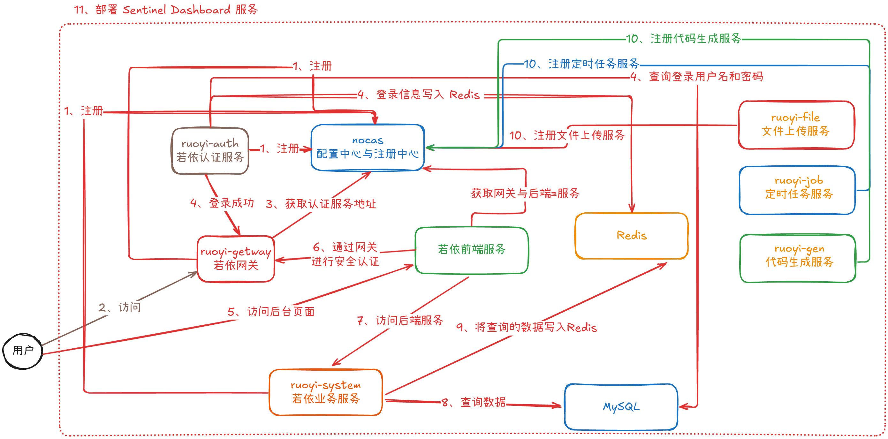

## **部署MySQL**

> 部署MySQL是为若依微服务项目提供核心数据存储服务，通常包括安装MySQL服务器、创建项目所需数据库及用户、导入初始化SQL脚本（如RuoYi微服务中的[ry_20250523.sql](https://gitee.com/y_project/RuoYi-Cloud/blob/master/sql/ry_20250523.sql)及quartz.sql等），并配置远程访问权限和字符集（推荐utf8mb4）。在分布式架构中，需确保MySQL服务高可用（如主从复制），并设置定期备份策略，为后端所有微服务提供稳定可靠的关系型数据支持。

### **下载MySQL的安装包和yum源**

```bash
# 下载MySQL yum源安装包
wget https://dev.mysql.com/get/mysql84-community-release-el7-2.noarch.rpm

# 安装 Yum 源
rpm -ivh mysql84-community-release-el7-2.noarch.rpm
```

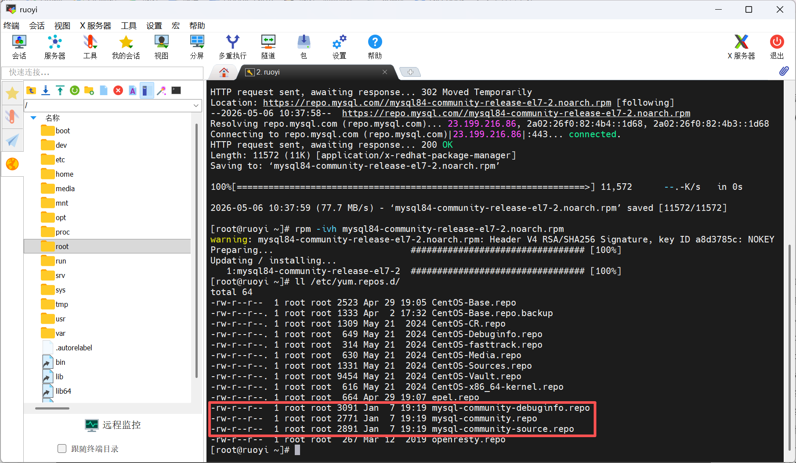

### **安装**

```bash
# 安装 MySQL 服务器
yum install mysql-community-server -y
```

#### **验证安装**

```bash
# 查看 MySQL 版本
mysql --version
```

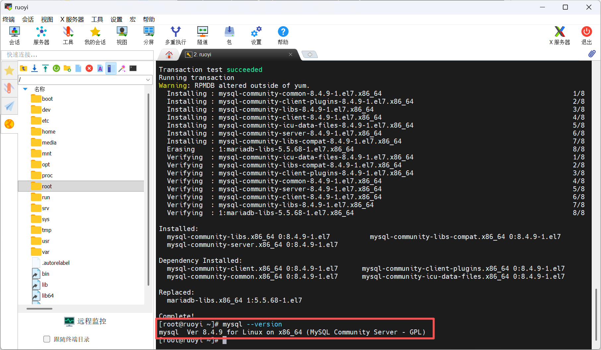

#### 修改MySQL的默认配置

```bash
cat > /etc/my.cnf <<EOF
# -------------------------- MySQL 全局配置文件 my.cnf --------------------------
# 适用系统：Linux/macOS（Windows 对应文件为 my.ini，路径和部分参数略有差异）
# 配置说明：整合基础服务配置、字符集配置，避免乱码并保障服务稳定运行
# 注意：修改后需重启 MySQL 服务生效（systemctl restart mysqld）

# -------------------------- 1. MySQL 服务器核心配置（[mysqld] 模块）--------------------------
# 该模块配置 MySQL 服务端（mysqld 进程）的核心参数，影响服务运行、存储、日志等
[mysqld]

# 1.1 基础服务与存储配置（你指定的核心配置项）
# 数据存储目录：MySQL 所有数据库文件（表、索引等）的存放路径，默认 /var/lib/mysql
# 注意：修改此路径需迁移原有数据并调整目录权限（chown -R mysql:mysql 新路径）
datadir=/var/lib/mysql

# 服务通信 socket 文件：MySQL 本地客户端（如 mysql 命令行）与服务端通信的 Unix 套接字文件
# 路径需与 [client] 模块的 socket 一致，否则本地连接会报错
socket=/var/lib/mysql/mysql.sock

# 符号链接开关：0 禁用符号链接（防止通过软链接访问非授权目录，提升安全性）
# 生产环境推荐设为 0，避免数据泄露或误操作风险
symbolic-links=0

# 错误日志路径：记录 MySQL 服务启动、运行、崩溃等所有错误信息，用于故障排查
# 定期清理避免日志过大，可通过 log_error_verbosity 调整日志详细程度
log-error=/var/log/mysqld.log

# 进程 ID 文件：存储 mysqld 进程的 PID，用于服务管理（如停止、重启时定位进程）
pid-file=/var/run/mysqld/mysqld.pid


# 1.2 字符集配置（解决中文乱码，支持 emoji）
# 服务器默认字符集：控制新建数据库、表的默认编码，推荐 utf8mb4（支持所有 Unicode 字符，含 emoji）
# 替代传统 utf8（仅支持 3 字节字符，无法存储 emoji）
character-set-server = utf8mb4

# 服务器默认排序规则：影响字符串比较（如 ORDER BY、WHERE 条件匹配）
# utf8mb4_general_ci：通用排序，性能较高；utf8mb4_unicode_ci：精准排序（支持更多语言），性能略低
collation-server = utf8mb4_general_ci

# 连接初始化 SQL：客户端每次连接时自动执行的SQL，强制设置连接编码（避免客户端未主动指定编码导致乱码）
# 覆盖连接级字符集，确保与服务器编码一致
init_connect = 'SET NAMES utf8mb4'


# 1.3 可选优化配置（根据服务器性能调整，非必须但推荐）
# 最大连接数：控制同时连接 MySQL 的客户端数量，默认 151，根据业务并发调整（如 1000）
max_connections = 1000

# 连接超时时间：客户端连接后无操作的超时时间（秒），避免空闲连接占用资源
wait_timeout = 600

# 表缓存数量：缓存已打开的表结构，减少磁盘 IO，根据表数量调整（如 2000）
table_open_cache = 2000

# 临时表最大大小：避免临时表过大导致磁盘占用，超过则写入磁盘临时表
tmp_table_size = 64M
max_heap_table_size = 64M


# -------------------------- 2. MySQL 客户端通用配置（[client] 模块）--------------------------
# 该模块配置所有 MySQL 客户端工具（如 mysql 命令行、Navicat、Python 连接等）的默认参数
[client]

# 客户端与服务端通信的 socket 文件：必须与 [mysqld] 模块的 socket 路径一致
# 否则本地客户端连接会报“Can't connect to local MySQL server through socket”错误
socket=/var/lib/mysql/mysql.sock

# 客户端默认字符集：客户端发送/接收数据的编码，与服务器编码保持一致（utf8mb4）
# 避免连接级编码不匹配导致的乱码（如中文显示为 ?）
default-character-set = utf8mb4

EOF
```

#### 创建必要目录并授权

```bash
mkdir -p /var/run/mysqld
mkdir -p /var/lib/mysql

chown -R mysql:mysql /var/lib/mysql
chown -R mysql:mysql /var/run/mysqld
```

#### 启动 MySQL 服务并设置开机自启

```bash
# 启动 MySQL 服务
systemctl start mysqld

# 设置开机自启
systemctl enable mysqld

# 检查服务状态
systemctl status mysqld
```

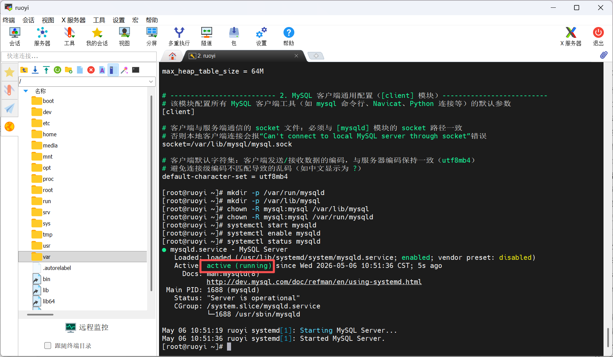

#### 获取初始密码

```bash
# 获取密码
grep 'temporary password' /var/log/mysqld.log | awk -F 'localhost: ' '{print $2}'
```

#### 登录 MySQL 并修改密码

```bash
# 输入刚刚的临时密码
mysql -u root -p
```

```mysql
# 修改密码（MySQL 8.0+ 要求密码包含大小写字母、数字和特殊字符）
ALTER USER 'root'@'localhost' IDENTIFIED BY 'Chen123456!';

# 配置远程可访问
CREATE USER 'root'@'%' IDENTIFIED BY 'Chen123456!';
GRANT ALL PRIVILEGES ON *.* TO 'root'@'%' WITH GRANT OPTION;
FLUSH PRIVILEGES;
QUIT;
```

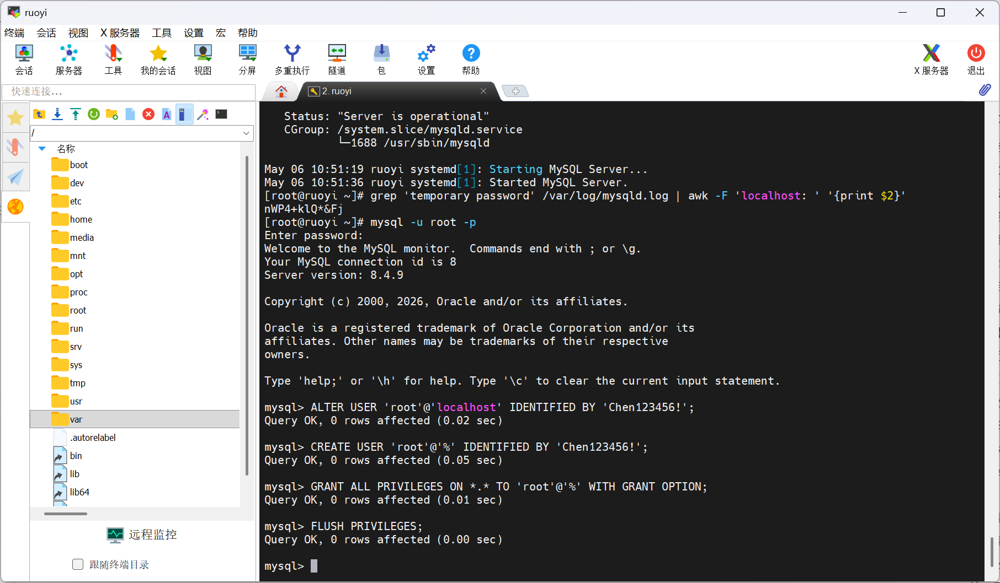

#### 远程连接MySQL数据库

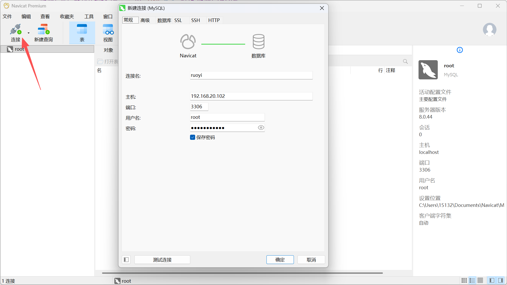

### 将若依项目中的 SQL 导入数据库

#### 创建数据库

```mysql
# 创建名称为 ruoyi 的数据库
CREATE DATABASE ruoyi CHARACTER SET utf8mb4 COLLATE utf8mb4_unicode_ci;
```

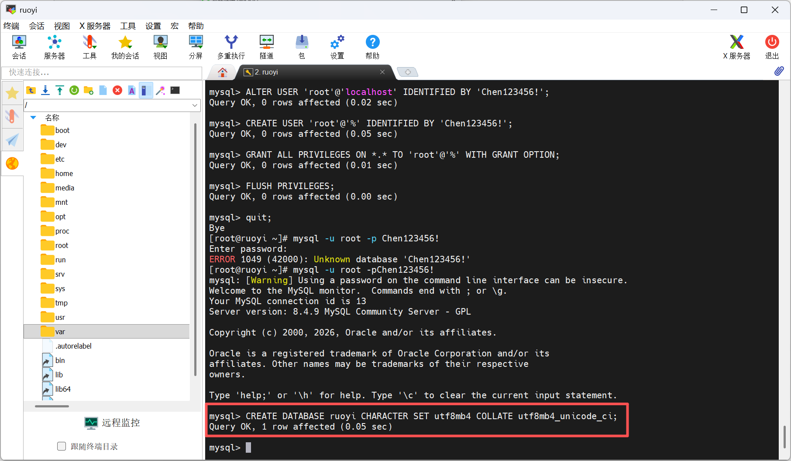

#### 导入SQL

https://gitee.com/chenyang0910/ruoyi/tree/master/sql


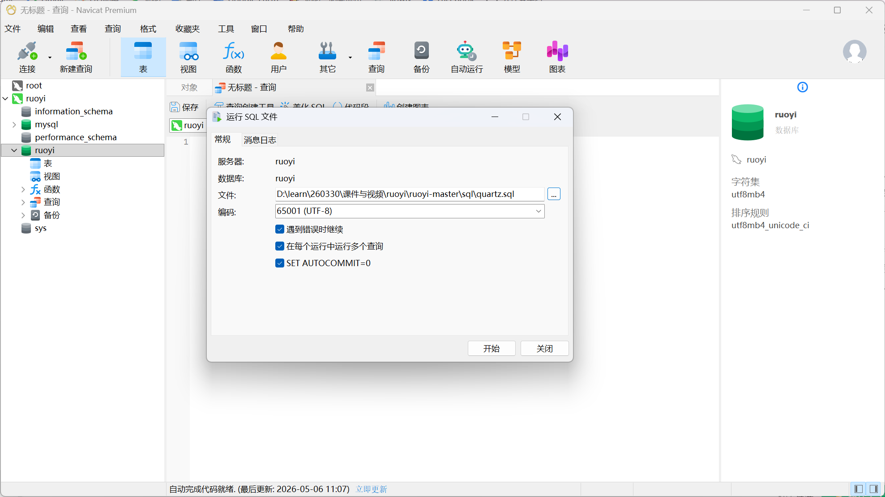


## 部署 Redis

> **Redis 是一个基于内存、支持多种数据结构的高性能键值数据库**，它将数据存储在内存中实现毫秒级读写响应，同时通过持久化机制确保数据安全，支持字符串、哈希、列表、集合、有序集合等丰富数据结构，能够满足复杂业务场景需求。**使用 Redis 的必要性主要体现在四个方面**：**一是提升系统性能**，将热点数据缓存在内存中，可将数据库查询响应从毫秒级降至微秒级，极大缓解后端压力；**二是支撑高并发场景**，单机 Redis 可支持 10万+ QPS，能够应对电商秒杀、社交 feed 流等瞬时流量高峰；**三是实现业务解耦**，作为分布式锁、消息队列、会话共享的中间层，帮助分布式系统实现数据一致性；**四是降低架构成本**，通过缓存命中减少数据库查询和计算资源消耗，用更低成本支撑更大流量。本质上，**Redis 是现代互联网架构中连接应用层与数据层的“高性能缓冲带”**，既能保障系统稳定运行，又能显著提升用户体验。

```bash
# 下载源代码包
wget https://download.redis.io/releases/redis-7.2.4.tar.gz

# 解压
tar -xf redis-7.2.4.tar.gz

# 创建 redis 用户（-r 表示系统用户，-s /sbin/nologin 禁止登录）
useradd -r -s /sbin/nologin redis

# 编译
cd redis-7.2.4
make && make install
redis-server -v

cp redis.conf /etc/
vim /etc/redis.conf

bind 0.0.0.0
dir /var/lib/redis
requirepass Chen123456!

mkdir -p /var/lib/redis
chown -R redis:redis /var/lib/redis
chmod -R 755 /var/lib/redis
```

```bash
# service
cat > /usr/lib/systemd/system/redis.service <<EOF
[Unit]
# 服务描述
Description=Redis In-Memory Data Store (Foreground to Daemon via systemd)
# 依赖网络服务（可选，若 Redis 需远程访问则保留）
After=network.target
# 依赖本地文件系统（确保配置文件目录已挂载）
After=local-fs.target

[Service]
# 运行用户（建议使用非 root 用户，如 redis，需提前创建：sudo useradd -r -s /sbin/nologin redis）
User=redis
# 运行组
Group=redis
# 服务类型：simple（前台进程由 systemd 直接管理）
Type=simple
# 启动命令（对应原前台运行命令，需指定配置文件）
ExecStart=/usr/local/bin/redis-server /etc/redis.conf
# 重启策略：失败时自动重启（可根据需求调整为 on-failure/always/never）
Restart=on-failure
# 重启间隔（秒）
RestartSec=3
# PID 文件路径（需与 redis.conf 中 pidfile 配置一致，默认通常为 /var/run/redis_6379.pid）
PIDFile=/var/run/redis_6379.pid
# 限制进程文件描述符数量（避免连接数过多时报错）
LimitNOFILE=65535
# 限制进程最大线程数
LimitNPROC=65535
# 工作目录（Redis 数据存储目录，需提前创建并授权）
WorkingDirectory=/var/lib/redis

[Install]
# 服务安装目录（设置为多用户模式下的自启服务）
WantedBy=multi-user.target
EOF
```


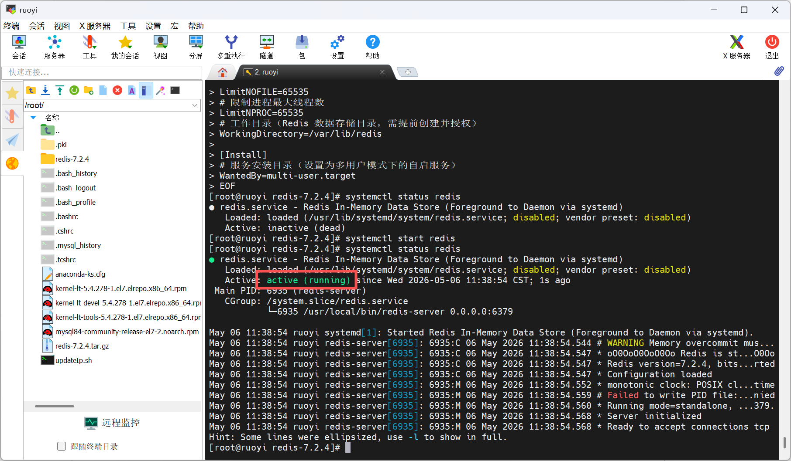

## 部署 nacos

>Nacos /nɑ:kəʊs/ 是 Dynamic Naming and Configuration Service 的⾸字⺟简 称，⼀个更易于构建云原⽣应⽤的动态服务发现、配置管理和服务管理平台。 
>
>Nacos 致⼒于帮助您发现、配置和管理微服务。Nacos 提供了⼀组简单易⽤的特性集， 帮助您快速实现动态服务发现、服务配置、服务元数据及流量管理。 
>
>Nacos 帮助您更敏捷和容易地构建、交付和管理微服务平台。 Nacos 是构建以“服务”为 中⼼的现代应⽤架构 (例如微服务范式、云原⽣范式) 的服务基础设施。

>**nocas 的功能**
>
>1. 服务注册：微服务启动时将自己的信息（IP、端口、健康状态等）注册到Nacos
>2. 服务发现：消费者通过服务名从Nacos获取可用的服务实例列表
>3. 健康检查：定期检查服务实例健康状态，自动剔除不健康的实例
>
>**什么是配置中心**
>
>配置中心如同微服务架构的“指挥中枢”或“总控开关”。它将所有散落在各服务中的配置文件集中管控，实现“牵一发而动全身”的动态更新能力。运维人员可在控制台一键调整参数（如数据库地址、功能开关），变更实时、安全地下发至所有相关服务，无需重启。同时，它完整记录每次变更的“快照”，便于审计与快速回滚。
>
>**什么是注册中心**
>
>注册中心是微服务架构的“中枢神经系统”。它扮演着两大核心角色：
>
>1. **服务目录簿**：所有微服务启动时都到此“登记报到”，告知“我是谁，我在哪”。当某个服务需要调用另一个服务时，只需询问注册中心“它在哪”，即可获得一个当前可用的、健康的服务地址列表，无需事先知道对方的具体位置。
>2. **系统健康管家**：它会持续对所有已注册的服务进行“健康检查”。一旦发现某个实例故障，便立即将其从可用列表中剔除，确保流量不会被导向一个已经宕机的服务，从而自动实现故障隔离与系统自愈。
>
>这彻底改变了服务间的连接方式：从“互相留有固定电话（硬编码地址）”变为“动态查询实时通讯录”，实现了服务的高可用与灵活伸缩。
>
>想象一下，你管理一个大型游乐场，里面有几十个不同的游戏摊位（微服务）。如果每个摊位要找人帮忙或者换零件，都得自己满场跑着问，那就太乱了。
>
>**为什么要用 nacos**
>
>**Nacos 就是这个游乐场的“智能总控台”**。它的作用特别简单：
>
>1. **自动登记**：每个摊位开门时，自己到总控台说：“我‘过山车’在5号区开业了！”（这叫**服务注册**）
>2. **一键查询**：卖冰淇淋的摊位需要找“过山车”合作，不用满场跑，直接问总控台：“‘过山车’在哪？”总控台立刻告诉它地址。（这叫**服务发现**）
>3. **远程调控**：园长想统一把所有摊位的音乐调小，不用挨个跑，在总控台调一个开关，所有摊位音乐自动变小了。（这叫**配置管理**）
>
>**简单说，用了 Nacos，所有服务就能自动找到彼此，还能统一远程管理，不用一个个手动配置，系统就能像智能积木一样灵活拼搭和改变。** 它是让复杂系统变简单的“万能指挥中心”。

### 统一用户

```bash
useradd -r -M -s /sbin/nologin www
```

### 安装 Java并验证

```bash
yum install java-11-openjdk java-11-openjdk-devel -y

java --version
```

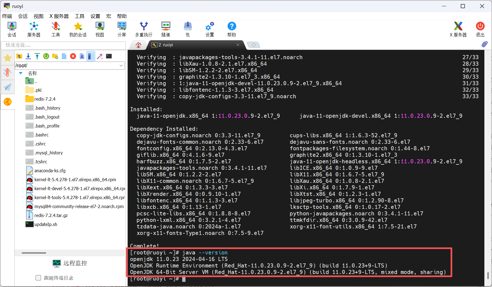

### nacos部署安装

>Nacos 是微服务架构中的 “一站式服务中心”，由阿里巴巴开源。它集成了两大核心功能：服务注册与发现（让所有服务能自动相互找到彼此）和动态配置管理（让系统参数能在运行时统一修改并实时生效）。部署 Nacos 就像启动一个“微服务指挥中心”：首先确保服务器已安装 Java 环境（因为 Nacos 本身基于 Java 开发），然后下载 Nacos 安装包、解压并安装。

```bash
wget https://github.com/alibaba/nacos/releases/download/2.5.2/nacos-server-2.5.2.tar.gz

tar -xf nacos-server-2.5.2.tar.gz -C /usr/local/

chown -R www.www /usr/local/nacos
```

```bash
vim /etc/profile
export NACOS_HOME=/usr/local/nacos
export PATH=$NACOS_HOME/bin:$PATH
```

### 修改 nacos 的配置

```bash
cd /usr/local/nacos

vim conf/application.properties

server.port=8848
spring.sql.init.platform=mysql
db.num=1
db.url.0=jdbc:mysql://192.168.20.102:3306/ruoyi?characterEncoding=utf8&connectTimeout=1000&socketTimeout=3000&autoReconnect=true&useUnicode=true&useSSL=false&serverTimezone=Asia/Shanghai&allowPublicKeyRetrieval=true
db.user.0=root
db.password.0=Chen123456!
```

### 添加 nacos.service

```bash
cat > /etc/systemd/system/nacos.service <<EOF
[Unit]
Description=Nacos Service
After=network.target

[Service]
Type=forking
User=www
Group=www
ExecStart=/usr/local/nacos/bin/startup.sh -m standalone
ExecStop=/usr/local/nacos/bin/shutdown.sh
WorkingDirectory=/usr/local/nacos
Restart=on-failure
RestartSec=10
SuccessExitStatus=143
LimitNOFILE=65535
LimitNPROC=65535

# 日志配置
StandardOutput=journal
StandardError=journal
SyslogIdentifier=nacos

[Install]
WantedBy=multi-user.target
EOF
```

### 启动服务并访问http://192.168.20.102:8848/nacos

```bash
systemctl start nacos.service
ss -tunlp | grep 8848 # 要多等一会
```

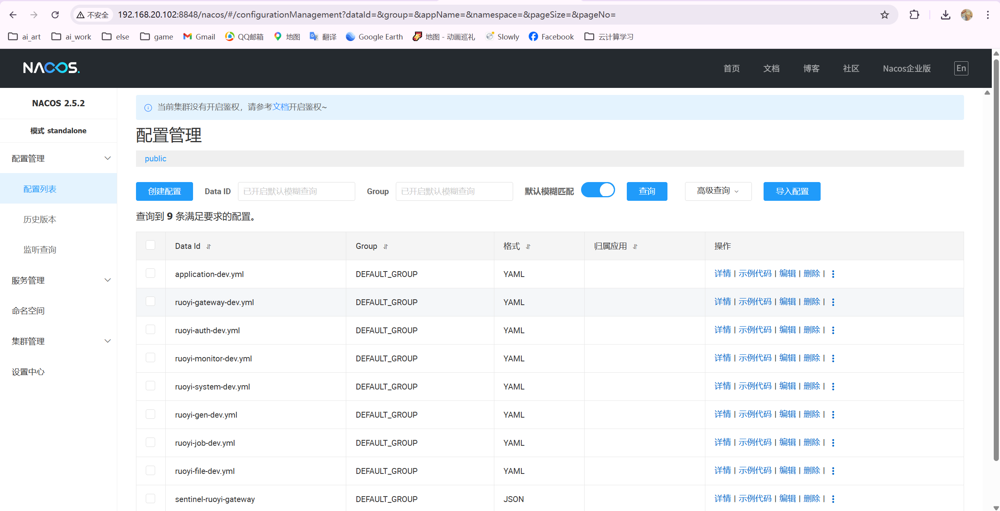

## 部署 Minio 对象存储

>官网：https://www.min.io/

>**MinIO 是一个高性能、云原生的开源对象存储系统**，完全兼容 Amazon S3 API，专为大规模数据湖、AI/ML 工作负载和云原生应用而设计。它采用**去中心化的无共享架构**，支持横向扩展至数千节点，实现 EB 级数据存储；提供**企业级数据保护**，包括擦除编码、加密和版本控制；具备**极致的性能表现**，在标准硬件上可实现每秒数百 GB 的读写吞吐量。作为**轻量级、纯 Go 语言实现**的存储方案，MinIO 既可作为独立的云存储服务，也能无缝集成到 Kubernetes 等容器平台中，为现代化应用提供简单可靠的存储基础设施。

### 部署 Minio 对象存储

```bash
wget https://dl.min.io/server/minio/release/linux-amd64/archive/minio-20250723155402.0.0-1.x86_64.rpm

yum localinstall minio-20250723155402.0.0-1.x86_64.rpm

# 创建数据⽬录
mkdir -p /data/minio

# 创建⽤户并授权
useradd -M -r -s /sbin/nologin minio-user

chown -R minio-user.minio-user /data/minio
```

```bash
vi /etc/default/minio

#minIO 用户名
MINIO_ROOT_USER=admin
# 密码
MINIO_ROOT_PASSWORD=Chen123456!
# 存储数据的目录
MINIO_VOLUMES="/data/minio"
# 服务的访问方式
MINIO_ADDRESS="0.0.0.0:9000"
# web服务访问的方式
MINIO_CONSOLE_ADDRESS="0.0.0.0:9001"
```

```bash
cat > /usr/lib/systemd/system/minio.service << 'EOF'
[Unit]
Description=MinIO
Documentation=https://docs.min.io
Wants=network-online.target
After=network-online.target
AssertFileIsExecutable=/usr/local/bin/minio

[Service]
WorkingDirectory=/usr/local

User=minio-user
Group=minio-user

EnvironmentFile=/etc/default/minio
ExecStartPre=/bin/bash -c "if [ -z \"${MINIO_VOLUMES}\" ]; then echo 'Variable MINIO_VOLUMES not set in /etc/default/minio'; exit 1; fi"

ExecStart=/usr/local/bin/minio server --address $MINIO_ADDRESS --console-address $MINIO_CONSOLE_ADDRESS $MINIO_VOLUMES

# Let systemd restart this service always
Restart=always

# Specifies the maximum file descriptor number that can be opened by this process
LimitNOFILE=65536
MemoryLimit=0

# Disable timeout logic and wait until process is stopped
TimeoutStopSec=infinity
SendSIGKILL=no

[Install]
WantedBy=multi-user.target
EOF
```

#### 启动服务并访问http://192.168.20.102:9001/login

```bash
systemctl start minio.service
ss -tunlp | grep 9001
```


### 安装客户端

```bash
wget https://dl.min.io/client/mc/release/linux-amd64/archive/mc
chmod +x mc
mv mc /usr/bin/

# 登录
mc alias set myminio http://127.0.0.1:9000 'admin' 'Chen123456!'  # 保存在 -> vi /etc/default/minio
Added `myminio` successfully.

# 查看用户列表
mc admin user list myminio

# 创建ruoyi用户并设置密码 Chen123456!
mc admin user add myminio ruoyi Chen123456!
Added user `ruoyi` successfully.

# 自动生成 Access Key 和 Secret Key
mc admin user svcacct add myminio ruoyi
Access Key: L70WI3O52J46I7DQ5JP9
Secret Key: UV8C+pvli5H7rFSR+d2jOzIDzA3IPPv+0ocHT0H1
Expiration: no-expiry

# 为 ruoyi 用户绑定读写权限
mc admin policy attach myminio readwrite --user ruoyi
```

```bash
# 绑定可读可写权限
mc admin policy attach myminio readwrite --user <用户名>

# 查看用户详细信息（包括状态）
mc admin user info myminio <用户名>

# 禁用指定用户
mc admin user disable myminio <用户名>

# 启用指定用户
mc admin user enable myminio <用户名>

# 删除指定用户
mc admin user remove myminio <用户名>

# 查看所有的 Bucket
mc ls myminio

# 查看 bucket 详情（包括大小、对象数等）
mc stat myminio/bucket-name

# 删除空 bucket
mc rb myminio/bucket-name
```

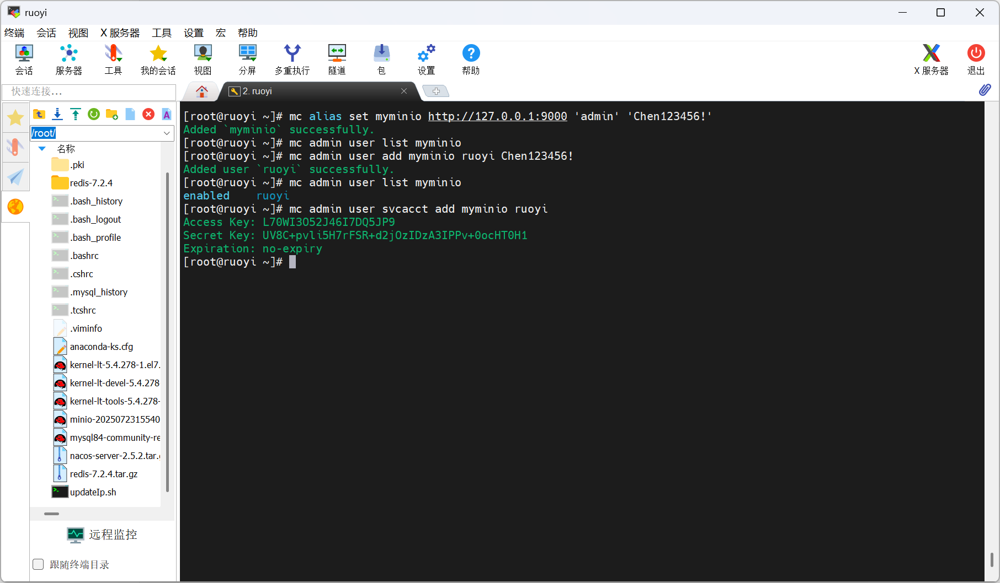

## 部署Sentinel Dashboard

>Sentinel Dashboard 是 **阿里巴巴开源的流量控制组件 Sentinel 的可视化管理控制台**。它提供了**图形化的操作界面**，让用户能够实时监控、配置和管理应用中的流量控制、熔断降级、系统保护等规则。
>
>**为什么要用它？**
>
>- **直观管理**：无需修改代码或重启服务，即可通过网页动态调整限流、降级等规则，实现秒级生效。
>- **集中监控**：实时查看所有接入 Sentinel 的服务的运行状态、资源调用情况和规则效果，便于快速发现并解决问题。
>- **提升可靠性**：帮助系统在高并发或异常情况下，通过限流和熔断机制防止雪崩效应，保障核心业务稳定性。
>- **降低运维成本**：统一的管理平台简化了分布式系统中复杂流量治理规则的维护工作。
>
>简而言之，Sentinel Dashboard 让 Sentinel 的**强大流量治理能力变得易于操作和观察**，是构建高可用微服务架构的重要工具。

### 部署Sentinel Dashboard

```bash
# 下载jar包：sentinel-dashboard-1.8.9.jar

mkdir /usr/local/sentinel-dashboard
cp sentinel-dashboard-1.8.9.jar /usr/local/sentinel-dashboard/
cd /usr/local/sentinel-dashboard
mkdir -p /var/log/sentinel-dashboard
chown -R www.www /var/log/sentinel-dashboard
chown -R www.www /usr/local/sentinel-dashboard
```

```bash
cat > /etc/systemd/system/sentinel-dashboard.service <<EOF
[Unit]
Description=Sentinel Dashboard
After=network.target

[Service]
Type=simple
User=www
Group=www

# 工作目录
WorkingDirectory=/usr/local/sentinel-dashboard

# 启动命令
ExecStart=/usr/bin/java \
  -Dserver.port=8718 \
  -Dcsp.sentinel.dashboard.server=localhost:8718 \
  -Dproject.name=sentinel-dashboard \
  -Dcsp.sentinel.api.port=8719 \
  -Dcsp.sentinel.log.dir=/var/log/sentinel-dashboard \
  -jar sentinel-dashboard-1.8.9.jar

# JVM 参数
Environment="JAVA_OPTS=-Xms512m -Xmx512m -XX:+UseG1GC"

# 重启策略
Restart=on-failure
RestartSec=10s
StartLimitInterval=60s
StartLimitBurst=3

# 资源限制
LimitNOFILE=65536
LimitNPROC=4096

# 安全设置
NoNewPrivileges=true
PrivateTmp=true
ProtectSystem=strict
# 允许写入日志目录
ReadWritePaths=/var/log/sentinel-dashboard

[Install]
WantedBy=multi-user.target
EOF
```

### 启动服务并访问http://192.168.20.102:8718

```bash
systemctl start sentinel-dashboard
ss -tunlp | grep 8718
```


## 部署 ruoyi 项目

>完成 ruoyi 项目的前置工作以后，现在开始来部署 ruoyi 项目。

### 部署 Maven

>**Maven** 是 Apache 基金会下的**项目构建和依赖管理工具**，它通过一个核心配置文件（pom.xml）统一管理 Java 项目的整个生命周期——从代码编译、测试、打包到部署。
>
>**为什么要用？**
>
>1. **依赖管理革命**：自动下载和管理项目所需的第三方库（JAR包），解决"jar包地狱"问题。只需在配置中声明需要什么库，Maven 就会自动从中央仓库下载，并处理版本冲突和传递依赖。
>2. **标准化项目结构**：强制执行统一的目录布局（src/main/java、src/test/resources等），让任何开发者都能快速理解项目组织。
>3. **一键式构建流程**：通过简单的命令（mvn clean package）完成编译、测试、打包全流程，替代复杂的手动操作和 Ant 脚本。
>4. **插件生态系统**：丰富的插件支持代码检查（Checkstyle）、测试覆盖率（Jacoco）、打包部署（Docker）等扩展功能。
>5. **多模块项目管理**：轻松管理大型项目的多个子模块，实现模块间的清晰依赖和统一版本控制。
>6. **生命周期管理**：定义清晰的构建阶段（clean、compile、test、package、install、deploy），支持持续集成流水线。
>
>**本质上**，Maven 将 Java 项目开发从"手工作坊"升级为"标准化工厂"，让团队能专注于业务代码而非构建细节，是现代 Java 生态系统不可或缺的"项目脚手架"和"依赖管家"。没有它，团队将陷入手动下载 jar 包、配置 classpath、编写复杂构建脚本的低效循环中。

```bash
wget https://dlcdn.apache.org/maven/maven-3/3.9.12/binaries/apache-maven-3.9.12-bin.tar.gz

tar -xf apache-maven-3.9.12-bin.tar.gz -C /usr/local

ln -s /usr/local/apache-maven-3.9.12 /usr/local/maven

echo 'export M2_HOME=/usr/local/maven' >> /etc/profile
echo 'export PATH=$M2_HOME/bin:$PATH' >> /etc/profile
source /etc/profile

mvn --version
```

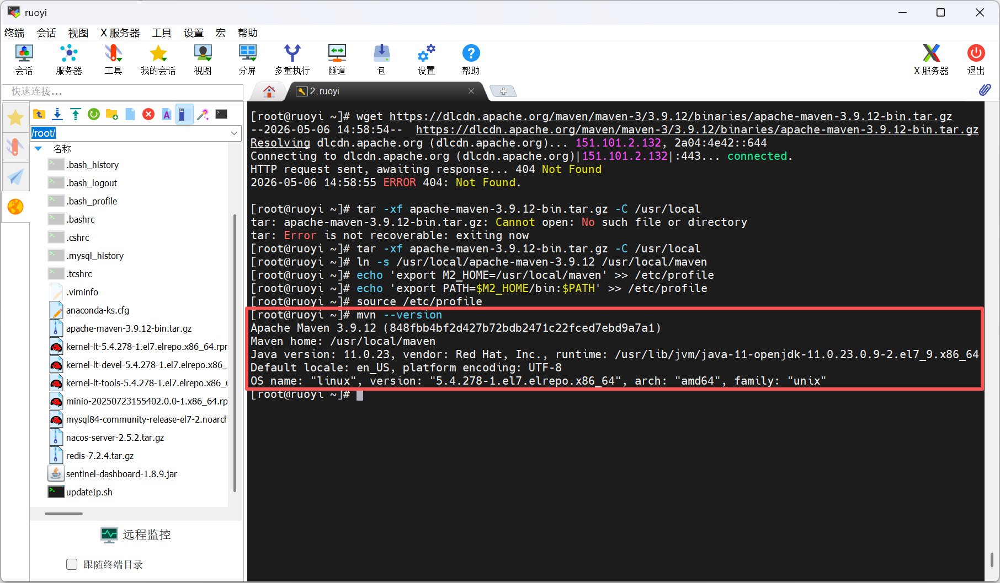

### 部署 ruoyi-gateway

>若依源码目录：https://gitee.com/chenyang0910/ruoyi

>**Ruoyi Gateway** 是若依微服务架构中的 **API 网关核心组件**，它作为整个系统的**统一流量入口**和**请求调度中心**，扮演着"交通警察"和"安全检查站"的双重角色。
>
>**为什么必须？**
>
>1. **统一入口**：所有外部请求（Web、App、第三方调用）都必须先经过网关，避免了客户端需要记忆多个微服务地址的复杂性。
>2. **路由转发**：根据请求路径智能分发到后端的用户服务、订单服务、权限服务等具体微服务，实现服务的透明调用。
>3. **安全防护**：统一进行身份认证（JWT校验）、权限验证、IP黑白名单控制，防止未授权访问直达业务服务。
>4. **流量治理**：集成Sentinel实现限流熔断、灰度发布、负载均衡，保护后端服务不被突发流量冲垮。
>5. **请求处理**：统一进行日志记录、监控埋点、跨域处理、请求/响应报文转换，减少各微服务的重复代码。
>6. **服务聚合**：将多个微服务的调用结果聚合后返回，优化前端体验（如首页需要同时调用用户信息、消息、配置等多个服务）。
>
>**简单来说**：没有网关，客户端就要直接面对几十个微服务的复杂网络；有了网关，就像有了一个"智能前台"，它知道该把每个请求引到哪个部门（服务），同时检查访客权限、控制人流量、记录来访日志，让整个系统更安全、更可控、更易维护。

#### 修改代码

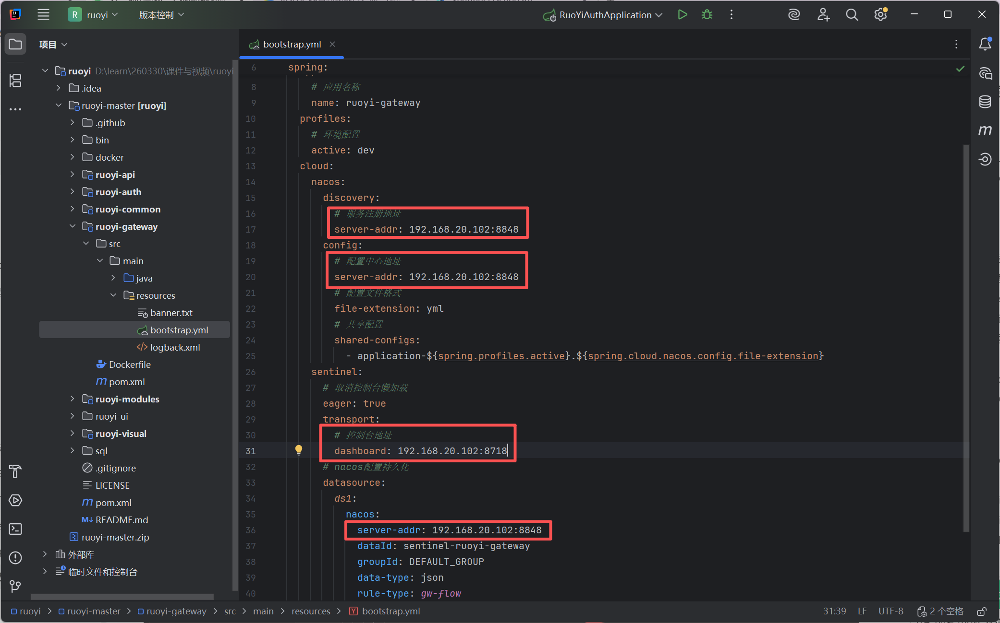

#### 编译 ruoyi-gateway 代码

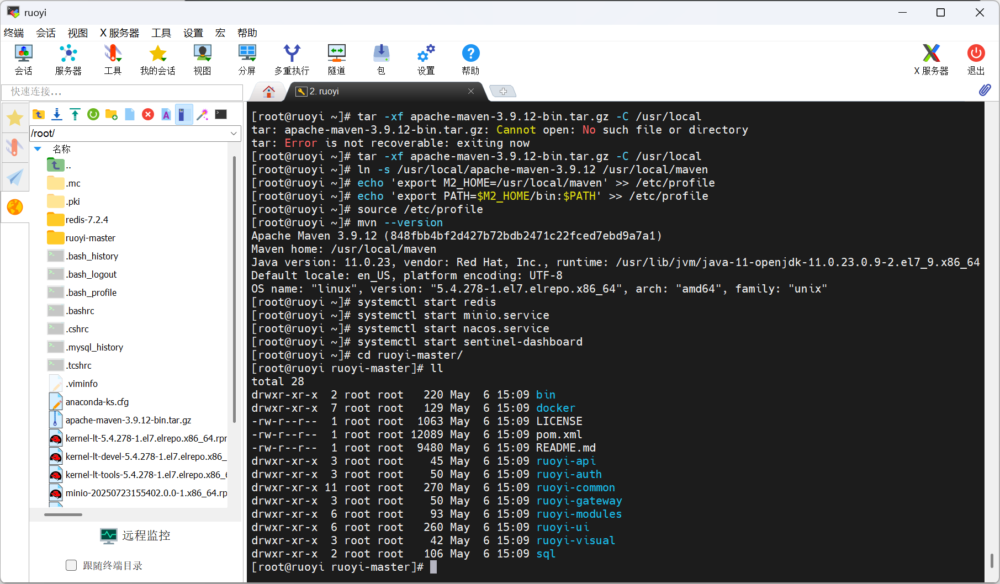

```bash
mvn clean package
```

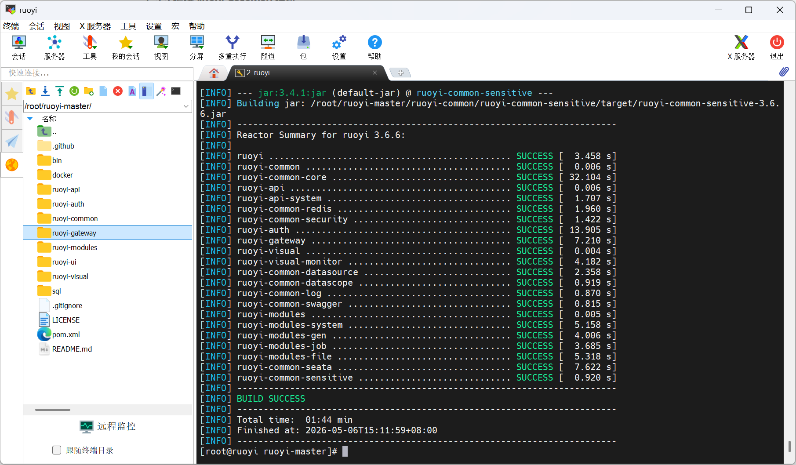

#### 部署 ruoyi-gateway

访问http://192.168.20.102:8848/nacos

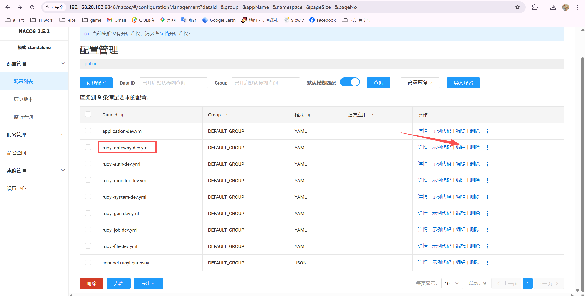

#### 修改相关配置


```bash
mkdir -p /usr/local/ruoyi/ruoyi-gateway
cp ruoyi-gateway/target/ruoyi-gateway.jar /usr/local/ruoyi/ruoyi-gateway/
chown -R www.www /usr/local/ruoyi

mkdir -p /var/log/sentinel
chown -R www:www /var/log/sentinel
chmod 755 /var/log/sentinel

mkdir -p /var/lib/nacos-client
chown -R www:www /var/lib/nacos-client
chmod 755 /var/lib/nacos-client
```

```bash
cat > /etc/systemd/system/ruoyi-gateway.service << EOF
[Unit]
Description=Ruoyi Gateway Service
After=network.target

[Service]
Type=simple
User=www
Group=www

# 工作目录（根据实际情况调整）
WorkingDirectory=/usr/local/ruoyi/ruoyi-gateway

# JVM 参数（根据实际情况调整）
Environment="JAVA_OPTS=-Xms512m -Xmx512m -XX:+UseG1GC"

# 启动命令
ExecStart=/usr/bin/java \$JAVA_OPTS -Dcsp.sentinel.log.dir=/var/log/sentinel -Dcsp.sentinel.log.use.pid=true -Dnacos.home=/var/lib/nacos-client -DJM.SNAPSHOT.PATH=/var/lib/nacos-client -DJM.LOG.PATH=/var/lib/nacos-client/logs -jar ruoyi-gateway.jar

# 重启策略
Restart=on-failure
RestartSec=10s
StartLimitInterval=60s
StartLimitBurst=3

# 资源限制
LimitNOFILE=65536
LimitNPROC=4096

# 安全设置
NoNewPrivileges=true
PrivateTmp=true

[Install]
WantedBy=multi-user.target

EOF
```

#### 启动网关服务

```bsah
systemctl start ruoyi-gateway
```

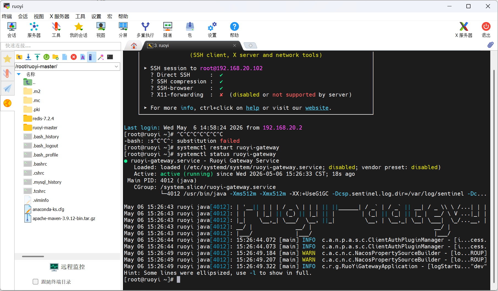

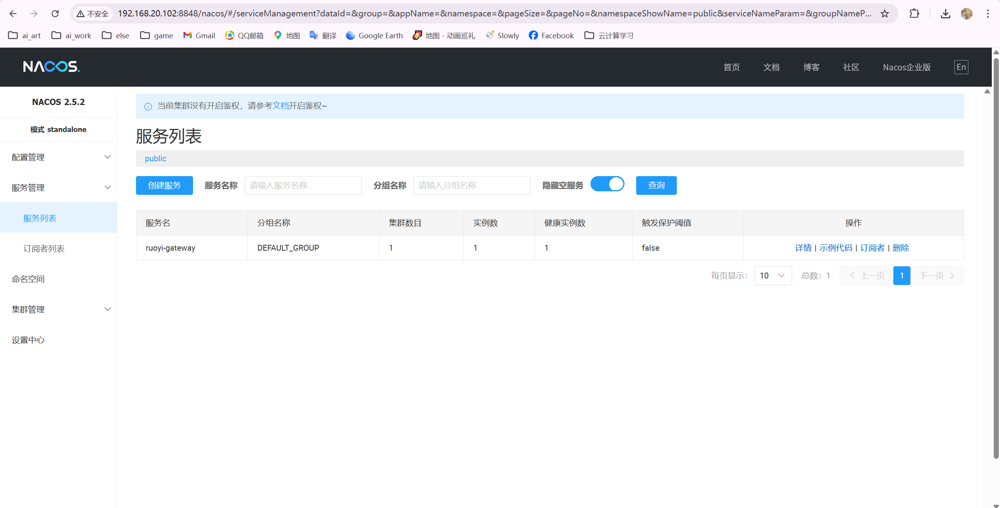

### 部署 ruoyi-auth

>**Ruoyi Auth** 是若依微服务架构中的**统一认证授权中心**，负责整个系统的**用户身份认证、权限验证和令牌管理**。它基于 Spring Security + OAuth2 实现，为所有微服务提供统一的安全入口，确保只有合法用户才能访问系统资源，并精确控制每个用户的操作权限范围，是构建安全微服务体系的**身份守卫者**和**权限裁判官**。

#### 修改代码

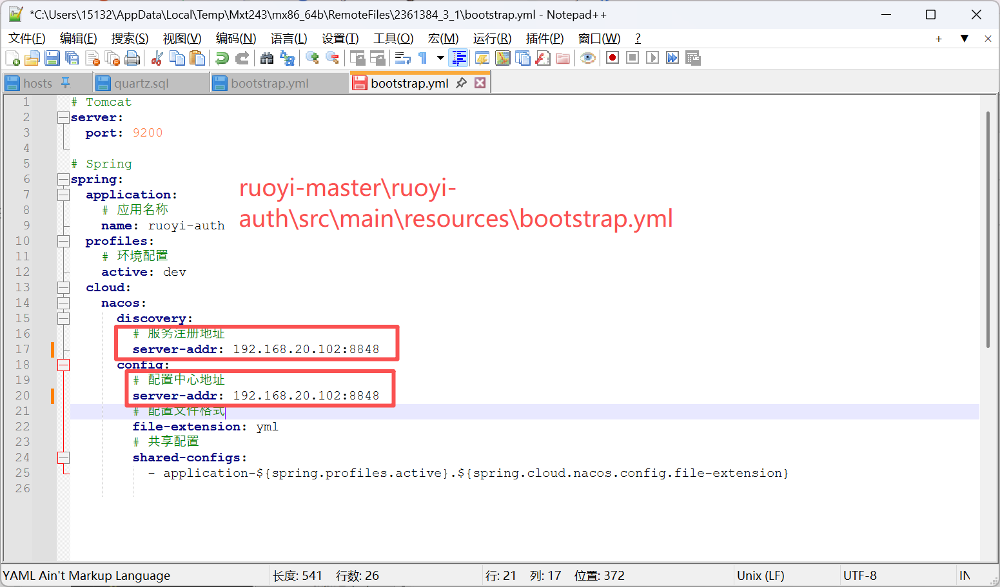

#### 编译 ruoyi-auth 项目代码

```bash
mvn clean package
```

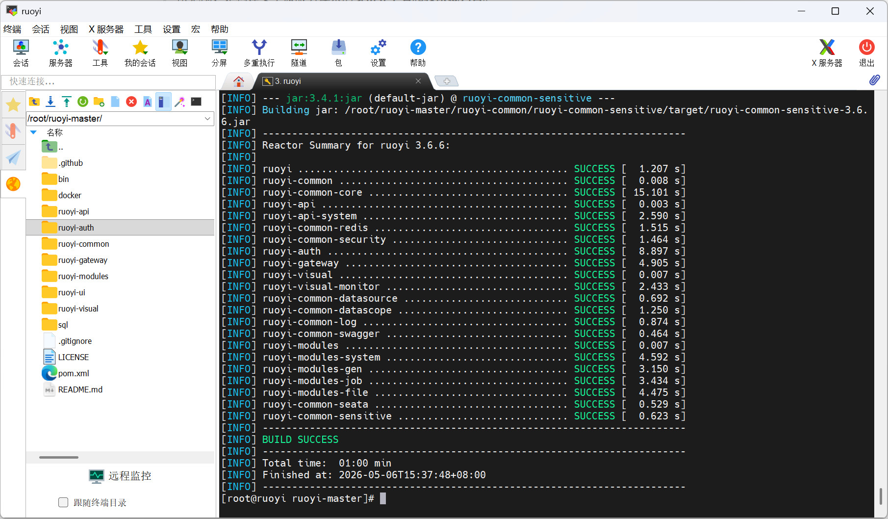

#### 部署 ruoyi-auth

访问http://192.168.20.102:8848/nacos

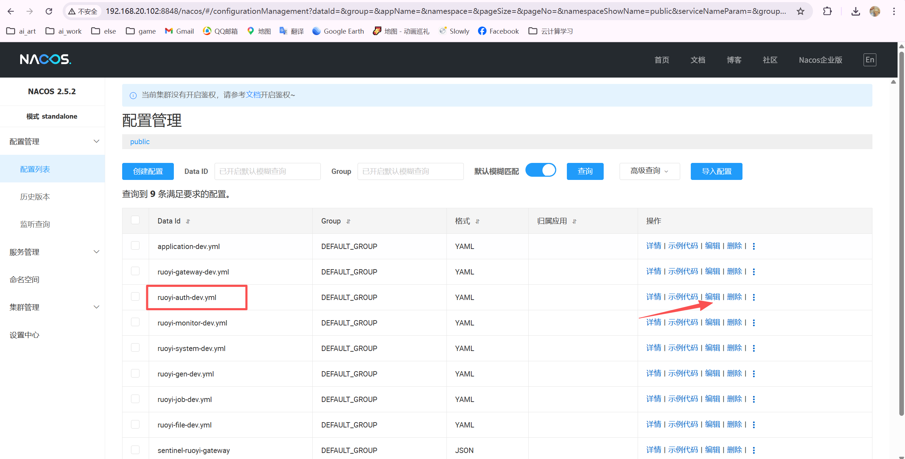

#### 修改相关配置

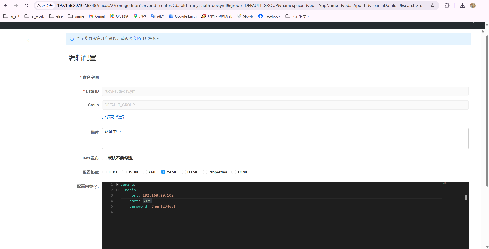

```bash
mkdir -p /usr/local/ruoyi/ruoyi-auth
cp ruoyi-auth/target/ruoyi-auth.jar /usr/local/ruoyi/ruoyi-auth/
chown -R www:www /usr/local/ruoyi/ruoyi-auth
chmod 755 /usr/local/ruoyi/ruoyi-auth
```

```bash
cat > /etc/systemd/system/ruoyi-auth.service <<EOF
[Unit]
Description=Ruoyi Auth Service
After=network.target

[Service]
Type=simple
User=www
Group=www

# 工作目录
WorkingDirectory=/usr/local/ruoyi/ruoyi-auth

# 启动命令
ExecStart=/usr/bin/java -Xms512m -Xmx512m -XX:+UseG1GC -Dcsp.sentinel.log.dir=/var/log/sentinel -Dcsp.sentinel.log.use.pid=true -Dnacos.home=/var/lib/nacos-client -DJM.SNAPSHOT.PATH=/var/lib/nacos-client -DJM.LOG.PATH=/var/lib/nacos-client/logs -jar ruoyi-auth.jar

# 重启策略
Restart=on-failure
RestartSec=10
StartLimitInterval=60
StartLimitBurst=3

# 资源限制
LimitNOFILE=65536
LimitNPROC=4096

# systemd 安全增强
NoNewPrivileges=true
PrivateTmp=true

[Install]
WantedBy=multi-user.target
EOF
```

#### 启动认证服务

```bash
systemctl start ruoyi-auth
```

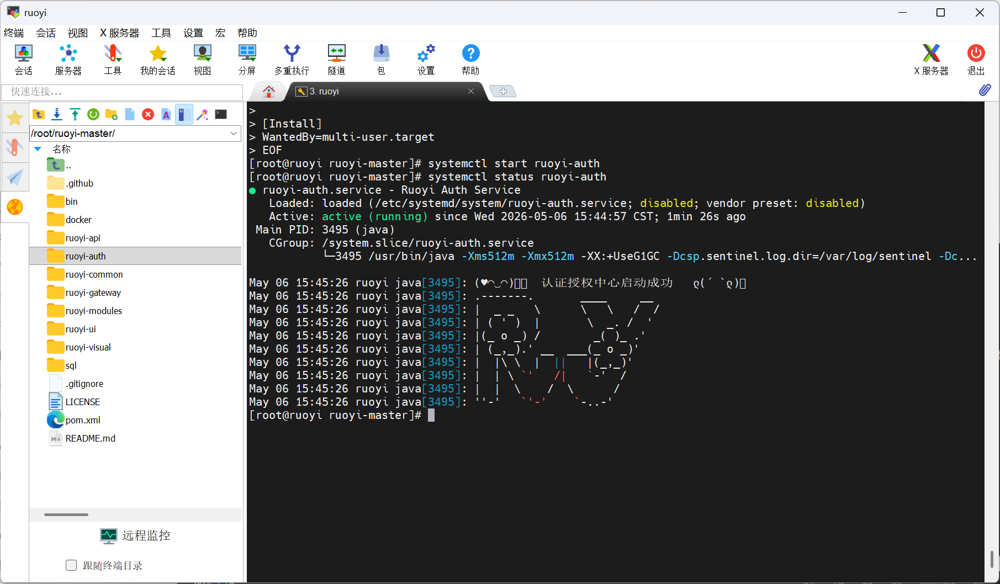

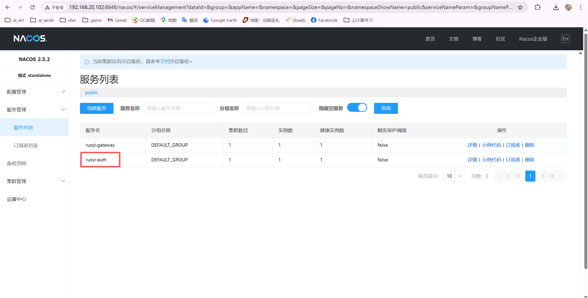

### 部署 ruoyi-system

#### 修改代码

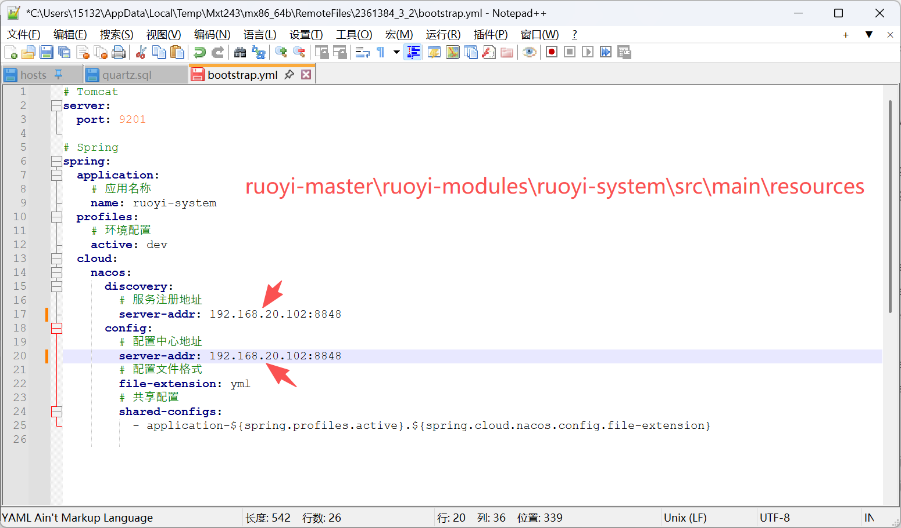

#### 编译 ruoyi-system 项目代码

```bash
mvn clean package
```


#### 部署 ruoyi-system

访问http://192.168.20.102:8848/nacos

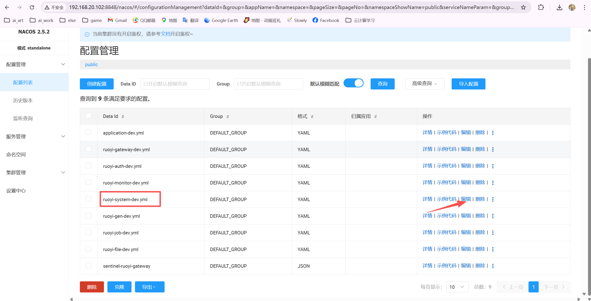

#### 修改相关配置

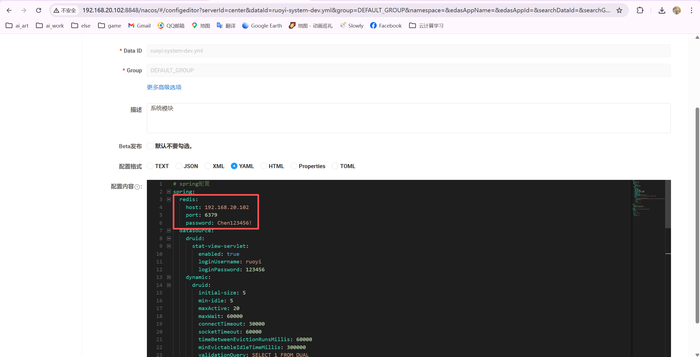

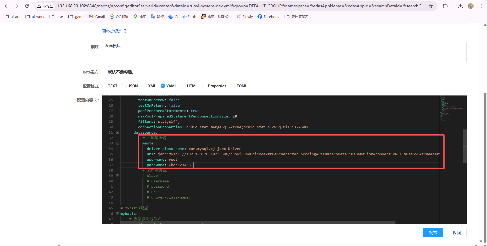

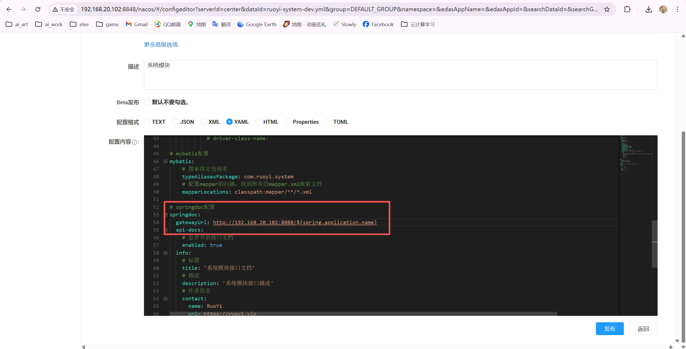

```bash
mkdir -p /usr/local/ruoyi/ruoyi-system
cp ruoyi-modules/ruoyi-system/target/ruoyi-modules-system.jar /usr/local/ruoyi/ruoyi-system/
chown -R www:www /usr/local/ruoyi/ruoyi-system
```

```bash
cat > /etc/systemd/system/ruoyi-system.service <<EOF
[Unit]
Description=Ruoyi System Service
After=network.target

[Service]
Type=simple
User=www
Group=www

# 工作目录
WorkingDirectory=/usr/local/ruoyi/ruoyi-system

# 启动命令
ExecStart=/usr/bin/java -Xms512m -Xmx512m -XX:+UseG1GC -Dcsp.sentinel.log.dir=/var/log/sentinel -Dcsp.sentinel.log.use.pid=true -Dnacos.home=/var/lib/nacos-client -DJM.SNAPSHOT.PATH=/var/lib/nacos-client -DJM.LOG.PATH=/var/lib/nacos-client/logs -jar ruoyi-modules-system.jar

# 重启策略
Restart=on-failure
RestartSec=10
StartLimitInterval=60
StartLimitBurst=3

# 资源限制
LimitNOFILE=65536
LimitNPROC=4096

# systemd 安全选项（CentOS 7 兼容）
NoNewPrivileges=true
PrivateTmp=true

[Install]
WantedBy=multi-user.target
EOF
```

#### 启动系统服务

```bash
systemctl start ruoyi-system
```

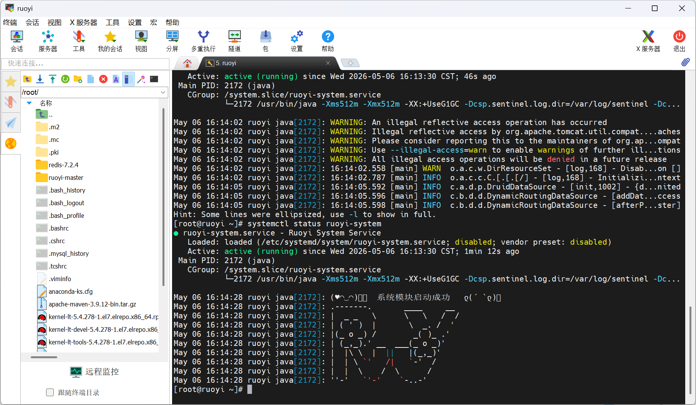

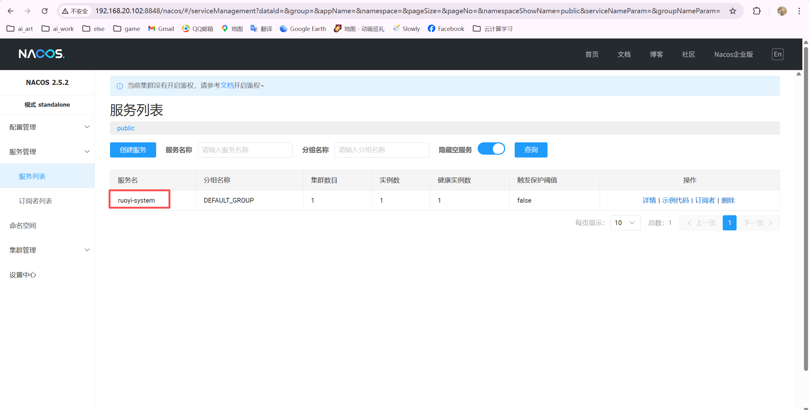

### 部署 ruoyi-job

>**Ruoyi Job** 是若依微服务架构中的**分布式定时任务调度中心**，负责整个系统的**定时任务管理、任务调度和执行监控**。它基于 XXL-Job 实现，解决了分布式环境下定时任务的重复执行、负载均衡、故障转移和可视化管理的难题，让开发者可以通过简单配置就能实现跨服务的复杂任务调度，是确保后台任务准时、可靠执行的**自动化管家**和**任务指挥官**。

#### 修改代码

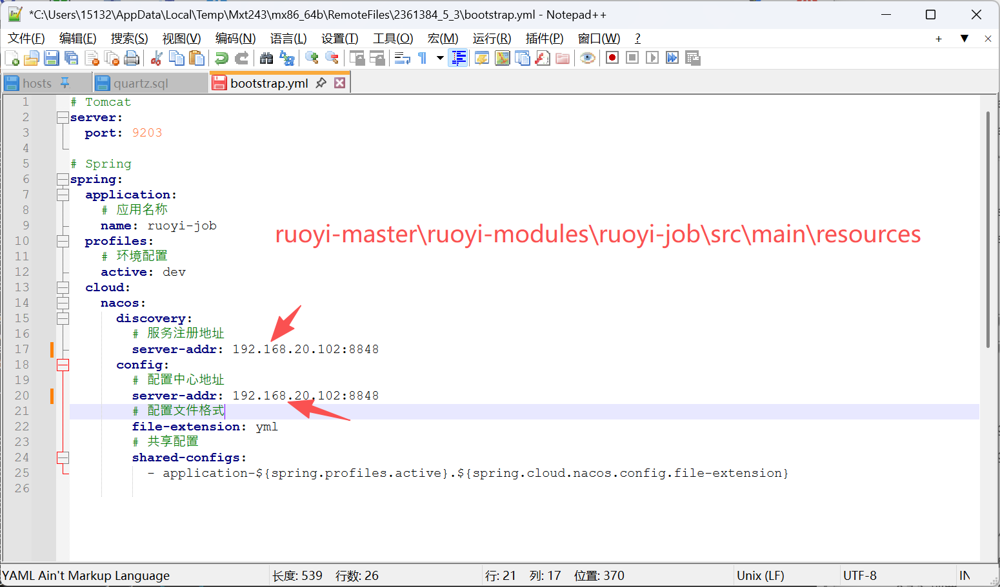

#### 编译 ruoyi-job 项目代码

```bash
mvn clean package
```

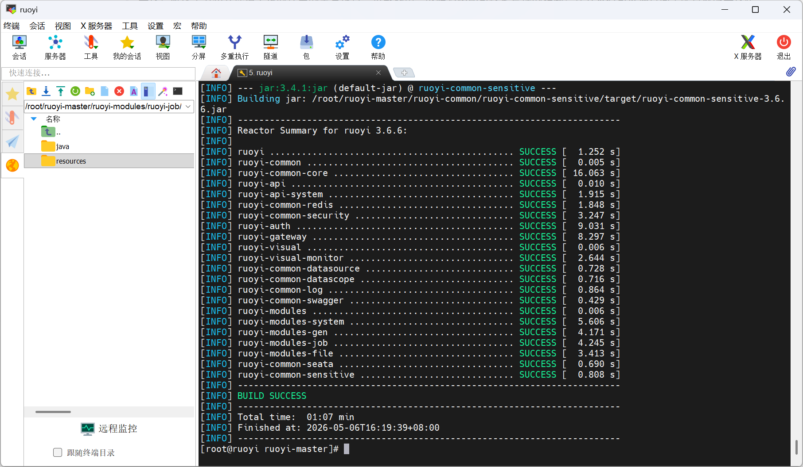

#### 部署 ruoyi-job 项目

访问http://192.168.20.102:8848/nacos

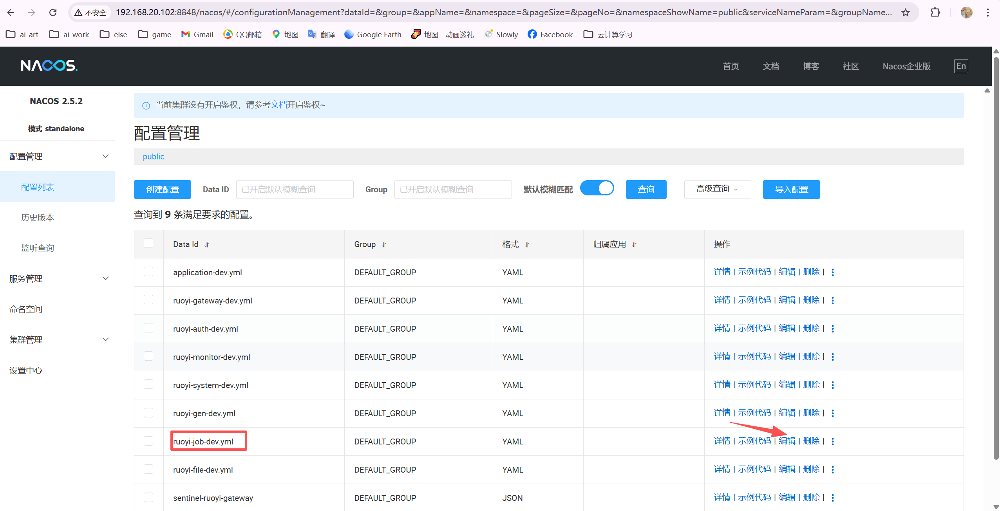

#### 修改相关配置

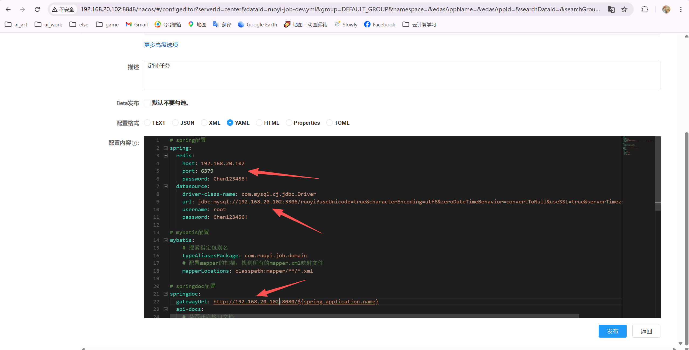

```bash
mkdir -p /usr/local/ruoyi/ruoyi-job
cp ruoyi-modules/ruoyi-job/target/ruoyi-modules-job.jar /usr/local/ruoyi/ruoyi-job/
chown -R www.www /usr/local/ruoyi/
```

```bash
cat > /etc/systemd/system/ruoyi-job.service <<EOF
[Unit]
Description=Ruoyi Job Service
After=network.target

[Service]
Type=simple
User=www
Group=www

# 工作目录
WorkingDirectory=/usr/local/ruoyi/ruoyi-job

# 启动命令（使用 jar 绝对路径，最稳）
ExecStart=/usr/bin/java -Xms512m -Xmx512m -XX:+UseG1GC -Dcsp.sentinel.log.dir=/var/log/sentinel -Dcsp.sentinel.log.use.pid=true -Dnacos.home=/var/lib/nacos-client -DJM.SNAPSHOT.PATH=/var/lib/nacos-client -DJM.LOG.PATH=/var/lib/nacos-client/logs -jar ruoyi-modules-job.jar

Restart=on-failure
RestartSec=10
LimitNOFILE=65536
LimitNPROC=4096
NoNewPrivileges=true
PrivateTmp=true

[Install]
WantedBy=multi-user.target
EOF
```

#### 启动定时服务

```bash
systemctl start ruoyi-job
```

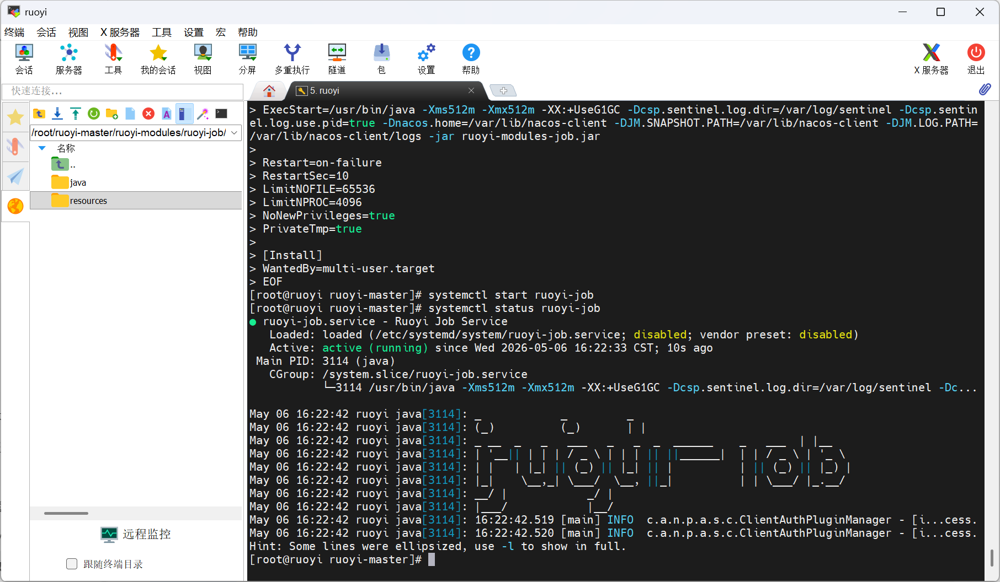

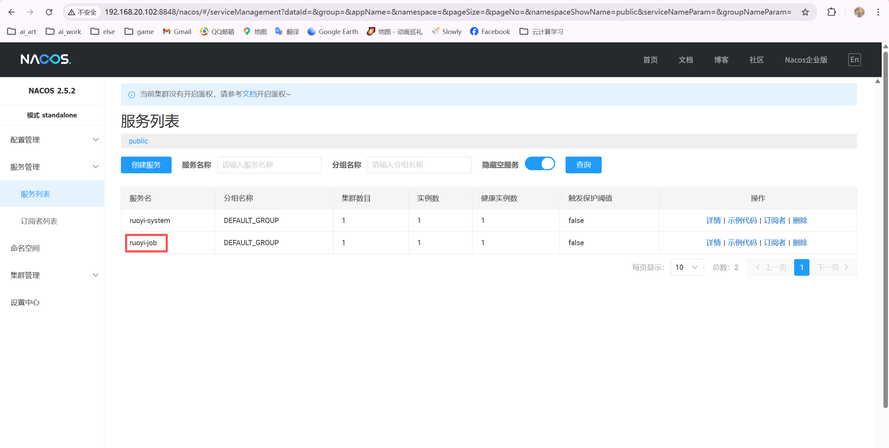

### 部署 ruoyi-gen 

#### 修改代码

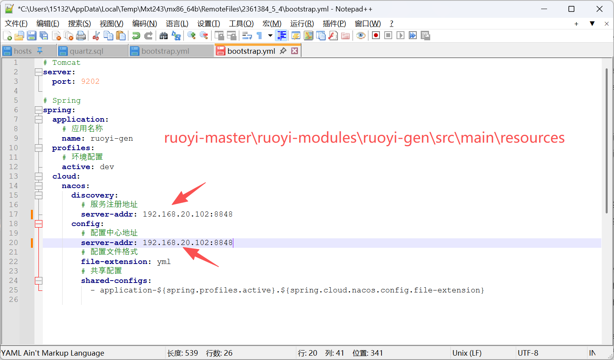

#### 编译 ruoyi-gen 项目代码

```bash
mvn clean package
```

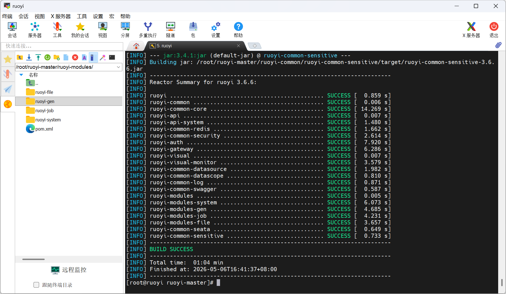

#### 部署 ruoyi-gen

访问http://192.168.20.102:8848/nacos


#### 修改相关配置

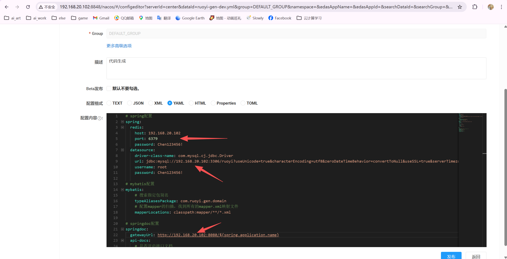

```bash
mkdir -p /usr/local/ruoyi/ruoyi-gen
cp ruoyi-modules/ruoyi-gen/target/ruoyi-modules-gen.jar /usr/local/ruoyi/ruoyi-gen/
chown -R www.www /usr/local/ruoyi/
```

```bash
cat > /etc/systemd/system/ruoyi-gen.service <<EOF
[Unit]
Description=Ruoyi Gen Service
After=network.target

[Service]
Type=simple
User=www
Group=www

# 工作目录
WorkingDirectory=/usr/local/ruoyi/ruoyi-gen

# 启动命令
ExecStart=/usr/bin/java -Xms512m -Xmx512m -XX:+UseG1GC -Dcsp.sentinel.log.dir=/var/log/sentinel -Dcsp.sentinel.log.use.pid=true -Dnacos.home=/var/lib/nacos-client -DJM.SNAPSHOT.PATH=/var/lib/nacos-client -DJM.LOG.PATH=/var/lib/nacos-client/logs -jar ruoyi-modules-gen.jar

# 失败自动重启
Restart=on-failure
RestartSec=10

# 系统限制
LimitNOFILE=65536
LimitNPROC=4096
NoNewPrivileges=true
PrivateTmp=true

[Install]
WantedBy=multi-user.target
EOF
```

#### 启动代码生成服务

```bash
systemctl start ruoyi-gen
```

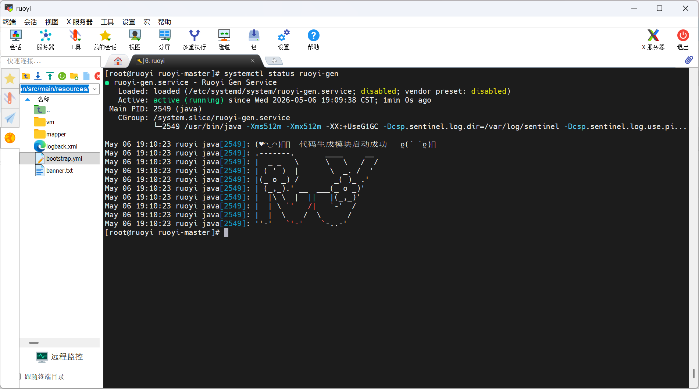

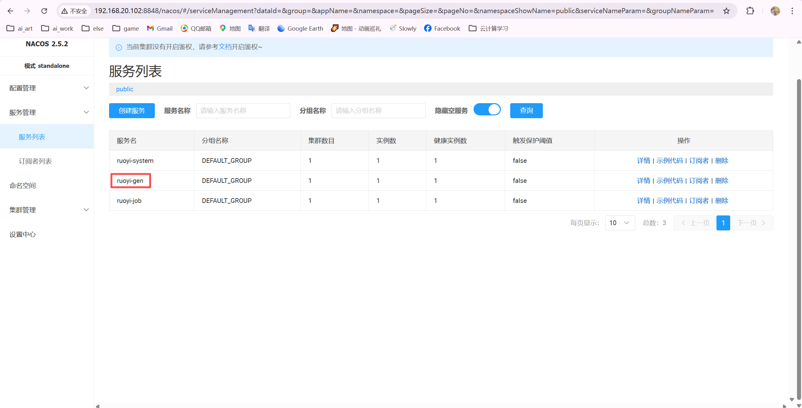

### 部署 ruoyi-file

>**Ruoyi File** 是若依微服务架构中的**统一文件服务模块**，负责整个系统的**文件上传、存储、管理和访问控制**。它采用微服务化设计，抽象了本地存储、FastDFS、MinIO、阿里云OSS等多种存储方式，为业务模块提供标准化的文件操作接口，实现了文件的分布式存储、访问鉴权、预览转换和生命周期管理，解决了微服务架构下文件管理的碎片化问题，是保障业务数据文件安全可靠存储的**数字仓库管理员**和**文件流量调度员**。

#### 修改代码

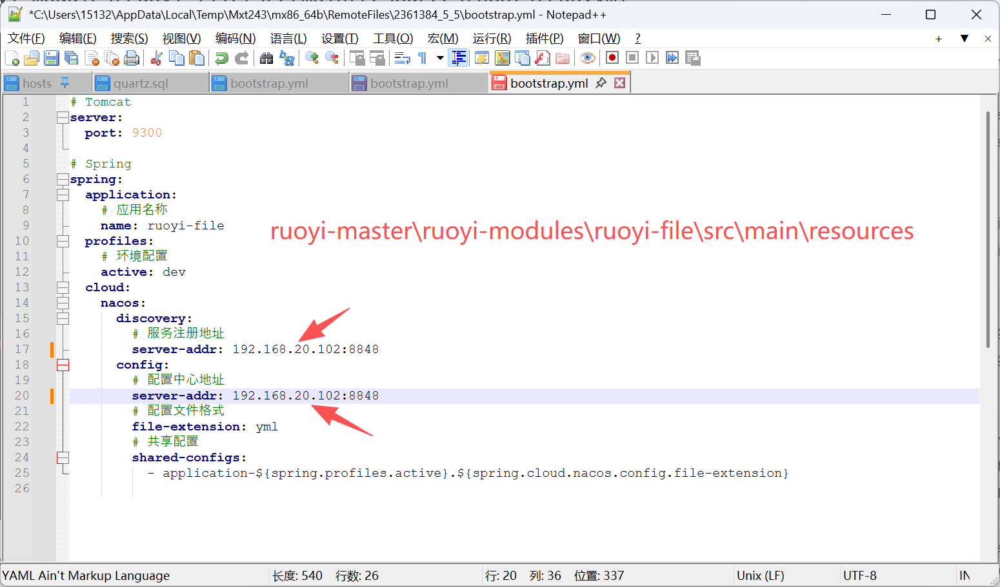

##### 关闭上传文件到本地

```bash
ruoyi-modules/ruoyi-file/src/main/java/com/ruoyi/file/service/LocalSysFileServiceImpl.java
```

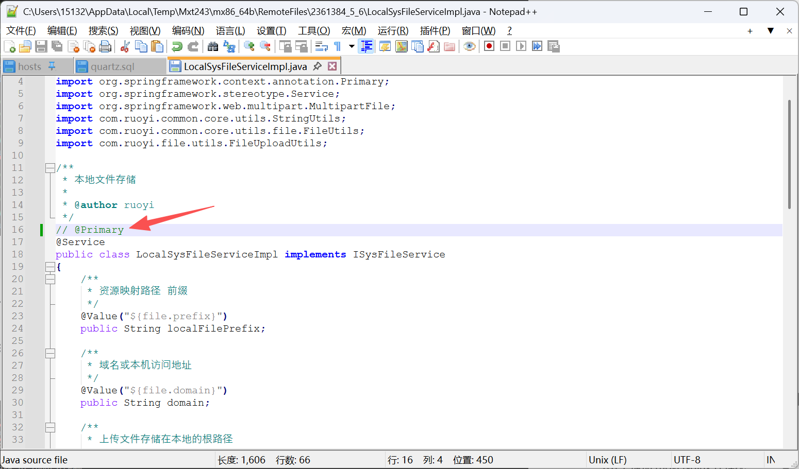

```java
ruoyi-modules/ruoyi-file/src/main/java/com/ruoyi/file/service/MinioSysFileServiceImpl.java

import org.springframework.context.annotation.Primary;
```


修改配置中心

```bash
# 登录
mc alias set ruoyiminio http://192.168.20.102:9000 L70WI3O52J46I7DQ5JP9 UV8C+pvli5H7rFSR+d2jOzIDzA3IPPv+0ocHT0H1

# 创建 bucket
mc mb ruoyiminio/ruoyi-bucket
```

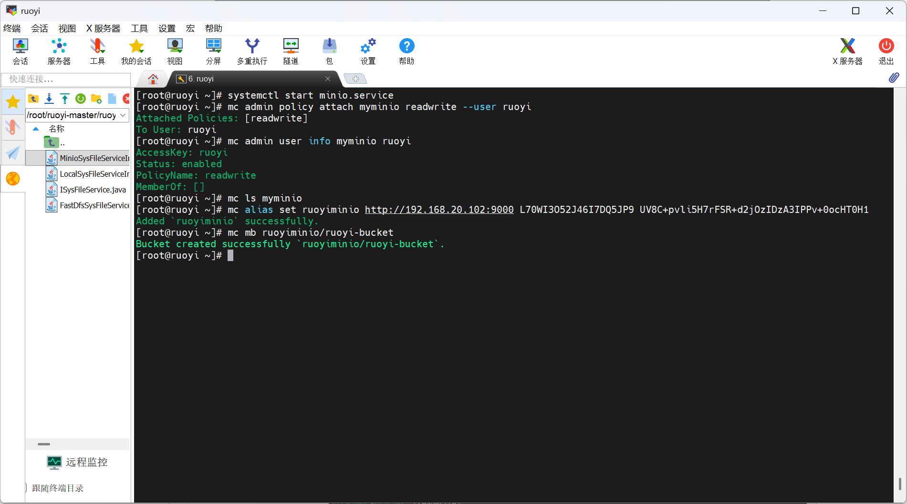

访问http://192.168.20.102:8848/nacos


修改相关配置

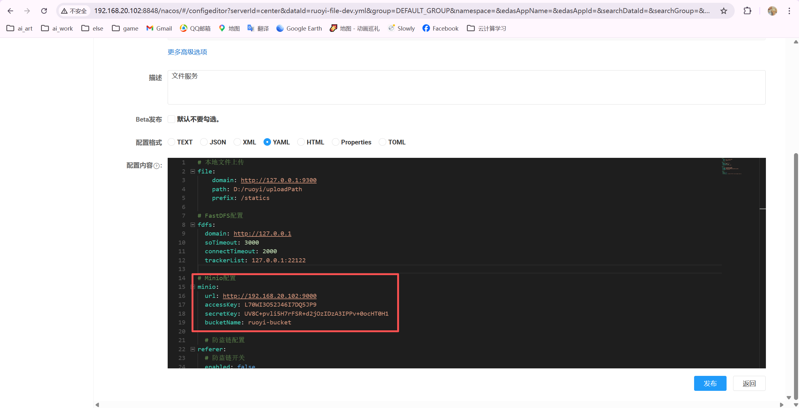

#### 编译 ruoyi-file 项目代码

```bash
mvn clean package
```

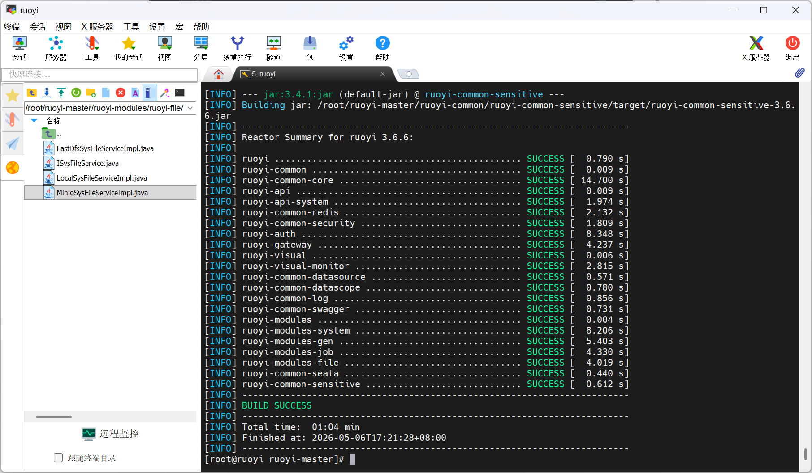

#### 部署 ruoyi-file

```bash
mkdir -p /usr/local/ruoyi/ruoyi-file
cp ruoyi-modules/ruoyi-file/target/ruoyi-modules-file.jar /usr/local/ruoyi/ruoyi-file/
chown -R www.www /usr/local/ruoyi/ruoyi-file
```

```bash
cat > /etc/systemd/system/ruoyi-file.service <<EOF
[Unit]
Description=Ruoyi File Service
After=network.target

[Service]
Type=simple
User=www
Group=www

# 工作目录
WorkingDirectory=/usr/local/ruoyi/ruoyi-file

# 启动命令
ExecStart=/usr/bin/java -Xms512m -Xmx512m -XX:+UseG1GC -Dcsp.sentinel.log.dir=/var/log/sentinel -Dcsp.sentinel.log.use.pid=true -Dnacos.home=/var/lib/nacos-client -DJM.SNAPSHOT.PATH=/var/lib/nacos-client -DJM.LOG.PATH=/var/lib/nacos-client/logs -jar ruoyi-modules-file.jar

# 失败自动重启
Restart=on-failure
RestartSec=10

# 系统限制
LimitNOFILE=65536
LimitNPROC=4096
NoNewPrivileges=true
PrivateTmp=true

[Install]
WantedBy=multi-user.target
EOF
```

#### 启动文件服务模块服务

```bash
systemctl start ruoyi-file
```

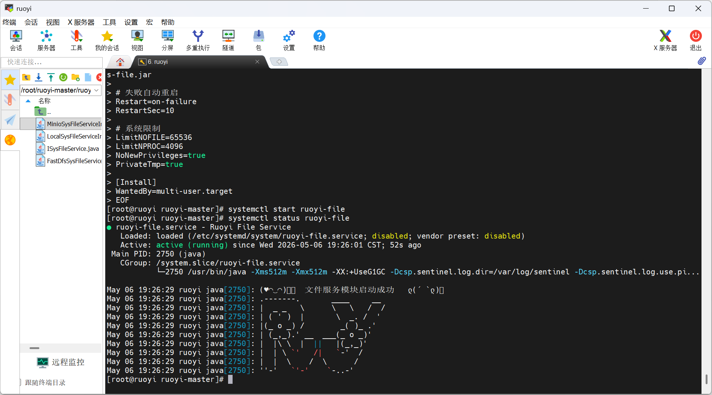

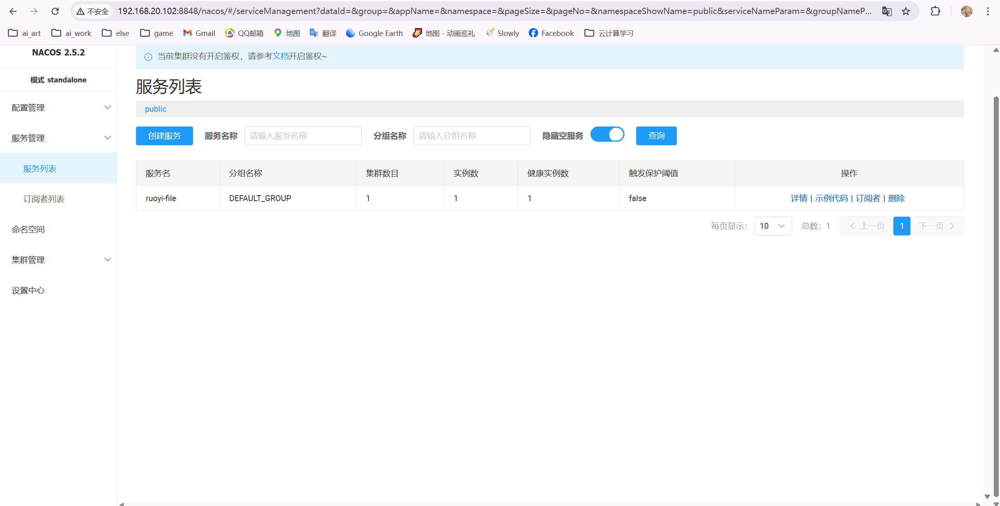

### 部署前端项目

#### 安装 nodeJs

```bash
wget https://nodejs.org/dist/v16.20.2/node-v16.20.2-linux-x64.tar.xz
tar -xf node-v16.20.2-linux-x64.tar.xz -C /usr/local/
ln -s /usr/local/node-v16.20.2-linux-x64 /usr/local/node

vim /etc/profile

export NODE_HOME=/usr/local/node
export PATH=$NODE_HOME/bin:$PATH

source /etc/profile
```

#### 设置 npm 代理

```bash
npm config set registry https://registry.npmmirror.com
npm config set strict-ssl false
```

#### 编译前端代码

```bash
cd ruoyi-ui/
npm install
npm run build:prod

mkdir /data/ruoyi
mv dist/* /data/ruoyi/
chown -R www.www /data/ruoyi
```

#### 安装 OpenResty

```bash
yum install yum-utils
yum-config-manager --add-repo https://openresty.org/package/centos/openresty.repo
yum install openresty -y

mkdir -p /etc/nginx/conf.d
mkdir -p /var/log/openresty
mkdir -p /run/openresty/
ln -s /usr/local/openresty/nginx/conf/nginx.conf /etc/nginx/nginx.conf
```

```bash
cat > /etc/nginx/nginx.conf <<EOF
# 设置 Worker 进程数
worker_processes auto;
# 设置 Worker 进程的用户
user www;
# pid⽂件保存路径
pid /run/openresty/openresty.pid;
# ⼯作进程nice值即进程运行优先级，数值越小越优先，-20~19
worker_priority 0;
# 这个数字包括Nginx的所有连接（例如与代理服务器的连接等），⽽不仅仅是与客户端的连接,另⼀个考虑因素是实际的并发连接数不能超过系统级别的最⼤打开⽂件数的限制.
worker_rlimit_nofile 65536;
# 前台运⾏Nginx服务⽤于测试、docker等环境。
daemon on;
# 事件配置块
events {
    # 每个 worker 最大连接数
    worker_connections 1024;
    # Linux 推荐使用 epoll 事件模型
    use epoll;
    # 防止惊群效应
    accept_mutex on;
    # 批量分配新连接
    multi_accept on;
}

# OpenResty/Nginx 提供 4 层代理的时候所用的配置块
stream {}

# OpenResty/Nginx 提供 7 层代理时候所用的配置块
http {
    # 设置字符集编码
    charset utf-8;
    # 加载 OpenResty/Nginx 支持的文件类型
    include       mime.types;
    # 设置当 OpenResty/Nginx 不能识别的文件类型的时候，默认当做文件流处理
    default_type  application/octet-stream;
    # 设置日志格式
    log_format json '{'
           '"remote_addr":"$remote_addr",'
           '"time_local":"$time_local",'
           '"request":"$request",'
           '"status":$status,'
           '"body_bytes_sent":$body_bytes_sent,'
           '"http_referer":"$http_referer",'
           '"http_user_agent":"$http_user_agent",'
           '"request_time":$request_time,'
           '"upstream_response_time":"$upstream_response_time",'
           '"upstream_connect_time":"$upstream_connect_time",'
           '"upstream_header_time":"$upstream_header_time",'
           '"http_x_forwarded_for":"$http_x_forwarded_for",'
           '"host":"$host",'
           '"request_method":"$request_method",'
           '"server_protocol":"$server_protocol",'
           '"connection":$connection,'
           '"connection_requests":$connection_requests,'
           '"request_length":$request_length,'
           '"bytes_sent":$bytes_sent,'
           '"upstream_cache_status":"$upstream_cache_status",'
           '"server_addr":"$server_addr",'
           '"server_port":"$server_port",'
           '"document_root":"$document_root",'
           '"fastcgi_script_name":"$fastcgi_script_name",'
           '"request_filename":"$request_filename",'
           '"remote_port":"$remote_port"'
       '}';
    # 设置普通日志的路径
    access_log /var/log/openresty/access.log json;
    # 设置错误日志的路径
    error_log /var/log/openresty/error.log warn;
    # 设置减少文件拷贝
    sendfile on;
    # 设置OpenResty/Nginx的长连接
    keepalive_timeout 65s;
    # 启用 gzip 压缩
    gzip on;
    # 压缩级别：1-9，推荐 4-6（平衡性能与压缩率）
    gzip_comp_level 6;
    # 最小压缩文件大小：小于 1k 的文件不压缩（避免压缩开销大于收益）
    gzip_min_length 1k;
    # 压缩缓冲区：4 个 16k 大小的缓冲区
    gzip_buffers 4 16k;
    # 压缩协议版本：支持 HTTP/1.0 及以上
    gzip_http_version 1.0;
    # 对代理请求启用压缩（如反向代理场景）
    gzip_proxied any;
    # 在响应头添加 Vary: Accept-Encoding，帮助代理服务器正确缓存
    gzip_vary on;
    # 指定需要压缩的 MIME 类型（按需添加）
    gzip_types text/plain text/css text/javascript application/javascript application/json application/xml application/x-javascript image/svg+xml;
    # 加载外部的 server 配置
    include /etc/nginx/conf.d/*.conf;
}
EOF
```

#### 添加 ruoyi Nginx 代理配置文件

```bash
vi /etc/nginx/conf.d/ruoyi.example.com.conf
```

```nginx
server {
    server_name ruoyi.example.com;
    listen 80;
    location / {
        root /data/ruoyi;
        try_files $uri $uri/ /index.html;
        index index.html index.htm;
    }

    location /prod-api/ {
        proxy_set_header Host $http_host;
        proxy_set_header X-Real-IP $remote_addr;
        proxy_set_header REMOTE-HOST $remote_addr;
        proxy_set_header X-Forwarded-For $proxy_add_x_forwarded_for;
        proxy_pass http://192.168.20.102:8080/;
    }
    
    location /ruoyi-bucket {
        proxy_set_header Host $http_host;
        proxy_set_header X-Real-IP $remote_addr;
        proxy_set_header REMOTE-HOST $remote_addr;
        proxy_set_header X-Forwarded-For $proxy_add_x_forwarded_for;
        proxy_pass http://192.168.20.102:9000;
    }
}
```

## 启动项目

### 启动相关服务

```bash
systemctl start redis
systemctl start mysqld
systemctl start nacos.service
systemctl start ruoyi-gateway
systemctl start ruoyi-auth
systemctl start ruoyi-system
```

### 配置域名解析

```bash
192.168.20.102 ruoyi.example.com
```

### 访问ruoyi.example.com


